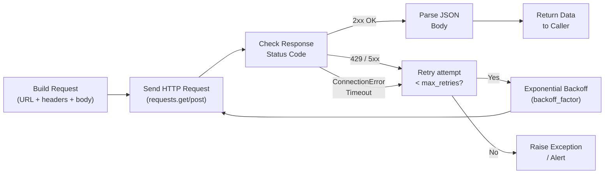

# Python Automation — Integrations


<div class="kb-summary">
Integrations reference covering API Call and Retry Flow.
</div>

## API Call and Retry Flow


┌──────────────────────────────────────── Python — Integrations ────────────────────────────────────────┐
│   ┌───────────────────────────────────────────────────────────────────────────────────────────────┐   │
│   │     Python integrates with cloud, storage, monitoring, and ITSM platforms via vendor SDKs     │   │
│   │ AWS: boto3; VMware: pyVmomi; NetApp: netapp-ontap; Pure: purestorage SDK; Dell: requests+REST │   │
│   │  CI/CD: scripts run in GitHub Actions, GitLab CI, Jenkins; pass results via exit codes + JSON │   │
│   └───────────────────────────────────────────────────────────────────────────────────────────────┘   │
│                                                                                                       │
│   ┌─────────────────────────────┐  ┌─────────────────────────────┐  ┌─────────────────────────────┐   │
│   │          Cloud SDKs         │  │          Infra SDKs         │  │      Monitoring / ITSM      │   │
│   │         boto3 (AWS)         │  │      pyVmomi (vSphere)      │  │    requests → Grafana API   │   │
│   │     azure-sdk-for-python    │  │         netapp-ontap        │  │         PyServiceNow        │   │
│   │     google-cloud-* libs     │  │       purestorage SDK       │  │      Jira python client     │   │
│   │        paramiko (SSH)       │  │      netmiko (network)      │  │     Slack SDK (webhooks)    │   │
│   └─────────────────────────────┘  └─────────────────────────────┘  └─────────────────────────────┘   │
│                                                                                                       │
│   ┌───────────────────────────────────────────────────────────────────────────────────────────────┐   │
│   │   pyVmomi     = VMware vSphere Python SDK; SmartConnect to vCenter; traverse managed objects  │   │
│   │  netmiko     = multi-vendor network device SSH library; supports Cisco, Arista, Juniper, etc. │   │
│   │       Exit codes  = scripts should exit 0 on success, 1+ on failure; CI checks exit code      │   │
│   └───────────────────────────────────────────────────────────────────────────────────────────────┘   │
└───────────────────────────────────────────────────────────────────────────────────────────────────────┘

### Auth Patterns

```python
import requests
from requests.auth import HTTPBasicAuth

# Bearer token (most REST APIs)
headers = {'Authorization': f'Bearer {api_token}'}
resp = requests.get('https://api.example.com/v1/me', headers=headers)

# Basic auth
resp = requests.get(
    'https://api.example.com/v1/data',
    auth=HTTPBasicAuth('user', 'password')
)

# API key in query string
resp = requests.get(
    'https://api.example.com/v1/data',
    params={'api_key': api_key, 'limit': 100}
)

# Session with persistent headers
session = requests.Session()
session.headers.update({'Authorization': f'Bearer {token}', 'Accept': 'application/json'})
resp = session.get('https://api.example.com/v1/servers')
```

### Pagination

Most APIs paginate large result sets. Handle both cursor-based and offset-based pagination.

```python
def get_all_pages(url: str, headers: dict) -> list:
    """Collect all items from a paginated API using cursor-based pagination."""
    items = []
    params = {'limit': 100}

    while url:
        resp = requests.get(url, headers=headers, params=params)
        resp.raise_for_status()
        data = resp.json()
        items.extend(data.get('items', []))
        # Follow next_cursor or next_url — adapt to the API's convention
        next_url = data.get('pagination', {}).get('next_url')
        url = next_url
        params = {}   # params already embedded in next_url

    return items

# Offset/limit pagination
def get_all_offset(base_url: str, headers: dict) -> list:
    items, offset, limit = [], 0, 100
    while True:
        resp = requests.get(base_url, headers=headers,
                            params={'limit': limit, 'offset': offset})
        resp.raise_for_status()
        page = resp.json()['items']
        items.extend(page)
        if len(page) < limit:
            break
        offset += limit
    return items
```

### Error Handling and Retry

```python
import time
import requests
from requests.adapters import HTTPAdapter
from urllib3.util.retry import Retry

def build_session(retries: int = 3, backoff: float = 1.0) -> requests.Session:
    """Session with automatic retry on transient errors."""
    session = requests.Session()
    retry = Retry(
        total=retries,
        backoff_factor=backoff,
        status_forcelist=[429, 500, 502, 503, 504],
        allowed_methods=['GET', 'POST', 'PUT', 'DELETE'],
    )
    adapter = HTTPAdapter(max_retries=retry)
    session.mount('https://', adapter)
    session.mount('http://', adapter)
    return session

# Handle specific HTTP errors
try:
    resp = session.get('https://api.example.com/v1/servers', timeout=30)
    resp.raise_for_status()
except requests.exceptions.HTTPError as e:
    if e.response.status_code == 404:
        print("Resource not found")
    elif e.response.status_code == 429:
        retry_after = int(e.response.headers.get('Retry-After', 60))
        time.sleep(retry_after)
    else:
        raise
except requests.exceptions.ConnectionError:
    print("Connection failed — check network and API endpoint")
except requests.exceptions.Timeout:
    print("Request timed out")
```

### API Client Patterns

| Pattern | Use case | Implementation |
|---|---|---|
| Bearer token | REST APIs with OAuth / JWT | `Authorization: Bearer <token>` header |
| API key header | Simple API authentication | Custom header (e.g. `X-API-Key`) |
| Basic auth | Legacy or internal APIs | `requests.auth.HTTPBasicAuth` |
| Session object | Multiple requests to same host | `requests.Session()` |
| Retry adapter | Resilience against transient failures | `HTTPAdapter(max_retries=Retry(...))` |
| Timeout | Avoid hanging scripts | `timeout=(connect_timeout, read_timeout)` |
