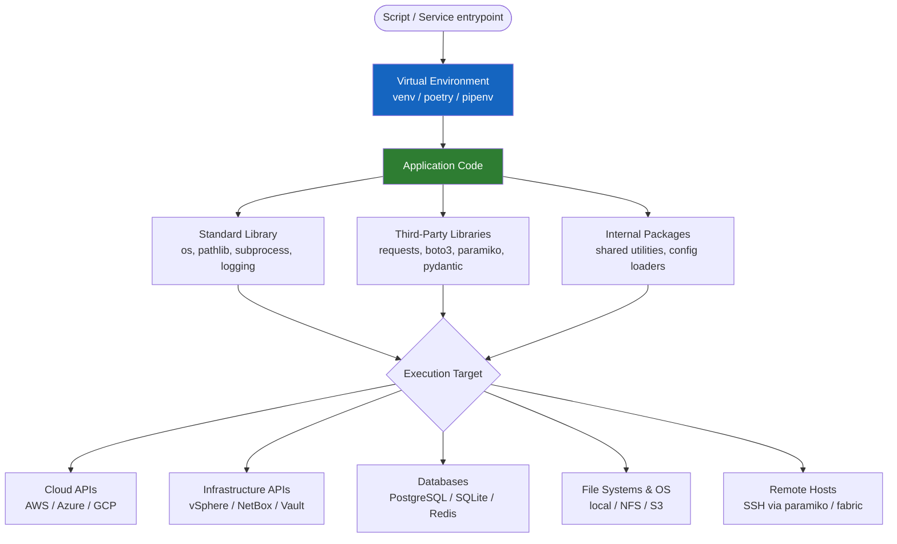

# Python Automation — Architecture Overview

Python is the dominant language for infrastructure automation, data pipelines, and API integration in modern enterprise environments. This page covers the architectural patterns, runtime models, and execution strategies used in production Python automation.

---

## Architecture Model



---

## Virtual Environments

Every automation project must use a virtual environment. Global `pip install` is prohibited in production.

### `venv` (standard library — preferred for simple scripts)

```bash
# Create
python3 -m venv .venv

# Activate (Linux/macOS)
source .venv/bin/activate

# Activate (Windows)
.venv\Scripts\Activate.ps1

# Install deps
pip install -r requirements.txt

# Deactivate
deactivate
```

### `poetry` (preferred for packaged projects)

```bash
# Install poetry
curl -sSL https://install.python-poetry.org | python3 -

# New project
poetry new my-automation

# Add a dependency
poetry add requests boto3 pydantic

# Add a dev dependency
poetry add --group dev pytest black mypy

# Activate shell
poetry shell

# Run without activating
poetry run python main.py
```

### `pipenv` (alternative — combines pip + virtualenv)

```bash
pipenv install requests
pipenv install --dev pytest
pipenv run python main.py
pipenv shell
```

### Comparison

| Tool | Lock file | Dependency groups | Build/publish | Best for |
|---|---|---|---|---|
| `venv` + `pip` | `requirements.txt` (manual) | No | No | Simple scripts |
| `pipenv` | `Pipfile.lock` | dev vs default | No | Application projects |
| `poetry` | `poetry.lock` | Multiple groups | Yes | Packages and services |

---

## Package Management

### `requirements.txt` (venv projects)

```bash
# Freeze current environment to requirements.txt
pip freeze > requirements.txt

# Install from requirements.txt
pip install -r requirements.txt

# Upgrade all packages
pip list --outdated | awk 'NR>2 {print $1}' | xargs pip install -U
```

### `pyproject.toml` (poetry projects)

```toml
[tool.poetry]
name = "platform-automation"
version = "1.0.0"
description = "Infrastructure automation scripts"
authors = ["Platform Team <platform@example.com>"]
python = "^3.11"

[tool.poetry.dependencies]
python = "^3.11"
requests = "^2.31"
boto3 = "^1.34"
pydantic = "^2.5"
structlog = "^24.1"

[tool.poetry.group.dev.dependencies]
pytest = "^8.0"
pytest-asyncio = "^0.23"
black = "^24.0"
mypy = "^1.8"
ruff = "^0.3"

[build-system]
requires = ["poetry-core"]
build-backend = "poetry.core.masonry.api"
```

---

## Script Execution Models

### CLI Scripts with `argparse`

```python
#!/usr/bin/env python3
"""Widget deployment automation."""

import argparse
import sys
import logging

def parse_args() -> argparse.Namespace:
    parser = argparse.ArgumentParser(
        description="Deploy widgets to the widget service",
        formatter_class=argparse.RawDescriptionHelpFormatter,
    )
    parser.add_argument("widget_name", help="Name of the widget to deploy")
    parser.add_argument("--env", choices=["dev", "staging", "prod"], default="dev")
    parser.add_argument("--dry-run", action="store_true", help="Preview without applying")
    parser.add_argument("-v", "--verbose", action="store_true")
    return parser.parse_args()


def main() -> int:
    args = parse_args()
    log_level = logging.DEBUG if args.verbose else logging.INFO
    logging.basicConfig(level=log_level, format="%(asctime)s %(levelname)s %(message)s")

    log = logging.getLogger(__name__)
    log.info("Deploying widget %s to %s", args.widget_name, args.env)

    if args.dry_run:
        log.info("Dry run — no changes applied")
        return 0

    # deploy_widget(args.widget_name, args.env)
    return 0


if __name__ == "__main__":
    sys.exit(main())
```

### Scheduled Execution

```bash
# Cron — every day at 02:30
30 2 * * * /opt/automation/venv/bin/python /opt/automation/scripts/backup.py >> /var/log/backup.log 2>&1

# systemd timer (preferred over cron for production)
# /etc/systemd/system/widget-sync.service
[Unit]
Description=Widget Sync Automation
After=network.target

[Service]
Type=oneshot
User=automation
ExecStart=/opt/automation/.venv/bin/python /opt/automation/scripts/widget_sync.py
EnvironmentFile=/etc/automation/widget-sync.env
StandardOutput=journal
StandardError=journal
```

```bash
# /etc/systemd/system/widget-sync.timer
[Unit]
Description=Run widget-sync daily

[Timer]
OnCalendar=daily
Persistent=true

[Install]
WantedBy=timers.target
```

---

## Async Patterns (`asyncio`)

Use `asyncio` when automation involves high concurrency (many API calls, multiple SSH connections, waiting on I/O).

```python
import asyncio
import aiohttp
import logging
from typing import Any

log = logging.getLogger(__name__)


async def fetch_widget(
    session: aiohttp.ClientSession,
    name: str,
    semaphore: asyncio.Semaphore,
) -> dict[str, Any]:
    """Fetch a single widget with concurrency control."""
    async with semaphore:
        try:
            async with session.get(f"/api/widgets/{name}") as resp:
                resp.raise_for_status()
                return await resp.json()
        except aiohttp.ClientError as exc:
            log.error("Failed to fetch widget %s: %s", name, exc)
            return {}


async def fetch_all_widgets(widget_names: list[str]) -> list[dict[str, Any]]:
    """Fetch many widgets concurrently, max 10 at a time."""
    semaphore = asyncio.Semaphore(10)
    async with aiohttp.ClientSession(base_url="https://api.example.com") as session:
        tasks = [
            fetch_widget(session, name, semaphore)
            for name in widget_names
        ]
        return await asyncio.gather(*tasks, return_exceptions=False)


if __name__ == "__main__":
    names = [f"widget-{i:03d}" for i in range(100)]
    results = asyncio.run(fetch_all_widgets(names))
    print(f"Fetched {len(results)} widgets")
```

### When to Use `asyncio`

| Scenario | Use asyncio? |
|---|---|
| Many concurrent HTTP/API calls | Yes |
| Multiple SSH connections in parallel | Yes (with `asyncssh`) |
| CPU-bound data processing | No — use `multiprocessing` |
| Simple sequential script | No — adds unnecessary complexity |
| Subprocess execution | Optional — `asyncio.create_subprocess_exec` |

---

## Containerisation with Docker

Containerising automation eliminates "works on my machine" issues and enables consistent execution in CI/CD and Kubernetes.

```dockerfile
# Dockerfile for automation scripts
FROM python:3.12-slim

# Security: run as non-root
RUN useradd --system --create-home automation

WORKDIR /app

# Install dependencies first (layer cache optimisation)
COPY pyproject.toml poetry.lock ./
RUN pip install --no-cache-dir poetry && \
    poetry config virtualenvs.create false && \
    poetry install --only main --no-root

# Copy application code
COPY --chown=automation:automation . .

USER automation

ENTRYPOINT ["python", "-m", "widget_automation"]
CMD ["--help"]
```

```yaml
# docker-compose.yml for local development
services:
  automation:
    build: .
    environment:
      - WIDGET_API_URL=https://api.example.com
      - LOG_LEVEL=DEBUG
    env_file:
      - .env.local        # never commit this file
    volumes:
      - ./output:/app/output
```

```bash
# Build and run
docker build -t widget-automation:latest .
docker run --rm --env-file .env widget-automation:latest deploy widget-01 --env staging
```

---

## Project Layout

```
widget-automation/
├── pyproject.toml         # Dependencies and tool config
├── poetry.lock            # Locked dependency tree
├── Dockerfile
├── .env.example           # Template — commit this, not .env
├── .gitignore             # Includes .env, .venv/, __pycache__/
├── src/
│   └── widget_automation/
│       ├── __init__.py
│       ├── __main__.py    # Entry point: python -m widget_automation
│       ├── cli.py         # argparse / click CLI
│       ├── config.py      # Configuration loading (pydantic settings)
│       ├── api.py         # API client
│       └── utils.py
└── tests/
    ├── conftest.py
    ├── test_api.py
    └── test_config.py
```
