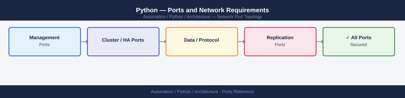

---
tags:
  - python
  - automation
  - networking
  - firewall
  - ports
---
# Python — Ports and Network Requirements

<div class="kb-summary">
Firewall port reference for Python automation scripts and services. Python scripts have no fixed listening ports — this page covers the outbound API ports used by common Python automation libraries and the inbound ports for Python-based web services (Flask, FastAPI, Gunicorn).

*Applies to: Python 3.10+ with common automation libraries*
</div>



```d2
direction: right

center: "Python" {shape: hexagon}
python_script_outbound_common_target: "Python Script Outbound — Common Target Ports" {shape: rectangle}
python_web_services_inbound: "Python Web Services (Inbound)" {shape: rectangle}
python_package_and_library_access: "Python Package and Library Access" {shape: rectangle}
firewall_zone_summary: "Firewall Zone Summary" {shape: rectangle}
verify: "Verify" {shape: rectangle}

center -> python_script_outbound_common_target
center -> python_web_services_inbound
center -> python_package_and_library_access
center -> firewall_zone_summary
center -> verify
```

## Python Script Outbound — Common Target Ports

Python automation scripts connect to APIs and infrastructure. Open from the host running the script to each target:

| Port | Protocol | Destination | Purpose |
|---|---|---|---|
| 443 | TCP | REST API endpoints | `requests`, `httpx`, `aiohttp` — all HTTPS API calls (vCenter, AWS boto3, Azure SDK, GCP) |
| 22 | TCP | Linux managed hosts | `paramiko`, `fabric` — SSH-based automation |
| 5985/5986 | TCP | Windows managed hosts | `pywinrm` — WinRM for Windows automation |
| 5432 | TCP | PostgreSQL | `psycopg2`, `asyncpg` |
| 3306 | TCP | MySQL | `mysql-connector-python`, `PyMySQL` |
| 1433 | TCP | SQL Server | `pyodbc`, `pymssql` |
| 6379 | TCP | Redis | `redis-py` — caching and queues |
| 5671/5672 | TCP | RabbitMQ | `pika` — message bus |
| 9092 | TCP | Kafka | `confluent-kafka`, `kafka-python` |

## Python Web Services (Inbound)

| Port | Protocol | Source | Purpose |
|---|---|---|---|
| 8080 | TCP | Clients / reverse proxy | Flask / FastAPI development server (common default) |
| 8000 | TCP | Clients / reverse proxy | Gunicorn / uvicorn default port |
| 443 | TCP | Clients (via reverse proxy — nginx/caddy/traefik) | Production HTTPS — Python app sits behind a reverse proxy |

## Python Package and Library Access

| Port | Protocol | Destination | Purpose |
|---|---|---|---|
| 443 | TCP | pypi.org, files.pythonhosted.org | pip install — package downloads |
| 443 | TCP | Private Nexus/Artifactory repo | pip from internal package repository |

## Firewall Zone Summary

| From | To | Ports | Notes |
|---|---|---|---|
| Python script host | REST APIs (vCenter, cloud) | 443 | All SDK-based automation |
| Python script host | Linux hosts | 22 | SSH via paramiko/fabric |
| Python script host | Windows hosts | 5986 | WinRM via pywinrm |
| Reverse proxy | Python web service | 8000 or 8080 | Internal proxy → app |
| Users | Reverse proxy | 443 | Production web services |

## Verify

```python
# Test HTTPS API reachability
import requests
r = requests.get('https://<api-host>/api/v1/health', verify=False, timeout=5)
print(r.status_code)

# Test SSH reachability
import paramiko
c = paramiko.SSHClient()
c.set_missing_host_key_policy(paramiko.AutoAddPolicy())
c.connect('<linux-host>', username='ansible', timeout=5)
print("SSH OK")
c.close()
```

## See also

- [Python — Architecture](how-it-works/)
- [Ansible — Ports](../../ansible/architecture/ports.md)
- [Terraform — Ports](../../terraform/architecture/ports.md)
