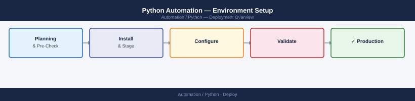

---
tags:
  - deployment
  - python
search:
  boost: 1.5
---
# Python Automation — Environment Setup



This guide covers installing Python, isolating dependencies with a virtual environment,
managing packages, loading secrets safely, integrating with VS Code, and wiring a CI
pipeline before running your first automation scripts.


---

## Before you begin

- **Access:** Admin credentials on all affected systems
- **Environment:** DNS, NTP, and network connectivity verified before starting
- **Change management:** change request approved; maintenance window scheduled
- **Rollback:** snapshot or backup taken immediately before deployment begins
- **Time estimate:** 30–90 minutes — do not start if less than 2 hours are available

---

## Install Python

**Linux (RHEL/Fedora/Rocky)**

```bash
sudo dnf install python3 python3-pip
```

**Linux (Debian/Ubuntu)**

```bash
sudo apt install python3 python3-pip
```

**macOS**

```bash
brew install python
```

**Windows**

```powershell
winget install Python.Python.3
```

**Verify**

```bash
python3 --version
pip3 --version
```

On Linux/macOS always use `python3`/`pip3` to avoid invoking a system Python 2
interpreter.

---

## Create a Project Virtual Environment

A virtual environment isolates project dependencies from the system Python and from
other projects. Always create one before installing packages.

```bash
python3 -m venv .venv
```

**Activate** — Linux/macOS: `source .venv/bin/activate` —
Windows PowerShell: `.venv\Scripts\Activate.ps1`

Upgrade pip after activation:

```bash
pip install --upgrade pip
```

Add `.venv/` to `.gitignore` so the directory is not committed to version control.

---

## Install Project Dependencies

```bash
# From a requirements file
pip install -r requirements.txt

# Or individually
pip install requests boto3 azure-identity paramiko pyyaml
```

| Package | Purpose |
|---|---|
| `requests` | HTTP client for REST API calls |
| `boto3` | AWS SDK |
| `azure-identity` | Azure authentication |
| `paramiko` | SSH client for remote execution |
| `pyyaml` | YAML parsing |
| `python-dotenv` | Load `.env` into environment variables |

Freeze dependencies after installing:

```bash
pip freeze > requirements.txt
```

---

## Configure Environment Variables

Store credentials in a `.env` file and load them at runtime — never hard-code them
in source files.

```bash
# .env
VCENTER_HOST=vcenter.corp.local
VCENTER_USER=automation@corp.local
VCENTER_PASS=changeme
```

Install and use `python-dotenv`:

```bash
pip install python-dotenv
```

```python
from dotenv import load_dotenv
import os

load_dotenv()

vcenter_host = os.getenv("VCENTER_HOST")
```

Add `.env` to `.gitignore` immediately:

```bash
echo ".env" >> .gitignore
```

In production, inject secrets from a secrets manager (HashiCorp Vault, AWS Secrets
Manager, GitHub Actions secrets) rather than shipping a `.env` file.

---

## Set Up IDE Integration (VS Code)

1. Install the **Python** extension (`ms-python.python`).
2. Open the Command Palette (`Ctrl+Shift+P`) → **Python: Select Interpreter** →
   choose the `.venv` interpreter.

Install linting and formatting tools, then reference them in `.vscode/settings.json`:

```bash
pip install black ruff
```

```json
{
    "editor.formatOnSave": true,
    "python.formatting.provider": "black",
    "python.linting.ruffEnabled": true
}
```

---

## Configure a CI Pipeline for Python Scripts

Create `.github/workflows/python.yml`:

```yaml
name: Python CI

on: [push, pull_request]

jobs:
  test:
    runs-on: ubuntu-latest
    steps:
      - uses: actions/checkout@v4
      - uses: actions/setup-python@v5
        with:
          python-version: "3.12"
      - run: pip install --upgrade pip && pip install -r requirements.txt
      - run: ruff check .
      - run: python -m pytest
```

Add the `test` job as a required status check under **Settings → Branches → Branch
protection rules** to block merges when tests fail.

Pass secrets via GitHub Actions secrets: `env: VCENTER_HOST: ${{ secrets.VCENTER_HOST }}`.

---

## Validate the Environment

```bash
# Python version
python3 --version

# Installed packages
pip list

# Import check
python3 -c "import requests; print(requests.__version__)"

# Env variable load
python3 -c "from dotenv import load_dotenv; import os; load_dotenv(); print(os.getenv('VCENTER_HOST'))"

# Run first script
python3 scripts/hello.py
```

| Check | Expected |
|---|---|
| `python3 --version` | Python 3.10 or later |
| `pip list` | All packages from `requirements.txt` listed |
| `import requests` | Prints version without `ModuleNotFoundError` |
| `load_dotenv()` check | Prints value from `.env`, not `None` |
| First script | Runs without import or missing-variable errors |

---

## Verify

- Confirm the service or component is running and reachable
- Check management UI for any errors or warnings
- Run a basic functional test (login, read, write) to confirm end-to-end operation

---

## See also

- [Python — Procedures](../operations/procedures/)
- [Python — Common Issues](../troubleshooting/common-issues/)
- [Python — How It Works](../architecture/how-it-works/)
