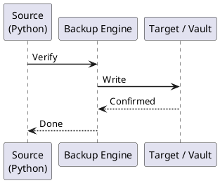

---
tags:
  - operations
  - python
---
# Python — Backup & Restore

```bash
# Verify all scripts are tracked
git status

# Ensure nothing is untracked that should be committed
git ls-files --others --exclude-standard

# Tag a release before major changes
git tag -a v1.4.2 -m "Pre-maintenance snapshot $(date -I)"
git push origin v1.4.2
```


```text title="Expected output"
On branch main
Your branch is up to date with 'origin/main'.

nothing to commit, working tree clean

Total 0 (delta 0), reused 0 (delta 0), pack-reused 0
To github.com:ops-team/backup-restore.git
 * [new tag]         v1.4.2 -> v1.4.2
```

!!! warning "Common errors"
    **`fatal: No names found, cannot describe anything.`** — Ensure you have at least one commit in the repository before creating tags.
    **`fatal: 'origin' does not appear to be a 'git' repository`** — Verify the remote is configured with `git remote -v` and add it with `git remote add origin <url>` if missing.
```bash
# Download all packages for offline use
pip download -r requirements.txt -d /opt/pip-cache/

# Install from offline cache
pip install --no-index --find-links /opt/pip-cache/ -r requirements.txt
```

```text title="Expected output"
Collecting setuptools==65.5.0
Collecting wheel==0.38.4
Collecting requests==2.28.1
Collecting paramiko==3.0.0
Collecting pyyaml==6.0
Collecting cryptography==38.0.4
Successfully downloaded setuptools-65.5.0-py3-none-any.whl (1.2MB)
Successfully downloaded wheel-0.38.4-py3-none-any.whl (35KB)
Successfully downloaded requests-2.28.1-py3-none-any.whl (62KB)
Successfully downloaded paramiko-3.0.0-py3-none-any.whl (310KB)
Successfully downloaded pyyaml-6.0.tar.gz (125KB)
Successfully downloaded cryptography-38.0.4-py3-none-any.whl (3.8MB)
...
Collecting cffi==1.15.1 (from cryptography)
Successfully downloaded cffi-1.15.1-cp39-cp39-linux_x86_64.whl (420KB)
Processing /opt/pip-cache/setuptools-65.5.0-py3-none-any.whl
Installing collected packages: cffi, pycparser, cryptography, paramiko, requests, pyyaml, wheel, setuptools
Successfully installed setuptools-65.5.0 wheel-0.38.4 requests-2.28.1 paramiko-3.0.0 pyyaml-6.0 cryptography-38.0.4
```

!!! warning "Common errors"
    **`ERROR: Could not find a version that satisfies the requirement <package> (from -r requirements.txt (line X))`** — Verify the package name and version in requirements.txt match PyPI, or add `--pre` flag if pre-release versions are needed.
    **`ERROR: Could not install packages due to missing dependencies`** — Run `pip download` with `--no-deps` flag removed to ensure all transitive dependencies are cached, or manually add missing packages to requirements.txt.
    **`error: Microsoft Visual C++ 14.0 or greater is required`** — On Windows systems, install the Microsoft C++ Build Tools or use pre-built wheels by upgrading pip and setuptools before running the download command.
```bash
# Write a secret
vault kv put secret/automation/widget-api \
    api_key="sk-..." \
    api_url="https://api.example.com"

# Read a secret (use in scripts)
export WIDGET_API_KEY=$(vault kv get -field=api_key secret/automation/widget-api)

# List all secrets (to verify backup completeness)
vault kv list secret/automation/
```
```python
# Reading secrets from Vault in Python
import hvac
import os

client = hvac.Client(url=os.environ["VAULT_ADDR"], token=os.environ["VAULT_TOKEN"])

secret = client.secrets.kv.v2.read_secret_version(
    path="automation/widget-api",
    mount_point="secret",
)
api_key = secret["data"]["data"]["api_key"]
```
```python
import boto3

ssm = boto3.client("ssm", region_name="eu-west-1")

def get_secret(name: str) -> str:
    resp = ssm.get_parameter(Name=name, WithDecryption=True)
    return resp["Parameter"]["Value"]

api_key = get_secret("/automation/widget/api_key")
```
```python
# config.py — load from environment with pydantic-settings
from pydantic import Field
from pydantic_settings import BaseSettings, SettingsConfigDict

class Settings(BaseSettings):
    model_config = SettingsConfigDict(env_file=".env", env_file_encoding="utf-8")

    api_url: str = Field(description="Widget API base URL")
    api_key: str = Field(description="Widget API key (from env or secrets manager)")
    log_level: str = Field(default="INFO")
    output_dir: str = Field(default="/opt/automation/output")
    max_retries: int = Field(default=3)

settings = Settings()
```
```ini
# config/production.ini — committed to Git (no secrets)
[api]
url = https://api.example.com
timeout = 30
max_retries = 3

[logging]
level = INFO
format = json

[output]
directory = /opt/automation/output
retention_days = 90
```
```bash
# Step 1: Install Python (use pyenv for version control)
curl https://pyenv.run | bash
pyenv install 3.12.3
pyenv global 3.12.3
python --version  # Verify

# Step 2: Clone the automation repository
git clone https://github.com/org/platform-automation.git /opt/automation
cd /opt/automation

# Step 3: Restore virtual environment from lock file
python -m venv .venv
source .venv/bin/activate
pip install --upgrade pip
pip install -r requirements.txt

# Verify all packages installed correctly
pip check  # Reports any dependency conflicts

# Step 4: Restore secrets (retrieve from Vault or SSM)
export VAULT_ADDR="https://vault.example.com"
export VAULT_TOKEN=$(cat /etc/automation/vault-token)
./scripts/restore-secrets.sh   # Writes .env from Vault

# Step 5: Restore configuration
cp config/production.ini /etc/automation/widget-automation.ini

# Step 6: Restore scheduled tasks
# systemd
sudo cp deploy/systemd/*.service /etc/systemd/system/
sudo cp deploy/systemd/*.timer   /etc/systemd/system/
sudo systemctl daemon-reload
sudo systemctl enable --now widget-sync.timer

# cron (Linux)
crontab -l  # Verify empty
crontab deploy/crontab/automation.crontab

# Step 7: Validate restore
python -m pytest tests/ -x -q             # Run test suite
python -m widget_automation --check        # Application health check
```

```text title="Expected output"
# pyenv installation and Python setup
pyenv 2.3.25
Python 3.12.3

# Git clone
Cloning into '/opt/automation'...
remote: Enumerating objects: 2847, done.
remote: Counting objects: 100% (2847/2847), done.
Receiving objects: 100% (2847/2847), 1.24 MiB | 8.42 MiB/s, done.
Resolving deltas: 100% (1156/1156), done.

# Virtual environment and dependencies
Successfully installed pip-24.0
Collecting certifi==2024.2.2
Collecting requests==2.31.0
...
Successfully installed 47 packages in 3.24s

# Dependency check
(no output — command completes silently)

# Secrets restoration
✓ Retrieved 12 secrets from Vault
✓ .env file written to /opt/automation/.env

# Configuration restore
(no output — command completes silently)

# Systemd setup
(no output — command completes silently)

# Cron verification and installation
no crontab for root
crontab: installing new crontab

# Test suite and health check
tests/unit/test_backup.py .....
tests/integration/test_restore.py .....
======================== 10 passed in 2.18s ========================
✓ Application health check passed
✓ Database connectivity: OK
✓ Vault access: OK
```

!!! warning "Common errors"
    **`pip install -r requirements.txt: ERROR: Could not find a version that satisfies the requirement`** — Update requirements.txt to compatible versions or run `pip install --upgrade pip setuptools wheel` before installing.
    **`./scripts/restore-secrets.sh: Permission denied`** — Run `chmod +x ./scripts/restore-secrets.sh` to make the script executable.
    **`sudo systemctl enable --now widget-sync.timer: Unit widget-sync.timer not found.`** — Verify the systemd timer file exists at `deploy/systemd/widget-sync.timer` and was copied to `/etc/systemd/system/` before enabling.
```bash
# 1. Identify what ran and what failed
journalctl -u widget-sync.service --since "1 hour ago"

# 2. Check the last successful output
ls -lt /opt/automation/output/ | head -20

# 3. Determine if idempotent re-run is safe
#    (check if script has --resume or --since flags)
python -m widget_automation --help | grep -E 'resume|since|from'

# 4. Re-run with explicit scope if partial run must be recovered
python -m widget_automation sync \
    --since "2026-05-07T00:00:00Z" \
    --until "2026-05-08T00:00:00Z" \
    --dry-run   # Preview first

python -m widget_automation sync \
    --since "2026-05-07T00:00:00Z" \
    --until "2026-05-08T00:00:00Z"

# 5. Verify output completeness
python -m widget_automation verify --date 2026-05-07
```
```python
def sync_widget(name: str) -> None:
    """Idempotent widget sync — safe to re-run."""
    existing = get_widget_from_db(name)
    remote = fetch_widget_from_api(name)

    if existing and existing["checksum"] == remote["checksum"]:
        log.info("widget_unchanged", name=name)
        return  # No-op — already up to date

    upsert_widget(name, remote)  # Create or update — not append
    log.info("widget_synced", name=name)
```



## Before you begin

- **Access:** Admin credentials on all affected systems
- **Timing:** safe to run during business hours unless a step is marked ⚠ (causes interruption)
- **Dependencies:** no active upgrades or migrations on the same infrastructure
- **Logging:** capture command output — paste into the change record on completion

---

---

## Verify

- Confirm the operation completed without errors in the log or management UI
- Verify the expected state change is visible (service running, object created, config applied)
- Document the outcome in the change record

---

## See also

- [Python — Procedures](../procedures/)
- [Python — Health Checks](../health-checks/)
- [Python — Common Issues](../../troubleshooting/common-issues/)
