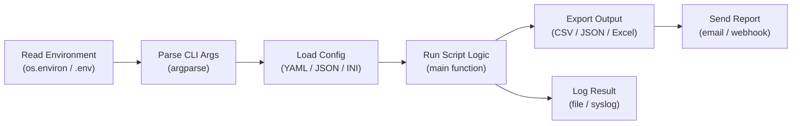

---
tags:
  - operations
  - python
---
# Python Automation — CLI Reference


<div class="kb-summary">
CLI Reference reference covering Python Script Execution Pipeline, Package Management (pip), Common Infrastructure Packages, Environment Variables, Running Scripts and 3 more sections.

*Applies to: Python 3.x*
</div>

## Before you begin

- **Access:** Python 3.10+ installed on the control host; `pip` or `pipx` available
- **Timing:** safe to run at any time — all commands below are read-only unless noted
- **Dependencies:** virtual environment activated (`source venv/bin/activate`) before running scripts

---

## Python Script Execution Pipeline


```text
┌─────────────────────────────────────── Python — CLI Reference ────────────────────────────────────────┐
│   ┌───────────────────────────────────────────────────────────────────────────────────────────────┐   │
│   │         Essential Python CLI commands for development, testing, and package management        │   │
│   └───────────────────────────────────────────────────────────────────────────────────────────────┘   │
│                                                                                                       │
│   ┌──────────────────────────────────────────────┐  ┌─────────────────────────────────────────────┐   │
│   │               Python and venv                │  │                     pip                     │   │
│   │              python3 --version               │  │            pip install <package>            │   │
│   │            python3 -m venv .venv             │  │       pip install -r requirements.txt       │   │
│   │              python3 script.py               │  │             pip list --outdated             │   │
│   │          python3 -c "import boto3"           │  │              pip show <package>             │   │
│   │           python3 -m pdb script.py           │  │        pip freeze > requirements.txt        │   │
│   └──────────────────────────────────────────────┘  └─────────────────────────────────────────────┘   │
│                                                                                                       │
│   ┌──────────────────────────────────────────────┐  ┌─────────────────────────────────────────────┐   │
│   │                    pytest                    │  │                 Code Quality                │   │
│   │                pytest tests/                 │  │              ruff check . --fix             │   │
│   │            pytest -v -k test_name            │  │                ruff format .                │   │
│   │           pytest --cov=src tests/            │  │              mypy src/ --strict             │   │
│   │        pytest -x (stop on first fail)        │  │                bandit -r src/               │   │
│   └──────────────────────────────────────────────┘  └─────────────────────────────────────────────┘   │
│                                                                                                       │
│   ┌───────────────────────────────────────────────────────────────────────────────────────────────┐   │
│   │        pdb          = Python Debugger; breakpoint() in code or python3 -m pdb script.py       │   │
│   │  --cov        = pytest-cov plugin; generates coverage report; set threshold in pyproject.toml │   │
│   │  ruff         = replaces flake8 + black + isort; configured in [tool.ruff] in pyproject.toml  │   │
│   └───────────────────────────────────────────────────────────────────────────────────────────────┘   │
└───────────────────────────────────────────────────────────────────────────────────────────────────────┘
```

---

## Common Infrastructure Packages

| Package | Install | Purpose |
|---|---|---|
| `requests` | `pip install requests` | HTTP client for REST APIs |
| `paramiko` | `pip install paramiko` | SSH client for automation |
| `boto3` | `pip install boto3` | AWS SDK (S3, EC2, etc.) |
| `pyVmomi` | `pip install pyVmomi` | VMware vSphere API (Python) |
| `netapp-ontap` | `pip install netapp-ontap` | NetApp ONTAP REST API SDK |
| `py-pure-client` | `pip install py-pure-client` | Pure Storage FlashArray/FlashBlade/Pure1 SDK |
| `ansible` | `pip install ansible` | Ansible automation engine |
| `ansible-core` | `pip install ansible-core` | Ansible core only (lighter) |
| `python-dotenv` | `pip install python-dotenv` | Load `.env` files into environment |
| `pyyaml` | `pip install pyyaml` | YAML parsing |
| `jinja2` | `pip install jinja2` | Templating engine |
| `cryptography` | `pip install cryptography` | TLS, keys, certificates |
| `urllib3` | `pip install urllib3` | HTTP library (used by requests) |

```bash
# Install a typical infra automation environment
pip install requests paramiko boto3 pyVmomi netapp-ontap py-pure-client \
  python-dotenv pyyaml ansible-core
```

---

## Environment Variables

```bash
# Pass environment variables to a Python script
API_KEY=mykey python3 script.py

# Read in Python
import os
api_key = os.environ["API_KEY"]                     # raises if missing
api_key = os.environ.get("API_KEY", "default")      # safe with fallback

# Using .env file (python-dotenv)
# .env file:
#   API_KEY=mykey
#   API_URL=https://api.example.com

from dotenv import load_dotenv
load_dotenv()
api_key = os.environ.get("API_KEY")
```

---

## Running Scripts

```bash
# Standard run
python3 script.py

# Pass arguments
python3 script.py --host 10.0.0.1 --port 443 --verbose

# Run as a module (script lives in a package)
python3 -m mypackage.script

# Pipe JSON into a script
curl -s https://api.example.com/data | python3 parse.py

# One-liner to pretty-print JSON from a file
python3 -m json.tool data.json

# One-liner to pretty-print JSON from curl
curl -s https://api.example.com/status | python3 -m json.tool
```

---

## Debugging

```bash
# Run with pdb (Python debugger) — breaks at first line
python3 -m pdb script.py

# Embed a breakpoint in code (Python 3.7+)
# Add to your script:
breakpoint()     # drops into pdb at this line

# Post-mortem: inspect state after an unhandled exception
python3 -c "
import pdb, traceback
try:
    exec(open('script.py').read())
except Exception:
    traceback.print_exc()
    pdb.post_mortem()
"

# Verbose import errors (find why a module is missing)
python3 -v script.py 2>&1 | grep -i "error\|fail\|not found"

# Check if a module is importable
python3 -c "import netapp_ontap; print('OK')"

# Find where a module is installed
python3 -c "import netapp_ontap; print(netapp_ontap.__file__)"
```

### Logging vs print

```python
# Prefer logging over print() for production scripts
import logging
logging.basicConfig(level=logging.INFO,
                    format="%(asctime)s %(levelname)s %(message)s")
logger = logging.getLogger(__name__)

logger.info("Connecting to %s", host)
logger.warning("Capacity above 90%%")
logger.error("Connection failed: %s", err)

# Enable debug level via environment
import os
level = logging.DEBUG if os.environ.get("DEBUG") else logging.INFO
logging.basicConfig(level=level)
```

---

## Windows-Specific

On Windows, the Python Launcher (`py`) is the preferred way to invoke Python when multiple versions are installed.

```powershell
# Check installed versions
py -0

# Run with a specific version
py -3 script.py
py -3.11 script.py

# Invoke pip via the launcher (avoids PATH conflicts)
py -3 -m pip install requests
py -3 -m pip list

# Create venv
py -3 -m venv venv

# Activate venv (PowerShell)
.\venv\Scripts\Activate.ps1

# If script execution is blocked, allow PS scripts (run as admin once)
Set-ExecutionPolicy -ExecutionPolicy RemoteSigned -Scope CurrentUser

# Activate venv (cmd.exe)
venv\Scripts\activate.bat
```

### Common Windows Issues

```powershell
# python not found — use py instead
py script.py

# pip not found — use module syntax
py -m pip install requests

# SSL errors on corporate proxy
py -m pip install --trusted-host pypi.org --trusted-host files.pythonhosted.org requests

# Behind proxy
$env:HTTPS_PROXY = "http://proxy.example.com:8080"
py -m pip install requests

# Line endings causing issues (scripts from Linux)
# In Git, set: git config --global core.autocrlf input
```

---

## requirements.txt Best Practices

```bash
# Pin exact versions for reproducible deployments
pip freeze > requirements.txt

# Or maintain a hand-crafted file with minimum versions:
# requirements.txt
# requests>=2.31.0
# netapp-ontap>=22.11.0
# boto3>=1.34.0
# paramiko>=3.4.0
# pyyaml>=6.0.1

# Separate dev dependencies
pip freeze > requirements-dev.txt   # full dev environment
# Keep requirements.txt lean for production

# Install and test in a clean venv
python3 -m venv venv-test
source venv-test/bin/activate
pip install -r requirements.txt
python3 -c "import requests, boto3, paramiko; print('All imports OK')"
deactivate
rm -rf venv-test
```

---

## Verify

- Confirm the operation completed without errors in the log or management UI
- Verify the expected state change is visible (service running, object created, config applied)
- Document the outcome in the change record
