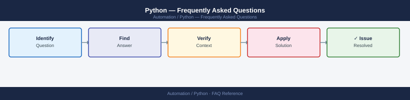

---
tags:
  - python
  - faq
  - operations
---
# Python — Frequently Asked Questions

*Applies to: Python 3.x*

Common questions about Python operations, configuration, and troubleshooting. For step-by-step procedures, see the <a href="index.md">Operations</a> section.

## General

**Q: What Python version is recommended for new infrastructure tooling?**
A: Python 3.11 or 3.12 LTS. Avoid 3.8 (EOL Oct 2024). Check with `python3 --version` or `python3 -c 'import sys; print(sys.version)'`.

**Q: How do I check the current Python version?**
A: `python3 --version`

## Configuration

**Q: What is the recommended virtual environment approach?**
A: `venv` (stdlib) for simple projects. `poetry` or `pdm` for dependency management with lockfiles. Avoid `conda` in production infrastructure tooling unless data science libraries require it.

**Q: How do I enable structured logging in a Python automation script?**
A: Use the `logging` stdlib with `logging.basicConfig(format='%(asctime)s %(levelname)s %(message)s', level=logging.INFO)`. For JSON logs, use `python-json-logger`.

## Operations

**Q: How do I upgrade a Python automation tool across all hosts without downtime?**
A: Use a blue/green deployment: install new version in a new venv, test, then update the symlink. For cron-driven tools, deploy outside the cron window.

**Q: What is the correct procedure to add a new Python dependency?**
A: Add to `pyproject.toml` or `requirements.in`, regenerate the lockfile (`pip-compile`), test in a fresh venv, then deploy. Never `pip install` directly on production without a lockfile update.

## Troubleshooting

**Q: Script shows 'DeprecationWarning: datetime.datetime.utcnow()'. What does it mean?**
A: Python 3.12 deprecated `utcnow()`. Replace with `datetime.now(timezone.utc)` which returns a timezone-aware object and is the correct approach going forward.

**Q: Script is slow processing large data sets — where do I start?**
A: Profile with `cProfile` or `py-spy`. Check for unnecessary loops over large lists (use generators). Consider `multiprocessing.Pool` for CPU-bound work. For I/O-bound, use `asyncio`.

## Backup and Recovery

**Q: How often should I back up Python scripts and configuration?**
A: All code in Git with pinned lockfiles (`requirements.txt` or `poetry.lock`). Configuration in a secrets manager. Commit lockfile changes alongside dependency updates.

**Q: Can I restore a deleted function without a full repo restore?**
A: Yes — `git log --all -S 'def function_name'` finds the commit where it existed. Use `git show <hash>:path/file.py` to recover it.

## See Also

- [Python Operations](index.md)
- [Python Troubleshooting](../../troubleshooting//)
