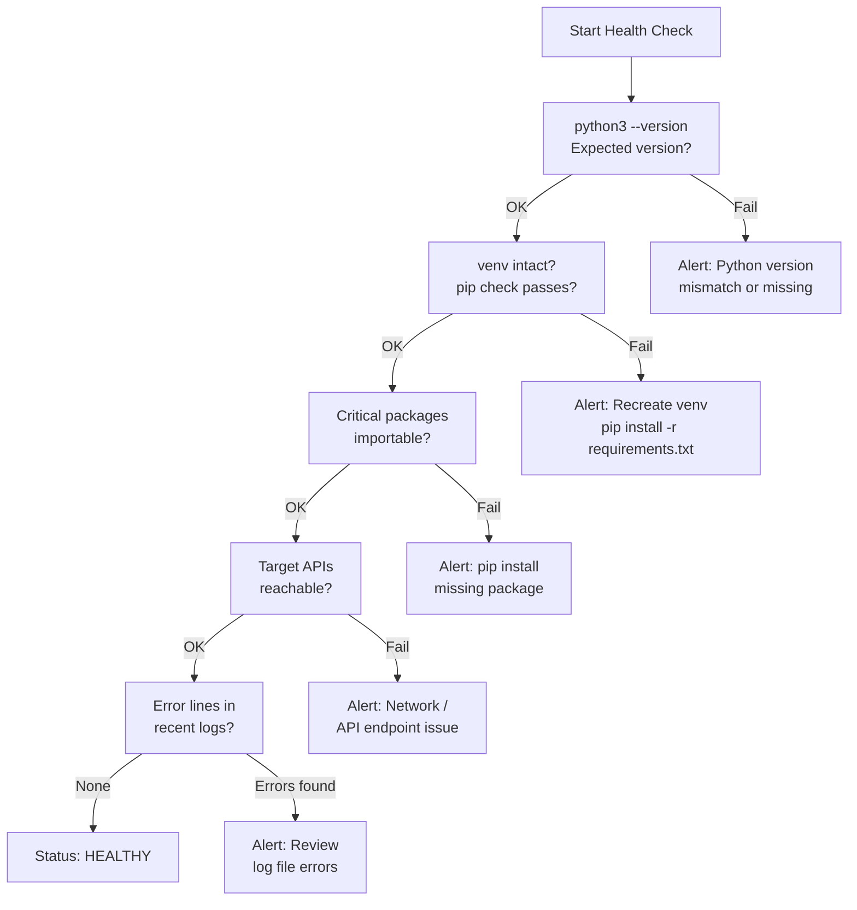

# Python Automation — Health Checks

## Python Automation Health Check Flow



## Daily Checks

| Check | Command | Notes |
|---|---|---|
| [ ] Confirm all scheduled Python automation jobs ran successfully in t |  | check cron logs, output files, or email alert summaries |
| [ ] Review any error output or non-zero exit codes from yesterday's ru | `/var/log/cron` |  |
| [ ] Confirm API tokens used by production scripts have not expired (ch |  |  |
| [ ] Review any scripts that interact with external APIs |  | confirm the API endpoints are reachable and returning expected responses |

## Health Check

```bash
# Check Python version installed on the automation host
python3 --version

# Confirm the virtual environment is intact (activate and check)
source /opt/automation/venv/bin/activate
python3 -m pip check

# Verify critical packages are importable
python3 -c "import boto3; import requests; import paramiko; print('Core imports OK')"

# Check for packages with known security vulnerabilities
pip audit

# Check connectivity from the automation host to target APIs (example: Dell API Gateway)
curl -s -o /dev/null -w "%{http_code}" https://apigw.dell.com/cloudiq/v1/health

# Review last 50 lines of the cron log to check for job failures
grep CRON /var/log/syslog | tail -50

# Check exit codes of recent job runs (if using a log wrapper)
grep -E "(ERROR|exit code [^0]|Traceback)" /var/log/automation/*.log | tail -30

# Check for outdated packages (run monthly)
pip list --outdated
```

## Incident Triage

**On alert or issue:**
1. Identify the failing script and the last successful run time — check cron logs (`grep CRON /var/log/syslog`) and script log files
2. Reproduce the failure manually in a test shell to get the full traceback:
   ```bash
   source /opt/automation/venv/bin/activate
   python3 /opt/automation/scripts/failing_script.py 2>&1 | tee /tmp/debug_run.log
   ```
3. Check the error type in the traceback to determine the root cause category
4. Apply the appropriate fix from the triage table below
5. After fixing, run the script manually once and confirm successful output before re-enabling the cron job

| Symptom | Likely Cause | Action |
|---|---|---|
| `ModuleNotFoundError: No module named 'X'` | Package not installed in active venv | `source /opt/automation/venv/bin/activate && pip install <package>` |
| `401 Unauthorized` from API call | Expired or revoked API token | Regenerate token in the target system's API settings, update token in config/secrets store |
| `ConnectionError` or `requests.exceptions.Timeout` | Target API unreachable or network timeout | Confirm API endpoint from automation host: `curl -v <api_url>`; check firewall and proxy settings |
| `JSONDecodeError` or `KeyError` in response parsing | API response format changed | Compare current response against expected schema, update parsing logic, check API changelog |
| `PermissionError` writing output file | File permissions or path issue | Check output directory permissions: `ls -la /path/to/output/`, fix with `chmod` or `chown` |
| Script ran but produced empty or unexpected output | Logic error or upstream data change | Add debug logging and re-run manually; compare against last known good output |
| Cron job not running at all | Cron daemon not running or syntax error in crontab | Check `systemctl status cron`; validate crontab with `crontab -l`; check `/var/log/syslog` for cron errors |
