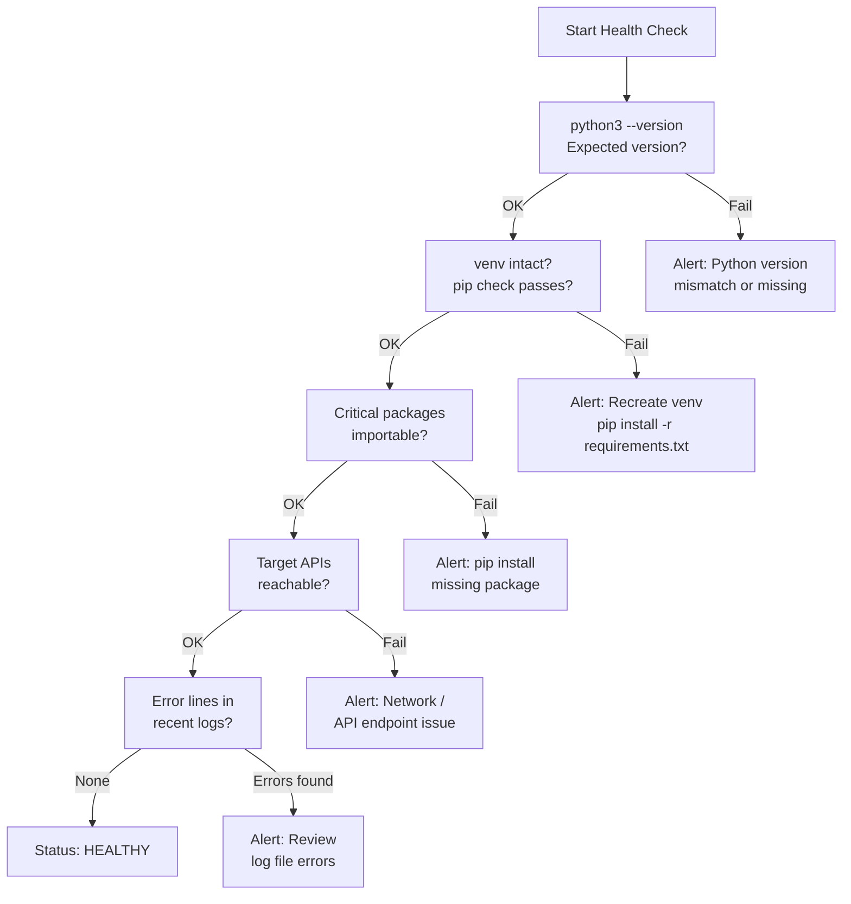

# Python Automation — Health Checks

## Python Automation Health Check Flow


┌─────────────────────────────────────── Python — Health Checks ────────────────────────────────────────┐
│   ┌───────────────────────────────────────────────────────────────────────────────────────────────┐   │
│   │  Python health checks: verify interpreter version, venv, dependency currency, test pass rate  │   │
│   │      CI pipeline is the primary health gate: ruff + mypy + bandit + pytest must all pass      │   │
│   │             Dependency audit: pip list --outdated; safety check; monthly CVE scan             │   │
│   └───────────────────────────────────────────────────────────────────────────────────────────────┘   │
│                                                                                                       │
│   ┌──────────────────────────────────────────────┐  ┌─────────────────────────────────────────────┐   │
│   │              Environment Checks              │  │                Quality Checks               │   │
│   │          python3 --version (>=3.11)          │  │           pytest (all tests pass)           │   │
│   │             pip list --outdated              │  │          ruff check . (zero errors)         │   │
│   │           safety check (CVE scan)            │  │           mypy src/ (zero errors)           │   │
│   │           python -c "import <lib>"           │  │          bandit -r src/ (zero high)         │   │
│   │         Check .python-version match          │  │            Coverage report >= 80%           │   │
│   └──────────────────────────────────────────────┘  └─────────────────────────────────────────────┘   │
│                                                                                                       │
│   ┌───────────────────────────────────────────────────────────────────────────────────────────────┐   │
│   │   safety check   = queries PyPI advisory database; reports known CVEs in installed packages   │   │
│   │    .python-version= pyenv file; records required Python version; auto-activates with pyenv    │   │
│   │        Dependabot     = GitHub service; auto-creates PRs to update dependencies weekly        │   │
│   └───────────────────────────────────────────────────────────────────────────────────────────────┘   │
└───────────────────────────────────────────────────────────────────────────────────────────────────────┘
```

## Incident Triage

**On alert or issue:**
1. Identify the failing script and the last successful run time — check cron logs (`grep CRON /var/log/syslog`) and script log files
2. Reproduce the failure manually in a test shell to get the full traceback:
   ```bash
   source /opt/automation/venv/bin/activate
   python3 /opt/automation/scripts/failing_script.py 2>&1 | tee /tmp/debug_run.log
   ```
3. Check the error type in the traceback to determine the root cause category
4. Apply the appropriate fix from the triage table below
5. After fixing, run the script manually once and confirm successful output before re-enabling the cron job

| Symptom | Likely Cause | Action |
|---|---|---|
| `ModuleNotFoundError: No module named 'X'` | Package not installed in active venv | `source /opt/automation/venv/bin/activate && pip install <package>` |
| `401 Unauthorized` from API call | Expired or revoked API token | Regenerate token in the target system's API settings, update token in config/secrets store |
| `ConnectionError` or `requests.exceptions.Timeout` | Target API unreachable or network timeout | Confirm API endpoint from automation host: `curl -v <api_url>`; check firewall and proxy settings |
| `JSONDecodeError` or `KeyError` in response parsing | API response format changed | Compare current response against expected schema, update parsing logic, check API changelog |
| `PermissionError` writing output file | File permissions or path issue | Check output directory permissions: `ls -la /path/to/output/`, fix with `chmod` or `chown` |
| Script ran but produced empty or unexpected output | Logic error or upstream data change | Add debug logging and re-run manually; compare against last known good output |
| Cron job not running at all | Cron daemon not running or syntax error in crontab | Check `systemctl status cron`; validate crontab with `crontab -l`; check `/var/log/syslog` for cron errors |
