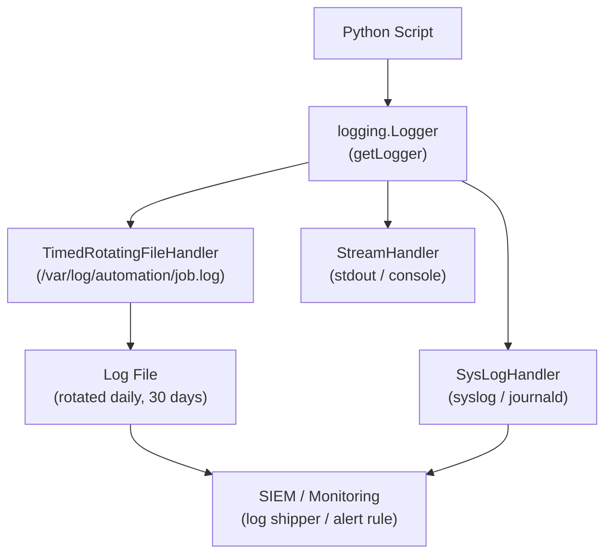

# Python Automation — Procedures


<div class="kb-summary">
Procedures reference covering Change Readiness, Maintenance Window, Post-Change Validation, Python Logging Pipeline, Reports.
</div>

## Change Readiness

- [ ] The change has been tested end-to-end in a non-production environment before touching the production script
- [ ] The current cron schedule for the affected script has been noted (run `crontab -l` on the automation user)
- [ ] A backup of the existing production script has been taken:
  ```bash
  cp /opt/automation/scripts/my_script.py /opt/automation/scripts/my_script.py.bak.$(date +%Y%m%d)
  ```
- [ ] API tokens used by the script have been confirmed current and not near expiry
- [ ] Connectivity from the automation host to all target APIs/systems has been confirmed
- [ ] If the script writes output files or sends alerts, the output destinations have been confirmed accessible

| Item | Status | Notes |
|---|---|---|
| Change tested in dev/non-prod environment | | |
| Cron schedule for affected script documented | | |
| Production script backed up with datestamp | | |
| API tokens confirmed current | | |
| Connectivity to target APIs confirmed | | |
| Output destinations (files, email, webhook) accessible | | |

## Maintenance Window

**Before a maintenance window that affects automation targets (e.g., storage array, API endpoint):**

1. Identify all scripts that interact with the target system:
   ```bash
   grep -r "<target_hostname_or_api>" /opt/automation/scripts/ --include="*.py" -l
   ```
2. Comment out or temporarily disable the affected cron jobs:
   ```bash
   crontab -e
   # Add a # before the relevant cron entries
   ```
3. Confirm the jobs are disabled by verifying no scheduled runs will occur during the window
4. Perform the maintenance window on the target system
5. Re-enable the cron jobs after the window:
   ```bash
   crontab -e
   # Remove the # from the relevant cron entries
   ```
6. Run the script manually once to confirm it completes successfully against the restored target
7. Monitor the output of the first two scheduled runs after re-enabling

## Post-Change Validation

- [ ] Script runs manually without errors:
  ```bash
  source /opt/automation/venv/bin/activate
  python3 /opt/automation/scripts/modified_script.py
  ```
- [ ] Output matches expected format and content
- [ ] No new errors in the script log file after the manual run
- [ ] Cron job re-enabled and confirmed active (`crontab -l`)
- [ ] First scheduled run after the change completes successfully and output is verified
- [ ] Second scheduled run also completes successfully (confirms no transient issue)
- [ ] Backup copy of the previous script version retained for at least 30 days

## Python Logging Pipeline


```text
┌───────────────────────────────────────── Python — Procedures ─────────────────────────────────────────┐
│   ┌───────────────────────────────────────────────────────────────────────────────────────────────┐   │
│   │  Common Python operational procedures: new project setup, dependency audit, release packaging │   │
│   │    New project: git init → pyproject.toml → venv → install deps → first test → CI pipeline    │   │
│   │    Release: bump version → update CHANGELOG → tag → build wheel → publish to internal PyPI    │   │
│   └───────────────────────────────────────────────────────────────────────────────────────────────┘   │
│                                                                                                       │
│   ┌──────────────────────────────────────────────┐  ┌─────────────────────────────────────────────┐   │
│   │              New Project Setup               │  │              Release Procedure              │   │
│   │           1. git init + .gitignore           │  │      1. Bump version in pyproject.toml      │   │
│   │       2. pyproject.toml (poetry init)        │  │            2. Update CHANGELOG.md           │   │
│   │           3. python3 -m venv .venv           │  │           3. git tag v1.2.3 + push          │   │
│   │         4. poetry install (dev deps)         │  │              4. python -m build             │   │
│   │          5. Add CI workflow (.yml)           │  │            5. twine upload dist/*           │   │
│   └──────────────────────────────────────────────┘  └─────────────────────────────────────────────┘   │
│                                                                                                       │
│   ┌───────────────────────────────────────────────────────────────────────────────────────────────┐   │
│   │    twine        = package upload tool; uploads wheel/sdist to PyPI or internal Artifactory    │   │
│   │              build        = python -m build; creates dist/*.whl and dist/*.tar.gz             │   │
│   │    internal PyPI= host with Nexus, Artifactory, or devpi; configure with pip.conf index-url   │   │
│   └───────────────────────────────────────────────────────────────────────────────────────────────┘   │
└───────────────────────────────────────────────────────────────────────────────────────────────────────┘
```

```python
from apscheduler.schedulers.blocking import BlockingScheduler
from apscheduler.triggers.cron import CronTrigger
import logging

logging.basicConfig(level=logging.INFO)
log = logging.getLogger(__name__)

scheduler = BlockingScheduler()

@scheduler.scheduled_job(CronTrigger(hour=6, minute=0))
def daily_report():
    log.info("Running daily report")
    # ... report logic ...

@scheduler.scheduled_job('interval', minutes=15)
def health_check():
    log.info("Running health check")
    # ... check logic ...

if __name__ == '__main__':
    log.info("Scheduler starting")
    scheduler.start()
```

### Job Logging

Good logging is essential for scheduled jobs running unattended.

```python
import logging
import logging.handlers
from pathlib import Path

def configure_logging(job_name: str, log_dir: str = '/var/log/automation') -> logging.Logger:
    Path(log_dir).mkdir(parents=True, exist_ok=True)
    log_file = f"{log_dir}/{job_name}.log"

    logger = logging.getLogger(job_name)
    logger.setLevel(logging.INFO)

    # Rotate at midnight, keep 30 days
    handler = logging.handlers.TimedRotatingFileHandler(
        log_file, when='midnight', backupCount=30
    )
    handler.setFormatter(logging.Formatter(
        '%(asctime)s %(levelname)s %(name)s: %(message)s',
        datefmt='%Y-%m-%d %H:%M:%S'
    ))
    logger.addHandler(handler)
    logger.addHandler(logging.StreamHandler())  # also print to stdout
    return logger
```

### Idempotency Patterns

Automation jobs should produce the same result whether run once or many times.

```python
import json
from pathlib import Path
from datetime import date

STATE_FILE = Path('/var/lib/automation/daily_report_state.json')

def load_state() -> dict:
    if STATE_FILE.exists():
        return json.loads(STATE_FILE.read_text())
    return {}

def save_state(state: dict) -> None:
    STATE_FILE.parent.mkdir(parents=True, exist_ok=True)
    STATE_FILE.write_text(json.dumps(state, default=str))

def run_daily_report():
    state = load_state()
    today = str(date.today())

    if state.get('last_run_date') == today:
        print(f"Report already generated for {today}, skipping.")
        return

    # ... generate report ...
    print(f"Report generated for {today}")

    state['last_run_date'] = today
    save_state(state)
```

### Job Design Checklist

| Concern | Practice |
|---|---|
| Logging | Write timestamped logs to a file; rotate regularly |
| Error handling | Catch exceptions; log full tracebacks; exit with non-zero on failure |
| Idempotency | Check state before acting; safe to re-run without side effects |
| Timeouts | Set timeouts on all network and subprocess calls |
| Notifications | Alert on failure via email or monitoring system |
| Locking | Use a lockfile to prevent overlapping runs |

```python
import fcntl, sys

lock_file = open('/var/run/my_job.lock', 'w')
try:
    fcntl.flock(lock_file, fcntl.LOCK_EX | fcntl.LOCK_NB)
except OSError:
    print("Another instance is already running. Exiting.")
    sys.exit(0)
# ... job runs here ...
fcntl.flock(lock_file, fcntl.LOCK_UN)
```

## Reports

### pandas DataFrames

pandas is the standard library for tabular data manipulation in Python.

```bash
pip install pandas openpyxl
```

```python
import pandas as pd

# Create a DataFrame from a list of dicts
data = [
    {'host': 'web01', 'cpu': 45.2, 'memory': 72.1, 'disk': 38.0},
    {'host': 'web02', 'cpu': 12.8, 'memory': 55.3, 'disk': 61.4},
    {'host': 'db01',  'cpu': 88.6, 'memory': 91.0, 'disk': 74.2},
]
df = pd.DataFrame(data)

# Filter rows where CPU > 50%
high_cpu = df[df['cpu'] > 50]

# Add a calculated column
df['status'] = df['cpu'].apply(lambda x: 'critical' if x > 80 else 'ok')

# Summary statistics
print(df.describe())
print(df.groupby('status').size())
```

### CSV and Excel Output

```python
# Export to CSV
df.to_csv('reports/host_metrics.csv', index=False, encoding='utf-8')

# Read back
df = pd.read_csv('reports/host_metrics.csv')

# Export to Excel with multiple sheets
with pd.ExcelWriter('reports/server_report.xlsx', engine='openpyxl') as writer:
    df.to_excel(writer, sheet_name='All Hosts', index=False)
    high_cpu.to_excel(writer, sheet_name='High CPU', index=False)

# Read from Excel
df = pd.read_excel('reports/server_report.xlsx', sheet_name='All Hosts')
```

### Jinja2 HTML Reports

Jinja2 templates separate report logic from HTML structure.

```bash
pip install jinja2
```

```python
from jinja2 import Environment, FileSystemLoader
from pathlib import Path
from datetime import datetime

template_str = """<!DOCTYPE html>
<html>
<head>
  <style>
    body { font-family: Arial, sans-serif; }
    table { border-collapse: collapse; width: 100%; }
    th, td { border: 1px solid #ccc; padding: 8px; text-align: left; }
    tr.critical { background-color: #fdd; }
    tr.ok { background-color: #dfd; }
  </style>
</head>
<body>
  <h1>Server Health Report</h1>
  <p>Generated: {{ generated_at }}</p>
  <table>
    <tr><th>Host</th><th>CPU %</th><th>Memory %</th><th>Status</th></tr>
    
    <tr class="{{ row.status }}">
      <td>{{ row.host }}</td>
      <td>{{ row.cpu }}</td>
      <td>{{ row.memory }}</td>
      <td>{{ row.status }}</td>
    </tr>
    
  </table>
</body>
</html>"""

env = Environment()
template = env.from_string(template_str)
html = template.render(
    generated_at=datetime.now().strftime('%Y-%m-%d %H:%M:%S'),
    rows=data
)
Path('reports/health.html').write_text(html, encoding='utf-8')
```

### Sending Reports by Email

```python
import smtplib
from email.mime.multipart import MIMEMultipart
from email.mime.text import MIMEText
from email.mime.base import MIMEBase
from email import encoders
from pathlib import Path

def send_report(
    smtp_host: str,
    to_addresses: list[str],
    subject: str,
    html_body: str,
    attachments: list[str] = None
) -> None:
    msg = MIMEMultipart('alternative')
    msg['Subject'] = subject
    msg['From'] = 'automation@example.com'
    msg['To'] = ', '.join(to_addresses)
    msg.attach(MIMEText(html_body, 'html'))

    for path in (attachments or []):
        part = MIMEBase('application', 'octet-stream')
        part.set_payload(Path(path).read_bytes())
        encoders.encode_base64(part)
        part.add_header('Content-Disposition', f'attachment; filename="{Path(path).name}"')
        msg.attach(part)

    with smtplib.SMTP(smtp_host, 587) as smtp:
        smtp.starttls()
        smtp.sendmail(msg['From'], to_addresses, msg.as_string())
```

### Reporting Format Comparison

| Format | Library | Best for |
|---|---|---|
| CSV | `pandas` / `csv` | Data exchange, Excel import |
| Excel (.xlsx) | `pandas` + `openpyxl` | Rich tables, multi-sheet, formulas |
| HTML | `jinja2` | Emailed reports, browser viewing |
| JSON | `json` / `pandas` | API output, programmatic consumption |
| PDF | `weasyprint` / `reportlab` | Formal printed documents |
| Markdown | plain string | Wiki, GitHub, MkDocs |

## Create and Manage a Virtual Environment

`python3 -m venv .venv` → `source .venv/bin/activate` (Linux/Mac) or `.venv\Scripts\activate` (Windows) → install packages → `deactivate` when done.

```bash
# Create a virtual environment in the project directory
python3 -m venv .venv

# Activate (Linux / macOS)
source .venv/bin/activate

# Activate (Windows — PowerShell)
.venv\Scripts\Activate.ps1

# Activate (Windows — cmd.exe)
.venv\Scripts\activate.bat

# Confirm the active environment
which python          # Linux/macOS
where python          # Windows
python --version

# Install packages into the active environment
pip install requests pandas

# Save dependencies to a requirements file
pip freeze > requirements.txt

# Install from a requirements file
pip install -r requirements.txt

# Deactivate when done
deactivate
```

| Practice | Reason |
|---|---|
| One venv per project | Prevents dependency conflicts between projects |
| Add `.venv/` to `.gitignore` | The venv is not portable — recreate from `requirements.txt` |
| Pin versions in `requirements.txt` | Reproducible installs across environments |
| Use `pip install -e .` | Install the project itself as editable for development |

## Package and Publish to PyPI

`pip install build twine` → `python -m build` → `twine upload dist/*` → verify at pypi.org.

```bash
# Install build tools
pip install build twine

# Ensure pyproject.toml is complete (name, version, description, dependencies)

# Build source distribution and wheel
python -m build
# Output: dist/mypackage-1.0.0.tar.gz and dist/mypackage-1.0.0-py3-none-any.whl

# Check the distribution before uploading
twine check dist/*

# Upload to TestPyPI first to verify
twine upload --repository testpypi dist/*
# Test install: pip install --index-url https://test.pypi.org/simple/ mypackage

# Upload to PyPI (production)
twine upload dist/*
# Prompts for PyPI username and API token

# Using a stored .pypirc to avoid entering credentials each time
# ~/.pypirc
# [pypi]
# username = __token__
# password = pypi-<your-api-token>
```

| Step | Command |
|---|---|
| Build | `python -m build` |
| Pre-upload check | `twine check dist/*` |
| Test upload | `twine upload --repository testpypi dist/*` |
| Production upload | `twine upload dist/*` |
| Verify | `pip install mypackage` from a clean environment |

## Write and Run Unit Tests

`pip install pytest` → create `test_*.py` files → `pytest -v` → check coverage with `pytest --cov=mymodule`.

```bash
# Install pytest and coverage plugin
pip install pytest pytest-cov

# Create a test file (must match test_*.py or *_test.py naming)
# test_utils.py
```

```python
# test_utils.py
from mymodule.utils import add_numbers, sanitise_input

def test_add_numbers_positive():
    assert add_numbers(2, 3) == 5

def test_add_numbers_negative():
    assert add_numbers(-1, 1) == 0

def test_sanitise_input_strips_whitespace():
    assert sanitise_input("  hello  ") == "hello"

def test_sanitise_input_raises_on_empty():
    import pytest
    with pytest.raises(ValueError):
        sanitise_input("")
```

```bash
# Run all tests
pytest -v

# Run tests in a specific file
pytest tests/test_utils.py -v

# Run a single test by name
pytest tests/test_utils.py::test_add_numbers_positive

# Run with coverage report
pytest --cov=mymodule --cov-report=term-missing

# Generate HTML coverage report
pytest --cov=mymodule --cov-report=html
# Open htmlcov/index.html in a browser
```

| Pytest feature | Usage |
|---|---|
| `-v` | Verbose output — show each test name and pass/fail |
| `-x` | Stop after the first failure |
| `-k "keyword"` | Run only tests whose name matches the keyword |
| `--tb=short` | Compact traceback on failures |
| `--cov` | Measure which lines of code were executed by tests |

## Use Environment Variables for Configuration

`import os; val = os.environ.get('MY_VAR', 'default')` → set in shell: `export MY_VAR=value` → use python-dotenv for `.env` files: `from dotenv import load_dotenv; load_dotenv()`.

```python
import os
from pathlib import Path

# Read an environment variable with a default fallback
db_host = os.environ.get('DB_HOST', 'localhost')
db_port = int(os.environ.get('DB_PORT', '5432'))
api_key = os.environ.get('API_KEY')          # returns None if not set

# Fail fast if a required variable is missing
if not api_key:
    raise EnvironmentError("API_KEY environment variable is required but not set")
```

```bash
# Set variables in the current shell session
export DB_HOST=db.prod.example.com
export API_KEY=my-secret-token

# Run the script with inline variable (does not persist)
DB_HOST=db.staging.example.com python3 my_script.py
```

```bash
# Install python-dotenv for .env file support
pip install python-dotenv
```

```python
# .env file (never commit to git)
# DB_HOST=localhost
# API_KEY=dev-token-123

from dotenv import load_dotenv
import os

load_dotenv()           # reads .env from the current directory
db_host = os.environ.get('DB_HOST')
api_key = os.environ.get('API_KEY')
```

| Approach | Best for |
|---|---|
| `os.environ.get('VAR', 'default')` | Simple config with safe fallbacks |
| `os.environ['VAR']` | Required variables — raises `KeyError` if missing |
| `python-dotenv` + `.env` file | Local development without exporting to the shell |
| CI/CD secrets | Set in the pipeline; accessed via `os.environ` at runtime |
| Never hardcode secrets | Avoids credentials leaking in version control |
