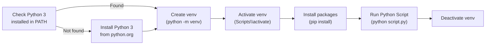

# Python Automation — Scripts

## Purpose

Use this page for practical Python scripts, field-tested commands, known issues, and operational notes.

## Windows Python Environment Setup Flow


```

Or simply double-click the `run-py-script.bat` file in File Explorer.

**What you should see**

The script prints numbered progress steps (1/5 through 5/5), installs packages on first run (subsequent runs skip this if already installed), then prints the output of your Python script. A "Script completed successfully." message appears at the end if the script exits cleanly. The window pauses so you can read the output before it closes.

---

## Windows: Python Environment Setup (PowerShell)

One-time setup script that verifies Python 3 is installed, creates a virtual environment in your Documents folder, installs common infrastructure packages, and validates that each key package imports correctly. Run this once before using any Python scripts in this KB.

~~~powershell
# setup-python-env.ps1
# Run once to set up your Python environment on Windows.
# Usage: Right-click → Run with PowerShell  (or see step-by-step guide below)

#Requires -Version 5.1

$ErrorActionPreference = "Stop"

$VenvPath = Join-Path $env:USERPROFILE "Documents\kb-venv"
$Packages = @(
    "py-pure-client",
    "pyVmomi",
    "requests",
    "netapp-ontap",
    "paramiko",
    "boto3"
)

Write-Host ""
Write-Host "=== Python Environment Setup ===" -ForegroundColor Cyan
Write-Host "Virtual environment: $VenvPath"
Write-Host ""

# --- Step 1: Check for Python 3 ---
Write-Host "[1/5] Checking for Python 3..." -ForegroundColor Yellow
$pythonCmd = $null

foreach ($cmd in @("python", "python3")) {
    try {
        $ver = & $cmd --version 2>&1
        if ($ver -match "Python 3\.") {
            $pythonCmd = $cmd
            Write-Host "Found: $ver (command: $cmd)" -ForegroundColor Green
            break
        }
    } catch { }
}

if (-not $pythonCmd) {
    Write-Host ""
    Write-Host "ERROR: Python 3 is not installed or not in PATH." -ForegroundColor Red
    Write-Host ""
    Write-Host "To install Python 3, run the following command in a terminal:" -ForegroundColor Yellow
    Write-Host "  winget install Python.Python.3" -ForegroundColor White
    Write-Host ""
    Write-Host "Or download manually from https://python.org/downloads/" -ForegroundColor White
    Write-Host "During install, check 'Add Python to PATH'." -ForegroundColor White
    Write-Host ""
    Read-Host "Press Enter to exit"
    exit 1
}

# --- Step 2: Create virtual environment ---
Write-Host ""
Write-Host "[2/5] Setting up virtual environment..." -ForegroundColor Yellow

if (Test-Path (Join-Path $VenvPath "Scripts\Activate.ps1")) {
    Write-Host "Virtual environment already exists at $VenvPath, skipping creation." -ForegroundColor Green
} else {
    Write-Host "Creating virtual environment at $VenvPath..."
    & $pythonCmd -m venv $VenvPath
    Write-Host "Virtual environment created." -ForegroundColor Green
}

# --- Step 3: Activate virtual environment ---
Write-Host ""
Write-Host "[3/5] Activating virtual environment..." -ForegroundColor Yellow
$activateScript = Join-Path $VenvPath "Scripts\Activate.ps1"
. $activateScript
Write-Host "Activated." -ForegroundColor Green

# --- Step 4: Install packages ---
Write-Host ""
Write-Host "[4/5] Installing packages..." -ForegroundColor Yellow
python -m pip install --quiet --upgrade pip
foreach ($pkg in $Packages) {
    Write-Host "  Installing $pkg..."
    python -m pip install --quiet $pkg
}
Write-Host "All packages installed." -ForegroundColor Green

# --- Step 5: Test imports ---
Write-Host ""
Write-Host "[5/5] Testing package imports..." -ForegroundColor Yellow

$importTests = @{
    "py-pure-client" = "import purestorage"
    "pyVmomi"        = "import pyVmomi"
    "boto3"          = "import boto3"
    "requests"       = "import requests"
    "paramiko"       = "import paramiko"
    "netapp-ontap"   = "import netapp_ontap"
}

$results = @()
foreach ($entry in $importTests.GetEnumerator()) {
    $pkg  = $entry.Key
    $stmt = $entry.Value
    try {
        $output = python -c $stmt 2>&1
        if ($LASTEXITCODE -eq 0) {
            $results += [PSCustomObject]@{ Package = $pkg; Status = "OK"; Version = (python -c "import importlib.metadata; print(importlib.metadata.version('$pkg'))" 2>$null) }
        } else {
            $results += [PSCustomObject]@{ Package = $pkg; Status = "FAIL"; Version = "-" }
        }
    } catch {
        $results += [PSCustomObject]@{ Package = $pkg; Status = "FAIL"; Version = "-" }
    }
}

# --- Summary ---
Write-Host ""
Write-Host "=== Installed Package Summary ===" -ForegroundColor Cyan
Write-Host ("{0,-20} {1,-10} {2}" -f "Package", "Status", "Version")
Write-Host ("-" * 50)
foreach ($r in $results) {
    $color = if ($r.Status -eq "OK") { "Green" } else { "Red" }
    Write-Host ("{0,-20} {1,-10} {2}" -f $r.Package, $r.Status, $r.Version) -ForegroundColor $color
}

$failed = $results | Where-Object { $_.Status -ne "OK" }
Write-Host ""
if ($failed) {
    Write-Host "WARNING: $($failed.Count) package(s) failed to import. Review errors above." -ForegroundColor Red
} else {
    Write-Host "SUCCESS: All packages imported successfully." -ForegroundColor Green
    Write-Host "Your Python environment is ready. Activate it with:" -ForegroundColor White
    Write-Host "  . `"$activateScript`"" -ForegroundColor White
}

Write-Host ""
Read-Host "Press Enter to exit"
~~~

### How to run this script — step by step

**Before you start — what you need**
- A Windows PC (Windows 10 or later)
- Internet access to download packages from PyPI
- Administrator rights are not required, but PowerShell must be able to run scripts (the guide covers this)

**Step 1 — Save the file**

1. Open **Notepad** on your Windows PC (search in the Start menu)
2. Copy the entire code block above
3. Click **File → Save As**
4. Set "Save as type" to **All Files**
5. Name it `setup-python-env.ps1` and save it to your Desktop

**Step 2 — Fill in your details**

This script uses sensible defaults. The only value you may want to change is the virtual environment path:

| Variable | What to enter | Where to find it |
|---|---|---|
| `$VenvPath` | Folder where the virtual environment is created | Defaults to `Documents\kb-venv` — change if you prefer a different location |

**Step 3 — Open a terminal**

Press `Windows key`, type `PowerShell`, right-click **Windows PowerShell**, and select **Run as Administrator**.

**Step 4 — Allow scripts to run**

In the PowerShell window, paste and press Enter:

```powershell
Set-ExecutionPolicy -Scope Process -ExecutionPolicy Bypass
```

**Step 5 — Run the script**

```bash
cd C:\Users\YourName\Desktop
.\setup-python-env.ps1
```

**What you should see**

The script steps through 5 numbered stages printed in yellow. If Python is missing it prints installation instructions and stops. Otherwise it creates the virtual environment, installs all six packages, then tests each import and prints a colour-coded summary table showing the package name, OK/FAIL status, and installed version. A green "SUCCESS" message confirms everything is ready.
