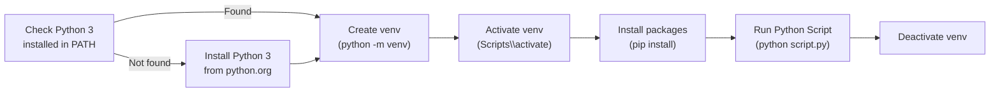

# Python Automation — Scripts


<div class="kb-summary">
Scripts reference covering Purpose, Windows Python Environment Setup Flow.
</div>

## Purpose

Use this page for practical Python scripts, field-tested commands, known issues, and operational notes.

## Windows Python Environment Setup Flow


```
┌────────────────────────────────────────── Python — Scripts ───────────────────────────────────────────┐
│   ┌───────────────────────────────────────────────────────────────────────────────────────────────┐   │
│   │Python utility scripts for infrastructure automation: AWS reporting, storage health, AD queries│   │
│   └───────────────────────────────────────────────────────────────────────────────────────────────┘   │
│                                                                                                       │
│   ┌─────────────────────────────┐  ┌─────────────────────────────┐  ┌─────────────────────────────┐   │
│   │         AWS Scripts         │  │       Storage Scripts       │  │       Network Scripts       │   │
│   │       ec2_inventory.py      │  │       unity_health.py       │  │     bgp_prefix_check.py     │   │
│   │         sg_audit.py         │  │      netapp_capacity.py     │  │     interface_errors.py     │   │
│   │        cost_report.py       │  │     snapshot_cleanup.py     │  │         dns_check.py        │   │
│   │       s3_lifecycle.py       │  │      replication_lag.py     │  │        cert_expiry.py       │   │
│   └─────────────────────────────┘  └─────────────────────────────┘  └─────────────────────────────┘   │
│                                                                                                       │
│   ┌───────────────────────────────────────────────────────────────────────────────────────────────┐   │
│   │  Script structure = argparse for CLI args; logging module for output; sys.exit() return codes │   │
│   │           boto3 pattern    = boto3.Session(profile_name=args.profile).client("ec2")           │   │
│   │ Output format    = JSON for machine parsing; tabulate/rich for human-readable terminal output │   │
│   └───────────────────────────────────────────────────────────────────────────────────────────────┘   │
└───────────────────────────────────────────────────────────────────────────────────────────────────────┘
```
```

**What you should see**

The script steps through 5 numbered stages printed in yellow. If Python is missing it prints installation instructions and stops. Otherwise it creates the virtual environment, installs all six packages, then tests each import and prints a colour-coded summary table showing the package name, OK/FAIL status, and installed version. A green "SUCCESS" message confirms everything is ready.
