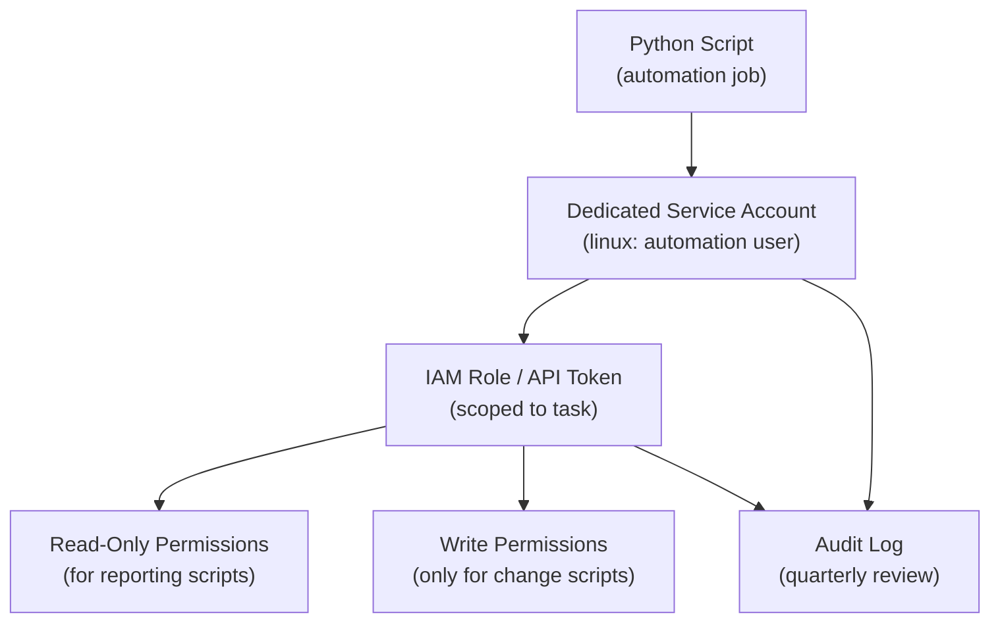

# Python Automation — Access Control

## Least Privilege Access Model



```python
# Verify the script is running as the expected user at startup
import os, sys

EXPECTED_USER = "automation"
if os.getlogin() != EXPECTED_USER:
    sys.exit(f"ERROR: This script must run as '{EXPECTED_USER}', not '{os.getlogin()}'")
```

## AWS IAM Least Privilege

```json
{
  "Version": "2012-10-17",
  "Statement": [
    {
      "Effect": "Allow",
      "Action": [
        "s3:GetObject",
        "s3:PutObject"
      ],
      "Resource": "arn:aws:s3:::my-automation-bucket/*"
    },
    {
      "Effect": "Allow",
      "Action": [
        "ec2:DescribeInstances"
      ],
      "Resource": "*"
    }
  ]
}
```

```bash
# Verify effective permissions for an IAM role
aws sts get-caller-identity
aws iam simulate-principal-policy \
  --policy-source-arn arn:aws:iam::123456789:role/automation-role \
  --action-names s3:GetObject \
  --resource-arns arn:aws:s3:::my-bucket/*
```

## Access Policies Reference

| Principle | Practice |
|---|---|
| Least privilege | Grant only the permissions the script actually needs |
| Separation of duties | Read-only scripts use read-only tokens; write scripts use write tokens |
| Token scoping | Scope API tokens to specific resources, not entire platforms |
| Account isolation | Use a dedicated service account — never a personal account |
| Regular review | Audit script credentials and permissions quarterly |
