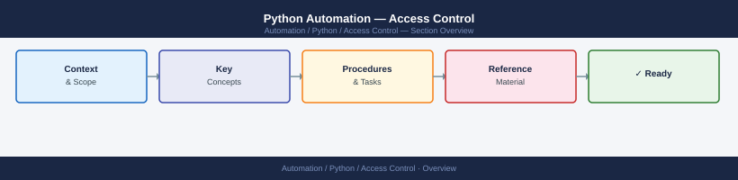
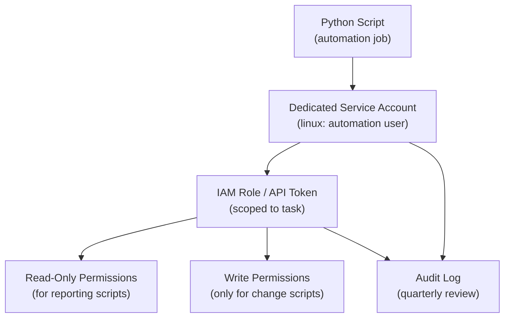

---
tags:
  - python
  - security
---
# Python Automation — Access Control


<div class="kb-summary">
Access Control reference covering Least Privilege Access Model, AWS IAM Least Privilege, Access Policies Reference.

*Applies to: Python 3.x*
</div>



```d2
direction: down

root: "Python\nAccess Control" {shape: hexagon}
least_privilege_access_model: "Least Privilege Access Model" {shape: rectangle}
access_policies_reference: "Access Policies Reference" {shape: rectangle}
resources: Protected Resources {shape: cylinder}

root -> least_privilege_access_model: role
least_privilege_access_model -> resources: scoped
root -> access_policies_reference: role
access_policies_reference -> resources: scoped
```

## Before you begin

- **Access:** Admin credentials on all affected systems
- **Change management:** security changes require CAB approval in most environments
- **Rollback plan:** document current state before any security control change
- **Testing:** validate in a non-production environment first where possible

---

## Least Privilege Access Model




```bash
# Verify effective permissions for an IAM role
aws sts get-caller-identity
aws iam simulate-principal-policy \
  --policy-source-arn arn:aws:iam::123456789:role/automation-role \
  --action-names s3:GetObject \
  --resource-arns arn:aws:s3:::my-bucket/*
```

## Access Policies Reference

| Principle | Practice |
|---|---|
| Least privilege | Grant only the permissions the script actually needs |
| Separation of duties | Read-only scripts use read-only tokens; write scripts use write tokens |
| Token scoping | Scope API tokens to specific resources, not entire platforms |
| Account isolation | Use a dedicated service account — never a personal account |
| Regular review | Audit script credentials and permissions quarterly |

---

## See also

- [Python — Authentication](../authentication/)
- [Python — Hardening](../hardening/)
- [Python — Encryption](../encryption/)
