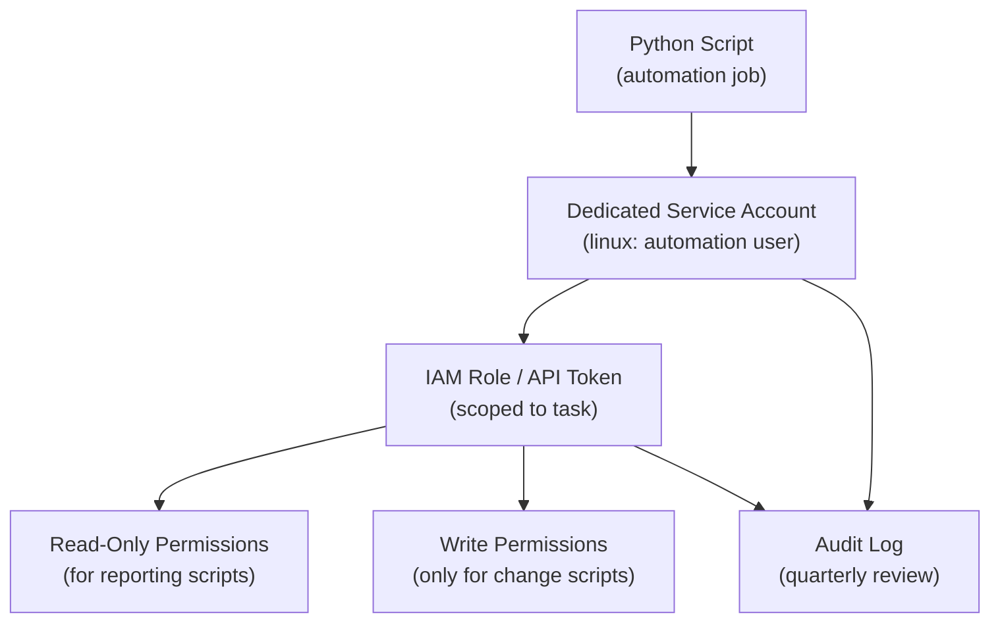

# Python Automation — Access Control


<div class="kb-summary">
Access Control reference covering Least Privilege Access Model, AWS IAM Least Privilege, Access Policies Reference.
</div>

## Least Privilege Access Model


```
┌─────────────────────────────────────── Python — Access Control ───────────────────────────────────────┐
│   ┌───────────────────────────────────────────────────────────────────────────────────────────────┐   │
│   │ Python access control: who can run scripts, API auth, file permissions, repo branch protection│   │
│   │      Destructive scripts: require explicit --confirm flag; prompt before prod environment     │   │
│   │     API auth: use IAM roles (AWS), service principals (Azure), service accounts (GCP/k8s)     │   │
│   └───────────────────────────────────────────────────────────────────────────────────────────────┘   │
│                                                                                                       │
│   ┌──────────────────────────────────────────────┐  ┌─────────────────────────────────────────────┐   │
│   │            Script Access Controls            │  │              API Auth Patterns              │   │
│   │          --dry-run flag for preview          │  │       boto3: IAM role via EC2 instance      │   │
│   │        --confirm for destructive ops         │  │        requests: Bearer token header        │   │
│   │         Env var for target env check         │  │         paramiko: SSH key auth only         │   │
│   │        Restrict executable: chmod 750        │  │         No username+password in code        │   │
│   └──────────────────────────────────────────────┘  └─────────────────────────────────────────────┘   │
│                                                                                                       │
│   ┌───────────────────────────────────────────────────────────────────────────────────────────────┐   │
│   │     --dry-run    = show what would change without making changes; implement in all scripts    │   │
│   │      IAM role     = EC2/Lambda instance profile; boto3 picks up credentials automatically     │   │
│   │    chmod 750    = owner execute, group execute, no world access; protect sensitive scripts    │   │
│   └───────────────────────────────────────────────────────────────────────────────────────────────┘   │
└───────────────────────────────────────────────────────────────────────────────────────────────────────┘
```

```bash
# Verify effective permissions for an IAM role
aws sts get-caller-identity
aws iam simulate-principal-policy \
  --policy-source-arn arn:aws:iam::123456789:role/automation-role \
  --action-names s3:GetObject \
  --resource-arns arn:aws:s3:::my-bucket/*
```

## Access Policies Reference

| Principle | Practice |
|---|---|
| Least privilege | Grant only the permissions the script actually needs |
| Separation of duties | Read-only scripts use read-only tokens; write scripts use write tokens |
| Token scoping | Scope API tokens to specific resources, not entire platforms |
| Account isolation | Use a dedicated service account — never a personal account |
| Regular review | Audit script credentials and permissions quarterly |
