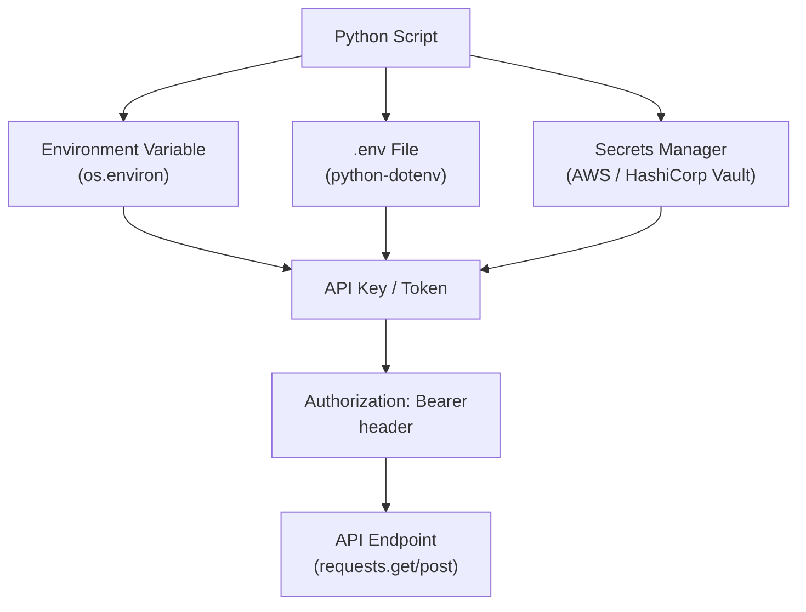

# Python Automation — Authentication


<div class="kb-summary">
Authentication reference covering Credential Flow — API Authentication, .env Files with python-dotenv, OAuth 2.0 (Client Credentials), Credential Management Reference.
</div>

## Credential Flow — API Authentication



```text
┌─────────────────────────────────────── Python — Authentication ───────────────────────────────────────┐
│   ┌───────────────────────────────────────────────────────────────────────────────────────────────┐   │
│   │     Python authentication: boto3 credential chain, paramiko SSH key, requests auth classes    │   │
│   │    boto3 credential chain: env var → ~/.aws/credentials → IAM role → container credentials    │   │
│   │         Never use access keys in code; prefer IAM roles (EC2) or OIDC (GitHub Actions)        │   │
│   └───────────────────────────────────────────────────────────────────────────────────────────────┘   │
│                                                                                                       │
│   ┌──────────────────────────────────────────────┐  ┌─────────────────────────────────────────────┐   │
│   │              AWS Authentication              │  │              SSH and REST Auth              │   │
│   │          IAM role: boto3.Session()           │  │       paramiko.RSAKey.from_private_key      │   │
│   │           Assume role: STS client            │  │         requests.auth.HTTPBasicAuth         │   │
│   │        boto3.Session(profile_name=X)         │  │       Bearer: headers={"Auth": "..."}       │   │
│   │           No hardcoded access keys           │  │          OAuth2: requests-oauthlib          │   │
│   └──────────────────────────────────────────────┘  └─────────────────────────────────────────────┘   │
│                                                                                                       │
│   ┌───────────────────────────────────────────────────────────────────────────────────────────────┐   │
│   │      STS AssumeRole = boto3 STS client; returns temp credentials for cross-account access     │   │
│   │     Credential chain= boto3 tries in order: env vars, shared file, container, EC2 metadata    │   │
│   │  keyring library = OS keychain integration; python-keyring; store/retrieve API tokens safely  │   │
│   └───────────────────────────────────────────────────────────────────────────────────────────────┘   │
└───────────────────────────────────────────────────────────────────────────────────────────────────────┘
```

```python
from dotenv import load_dotenv
import os

load_dotenv()   # loads .env from the current directory

api_key = os.environ.get("API_KEY")
api_url = os.environ.get("API_URL", "https://api.example.com")
```

```bash
# .env file — add to .gitignore
API_KEY=mykey
API_URL=https://api.example.com
DB_PASSWORD=s3cr3t
```

## OAuth 2.0 (Client Credentials)

Used for machine-to-machine authentication where no user interaction is needed.

```python
import requests

def get_access_token(token_url: str, client_id: str, client_secret: str, scope: str) -> str:
    resp = requests.post(
        token_url,
        data={
            "grant_type": "client_credentials",
            "client_id": client_id,
            "client_secret": client_secret,
            "scope": scope,
        },
        timeout=30,
    )
    resp.raise_for_status()
    return resp.json()["access_token"]

token = get_access_token(
    token_url="https://auth.example.com/oauth/token",
    client_id=os.environ["CLIENT_ID"],
    client_secret=os.environ["CLIENT_SECRET"],
    scope="read:servers write:servers",
)

headers = {"Authorization": f"Bearer {token}"}
```

## Credential Management Reference

| Method | Use case | Store secret in |
|---|---|---|
| Environment variable | Any script | Shell, CI/CD secrets, systemd unit |
| `.env` file | Local development | Not in version control |
| AWS Secrets Manager | AWS-hosted scripts | IAM role, not hardcoded |
| HashiCorp Vault | Multi-cloud / on-prem | Vault token via env var |
| Python keyring | Interactive desktop tools | OS keychain |
