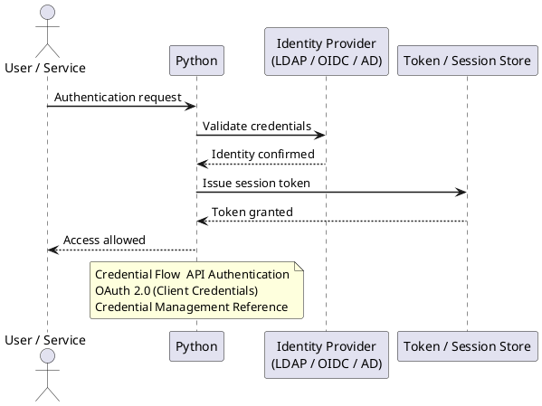
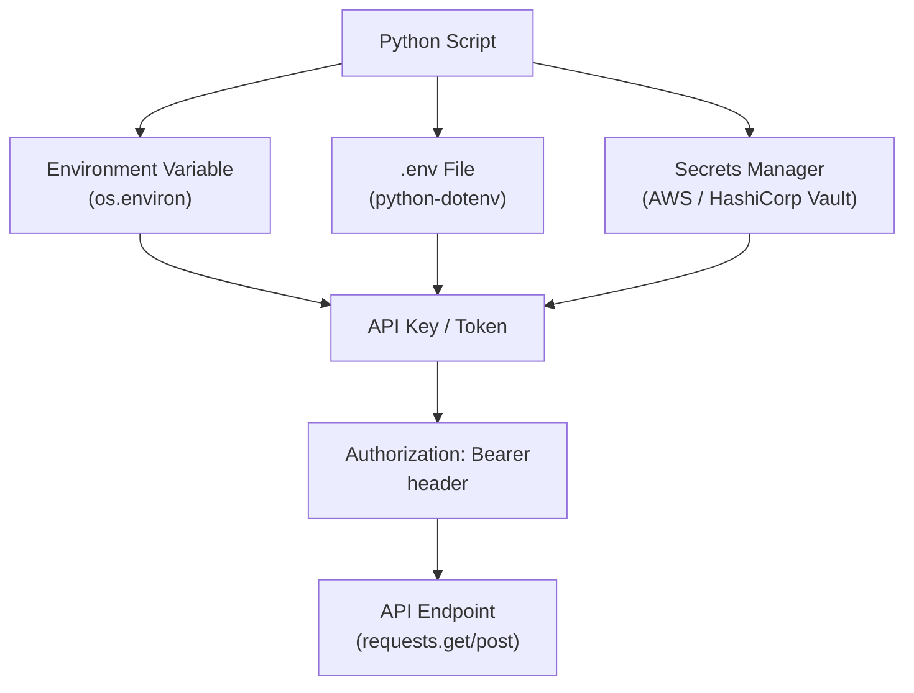

---
tags:
  - python
  - security
---
# Python Automation — Authentication

<div class="kb-summary">
Authentication reference covering Credential Flow — API Authentication, .env Files with python-dotenv, OAuth 2.0 (Client Credentials), Credential Management Reference.

*Applies to: Python 3.x*
</div>



## Before you begin

- **Access:** Admin credentials on all affected systems
- **Change management:** security changes require CAB approval in most environments
- **Rollback plan:** document current state before any security control change
- **Testing:** validate in a non-production environment first where possible

---

## Credential Flow — API Authentication



```python
from dotenv import load_dotenv
import os

load_dotenv()   # loads .env from the current directory

api_key = os.environ.get("API_KEY")
api_url = os.environ.get("API_URL", "https://api.example.com")
```

```bash
# .env file — add to .gitignore
API_KEY=mykey
API_URL=https://api.example.com
DB_PASSWORD=s3cr3t
```

## OAuth 2.0 (Client Credentials)

Used for machine-to-machine authentication where no user interaction is needed.

```python
import requests

def get_access_token(token_url: str, client_id: str, client_secret: str, scope: str) -> str:
    resp = requests.post(
        token_url,
        data={
            "grant_type": "client_credentials",
            "client_id": client_id,
            "client_secret": client_secret,
            "scope": scope,
        },
        timeout=30,
    )
    resp.raise_for_status()
    return resp.json()["access_token"]

token = get_access_token(
    token_url="https://auth.example.com/oauth/token",
    client_id=os.environ["CLIENT_ID"],
    client_secret=os.environ["CLIENT_SECRET"],
    scope="read:servers write:servers",
)

headers = {"Authorization": f"Bearer {token}"}
```

## Credential Management Reference

| Method | Use case | Store secret in |
|---|---|---|
| Environment variable | Any script | Shell, CI/CD secrets, systemd unit |
| `.env` file | Local development | Not in version control |
| AWS Secrets Manager | AWS-hosted scripts | IAM role, not hardcoded |
| HashiCorp Vault | Multi-cloud / on-prem | Vault token via env var |
| Python keyring | Interactive desktop tools | OS keychain |

---

## See also

- [Python — Access Control](../access-control/)
- [Python — Hardening](../hardening/)
- [Python — Encryption](../encryption/)
