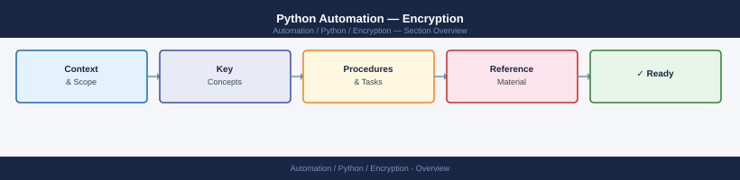
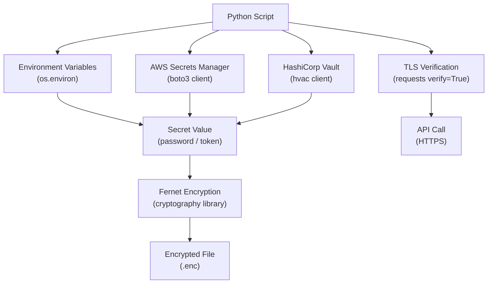

---
tags:
  - python
  - security
---
# Python Automation — Encryption


<div class="kb-summary">
Encryption reference covering Secrets and Encryption Architecture, Encrypting Local Files with cryptography, Encryption Reference.

*Applies to: Python 3.x*
</div>



## Before you begin

- **Access:** Admin credentials on all affected systems
- **Change management:** security changes require CAB approval in most environments
- **Rollback plan:** document current state before any security control change
- **Testing:** validate in a non-production environment first where possible

---

## Secrets and Encryption Architecture




## Encrypting Local Files with cryptography

```bash
pip install cryptography
```

```python
from cryptography.fernet import Fernet
import os

# Generate and store a key (store in a secrets manager, not in source code)
key = Fernet.generate_key()   # returns bytes — keep this secret

# Encrypt a file
fernet = Fernet(key)
plaintext = b"sensitive configuration data"
ciphertext = fernet.encrypt(plaintext)

with open("config.enc", "wb") as f:
    f.write(ciphertext)

# Decrypt
with open("config.enc", "rb") as f:
    ciphertext = f.read()

plaintext = fernet.decrypt(ciphertext)
```

## Encryption Reference

| Scenario | Approach |
|---|---|
| API credentials at rest | Environment variables or secrets manager |
| Credentials in CI/CD | CI/CD platform secrets (GitHub Actions secrets, GitLab CI variables) |
| File encryption | `cryptography` library with Fernet or AES-GCM |
| TLS in transit | Always `verify=True`; use custom CA bundle for internal PKI |
| SSH keys | Generate with `ssh-keygen -t ed25519`; restrict permissions with `chmod 600` |

---

## See also

- [Python — Hardening](../hardening/)
- [Python — Authentication](../authentication/)
- [Python — Access Control](../access-control/)
