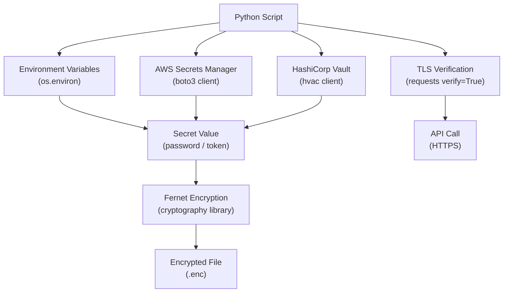

# Python Automation — Encryption

## Secrets and Encryption Architecture



## Secrets Management

Never store secrets in source code, logs, or plain-text config files.

```python
import os

# Read secrets from environment variables
db_password = os.environ["DB_PASSWORD"]
api_token   = os.environ["API_TOKEN"]

# Fetch secrets from AWS Secrets Manager at runtime
import boto3, json

def get_secret(secret_name: str, region: str = "eu-west-1") -> dict:
    client = boto3.client("secretsmanager", region_name=region)
    response = client.get_secret_value(SecretId=secret_name)
    return json.loads(response["SecretString"])

secret = get_secret("prod/myapp/db")
db_host = secret["host"]
db_pass = secret["password"]
```

## TLS and Certificate Verification

Always verify TLS certificates. Only disable verification in isolated test environments.

```python
import requests

# Default: verify=True — always leave enabled in production
resp = requests.get("https://api.example.com/v1/data", timeout=30)

# Custom CA bundle (e.g. internal PKI)
resp = requests.get(
    "https://internal.example.com/api",
    verify="/etc/ssl/certs/internal-ca.crt",
    timeout=30,
)

# Disable verification — development only, never in production
# resp = requests.get(url, verify=False)   # triggers InsecureRequestWarning
```

```bash
# Update the system CA bundle if API certs are self-signed
sudo cp internal-ca.crt /usr/local/share/ca-certificates/
sudo update-ca-certificates

# Test connectivity with certificate verification
openssl s_client -connect api.example.com:443 -CAfile /etc/ssl/certs/ca-certificates.crt
```

## Encrypting Local Files with cryptography

```bash
pip install cryptography
```

```python
from cryptography.fernet import Fernet
import os

# Generate and store a key (store in a secrets manager, not in source code)
key = Fernet.generate_key()   # returns bytes — keep this secret

# Encrypt a file
fernet = Fernet(key)
plaintext = b"sensitive configuration data"
ciphertext = fernet.encrypt(plaintext)

with open("config.enc", "wb") as f:
    f.write(ciphertext)

# Decrypt
with open("config.enc", "rb") as f:
    ciphertext = f.read()

plaintext = fernet.decrypt(ciphertext)
```

## Encryption Reference

| Scenario | Approach |
|---|---|
| API credentials at rest | Environment variables or secrets manager |
| Credentials in CI/CD | CI/CD platform secrets (GitHub Actions secrets, GitLab CI variables) |
| File encryption | `cryptography` library with Fernet or AES-GCM |
| TLS in transit | Always `verify=True`; use custom CA bundle for internal PKI |
| SSH keys | Generate with `ssh-keygen -t ed25519`; restrict permissions with `chmod 600` |
