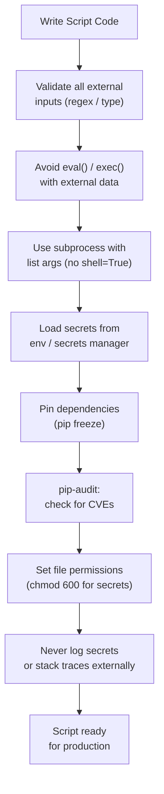

# Python Automation — Hardening

## Secure Script Development Checklist Flow



## Secure Coding Practices

```python
# Use subprocess safely — avoid shell=True with user-controlled input
import subprocess

# SAFE — arguments as a list
result = subprocess.run(["ls", "-la", "/opt/scripts"], capture_output=True, text=True, check=True)

# UNSAFE — shell=True with string interpolation risks command injection
# result = subprocess.run(f"ls -la {user_input}", shell=True)   # never do this

# Validate and sanitise all inputs before using them in commands
import re

def validate_hostname(hostname: str) -> str:
    if not re.match(r'^[a-zA-Z0-9._-]{1,253}$', hostname):
        raise ValueError(f"Invalid hostname: {hostname}")
    return hostname
```

```python
# Avoid eval() and exec() with untrusted data
# Use json.loads() instead of eval() for parsing API responses
import json

# SAFE
data = json.loads(response.text)

# UNSAFE
# data = eval(response.text)   # never eval untrusted strings
```

## Dependency Management

Keep dependencies pinned and regularly audited.

```bash
# Pin all dependencies for reproducible builds
pip freeze > requirements.txt

# Audit for known vulnerabilities
pip install pip-audit
pip-audit

# Check a specific package
pip-audit --require requests

# Update a vulnerable package
pip install --upgrade requests

# Scan with safety (alternative tool)
pip install safety
safety check -r requirements.txt
```

## File and Permission Security

```python
import os
import stat

# Write sensitive files with restricted permissions
def write_secret_file(path: str, content: str) -> None:
    with open(path, "w") as f:
        f.write(content)
    # Restrict to owner read/write only (600)
    os.chmod(path, stat.S_IRUSR | stat.S_IWUSR)

# Check a file has safe permissions before reading
def safe_read(path: str) -> str:
    file_stat = os.stat(path)
    if file_stat.st_mode & (stat.S_IRWXG | stat.S_IRWXO):
        raise PermissionError(f"{path} is readable by group or others — tighten permissions")
    return open(path).read()
```

## Hardening Checklist

| Area | Practice |
|---|---|
| Secrets | Never hardcode; use env vars or secrets manager |
| Inputs | Validate and sanitise all external inputs |
| Dependencies | Pin versions; audit regularly with `pip-audit` |
| subprocess | Use list arguments; never `shell=True` with user input |
| eval/exec | Never use with untrusted data |
| File permissions | Restrict sensitive files to `600`; scripts to `700` |
| Logging | Never log secrets, tokens, or passwords |
| Error messages | Do not expose internal paths or stack traces to external callers |
