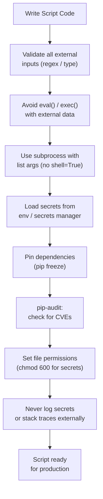

# Python Automation — Hardening


<div class="kb-summary">
Hardening reference covering Secure Script Development Checklist Flow, Dependency Management, File and Permission Security, Hardening Checklist.
</div>

## Secure Script Development Checklist Flow


```text
┌───────────────────────────────────────── Python — Hardening ──────────────────────────────────────────┐
│   ┌───────────────────────────────────────────────────────────────────────────────────────────────┐   │
│   │  Harden Python automation: input validation, subprocess safety, dep pinning, pre-commit hooks │   │
│   │       subprocess: always use list args; never shell=True with user input; capture stderr      │   │
│   │     YAML: use yaml.safe_load() not yaml.load(); prevents arbitrary Python object execution    │   │
│   └───────────────────────────────────────────────────────────────────────────────────────────────┘   │
│                                                                                                       │
│   ┌──────────────────────────────────────────────┐  ┌─────────────────────────────────────────────┐   │
│   │                Code Hardening                │  │              Pipeline Hardening             │   │
│   │       subprocess list args (no shell)        │  │      bandit + ruff in CI (block merge)      │   │
│   │       yaml.safe_load() not yaml.load()       │  │         pre-commit: bandit, gitleaks        │   │
│   │        Validate + type-cast all input        │  │        Dependabot or Renovate weekly        │   │
│   │        Use pathlib, not os.path.join         │  │       SBOM: pip-licenses --format=json      │   │
│   │         No pickle for untrusted data         │  │           pip-audit in CI for CVEs          │   │
│   └──────────────────────────────────────────────┘  └─────────────────────────────────────────────┘   │
│                                                                                                       │
│   ┌───────────────────────────────────────────────────────────────────────────────────────────────┐   │
│   │   pickle        = Python serialisation; never deserialise untrusted pickle (code exec risk)   │   │
│   │       gitleaks      = pre-commit hook scanning for secrets in staged code before commit       │   │
│   │   SBOM          = Software Bill of Materials; list all deps + versions for compliance audit   │   │
│   └───────────────────────────────────────────────────────────────────────────────────────────────┘   │
└───────────────────────────────────────────────────────────────────────────────────────────────────────┘
```

## File and Permission Security

```python
import os
import stat

# Write sensitive files with restricted permissions
def write_secret_file(path: str, content: str) -> None:
    with open(path, "w") as f:
        f.write(content)
    # Restrict to owner read/write only (600)
    os.chmod(path, stat.S_IRUSR | stat.S_IWUSR)

# Check a file has safe permissions before reading
def safe_read(path: str) -> str:
    file_stat = os.stat(path)
    if file_stat.st_mode & (stat.S_IRWXG | stat.S_IRWXO):
        raise PermissionError(f"{path} is readable by group or others — tighten permissions")
    return open(path).read()
```

## Hardening Checklist

| Area | Practice |
|---|---|
| Secrets | Never hardcode; use env vars or secrets manager |
| Inputs | Validate and sanitise all external inputs |
| Dependencies | Pin versions; audit regularly with `pip-audit` |
| subprocess | Use list arguments; never `shell=True` with user input |
| eval/exec | Never use with untrusted data |
| File permissions | Restrict sensitive files to `600`; scripts to `700` |
| Logging | Never log secrets, tokens, or passwords |
| Error messages | Do not expose internal paths or stack traces to external callers |
