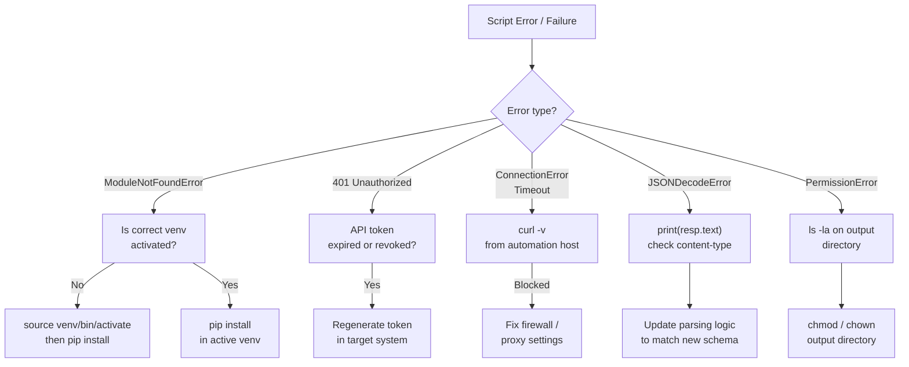

---
tags:
  - python
  - troubleshooting
---
# Python Automation — Common Issues


<div class="kb-summary">
Common Issues reference covering Python Error Triage Flow, API and Network Timeouts, Common Errors Reference.
</div>

## Python Error Triage Flow


```text
┌─────────────────────────────────────── Python — Common Issues ────────────────────────────────────────┐
│   ┌───────────────────────────────────────────────────────────────────────────────────────────────┐   │
│   │                    Most frequent Python automation failures and their fixes                   │   │
│   └───────────────────────────────────────────────────────────────────────────────────────────────┘   │
│                                                                                                       │
│   ┌───────────────────────────────────────────────────────────────────────────────────────────────┐   │
│   │                        Issue: ModuleNotFoundError: No module named <x>                        │   │
│   │                  Cause A: venv not activated → fix: source .venv/bin/activate                 │   │
│   │                  Cause B: package not installed → fix: pip install <package>                  │   │
│   │             Cause C: wrong interpreter → fix: which python3 (must show .venv path)            │   │
│   └───────────────────────────────────────────────────────────────────────────────────────────────┘   │
│                                                                                                       │
│   ┌───────────────────────────────────────────────────────────────────────────────────────────────┐   │
│   │                                Issue: boto3 NoCredentialsError                                │   │
│   │            Cause A: AWS env vars not set → fix: export AWS_ACCESS_KEY_ID and SECRET           │   │
│   │        Cause B: profile name wrong → fix: boto3.Session(profile_name="correct-profile")       │   │
│   │        Cause C: IAM role not attached → fix: check EC2 instance profile in AWS console        │   │
│   └───────────────────────────────────────────────────────────────────────────────────────────────┘   │
│                                                                                                       │
│   ┌───────────────────────────────────────────────────────────────────────────────────────────────┐   │
│   │                             Issue: SSL: CERTIFICATE_VERIFY_FAILED                             │   │
│   │           Fix (corp proxy): requests.get(url, verify="/path/to/corp-ca-bundle.pem")           │   │
│   │           Fix: export REQUESTS_CA_BUNDLE=/etc/ssl/certs/corp-ca.pem in shell profile          │   │
│   └───────────────────────────────────────────────────────────────────────────────────────────────┘   │
└───────────────────────────────────────────────────────────────────────────────────────────────────────┘
```

## API and Network Timeouts

```python
import requests

# Always set a timeout — default is None (hangs forever)
try:
    resp = requests.get('https://api.example.com/data',
                        timeout=(5, 30))  # (connect, read) seconds
    resp.raise_for_status()
except requests.exceptions.ConnectTimeout:
    print("Connection timed out — check host and port")
except requests.exceptions.ReadTimeout:
    print("Server accepted connection but response took too long")
except requests.exceptions.ConnectionError as e:
    print(f"Network error: {e}")
```

## Common Errors Reference

| Error | Cause | Fix |
|---|---|---|
| `ModuleNotFoundError` | Package not installed or wrong venv active | `pip install <pkg>` in correct venv |
| `PermissionError` | Script lacks write access to a path | Use a writable path or run with elevated privileges |
| `JSONDecodeError` | API returned non-JSON (e.g. HTML error page) | Check `resp.text` before calling `resp.json()` |
| `KeyError` | Dict key doesn't exist | Use `.get()` with a default; check API response schema |
| `AttributeError: NoneType` | Function returned None unexpectedly | Add None check; review return values |
| `SSL: CERTIFICATE_VERIFY_FAILED` | Untrusted cert or missing CA bundle | Pass `verify='/path/to/ca-bundle.crt'` or update certifi |

```python
# Check what an API actually returned before parsing
resp = requests.get(url, timeout=10)
print(resp.status_code, resp.headers.get('Content-Type'))
print(resp.text[:500])   # first 500 chars
resp.raise_for_status()
data = resp.json()
```
