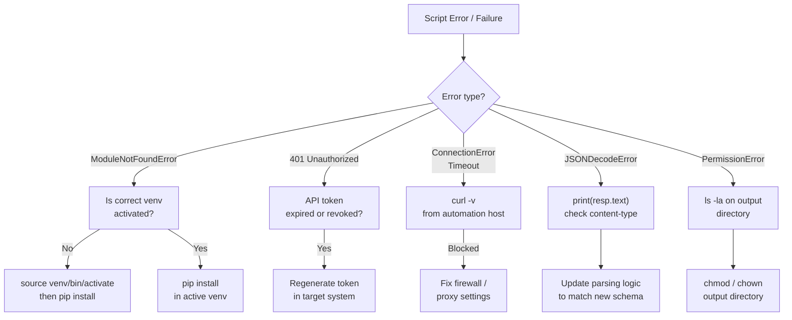

# Python Automation — Common Issues

## Python Error Triage Flow



## Virtualenv and Environment Issues

```bash
# Create a virtual environment
python3 -m venv .venv

# Activate (Linux/macOS)
source .venv/bin/activate

# Activate (Windows PowerShell)
.\.venv\Scripts\Activate.ps1

# Verify which Python is in use
which python
python --version
python -c "import sys; print(sys.executable)"

# Recreate a broken venv
rm -rf .venv
python3 -m venv .venv
source .venv/bin/activate
pip install -r requirements.txt

# Check for conflicting system packages
pip list | grep <package>
pip show <package>
```

## Import Errors

```bash
# ModuleNotFoundError — package not installed
pip install requests

# ImportError with installed package — likely wrong Python/venv
python -c "import sys; print(sys.path)"
pip show requests   # check installed location vs sys.path

# Circular import — check module dependency order
# Use lazy imports or restructure modules

# Check all installed packages in the active environment
pip list
pip freeze > requirements.txt
```

```python
# Diagnose an import issue at runtime
import importlib.util
spec = importlib.util.find_spec('requests')
print(spec.origin if spec else "Not found")
```

## API and Network Timeouts

```python
import requests

# Always set a timeout — default is None (hangs forever)
try:
    resp = requests.get('https://api.example.com/data',
                        timeout=(5, 30))  # (connect, read) seconds
    resp.raise_for_status()
except requests.exceptions.ConnectTimeout:
    print("Connection timed out — check host and port")
except requests.exceptions.ReadTimeout:
    print("Server accepted connection but response took too long")
except requests.exceptions.ConnectionError as e:
    print(f"Network error: {e}")
```

## Common Errors Reference

| Error | Cause | Fix |
|---|---|---|
| `ModuleNotFoundError` | Package not installed or wrong venv active | `pip install <pkg>` in correct venv |
| `PermissionError` | Script lacks write access to a path | Use a writable path or run with elevated privileges |
| `JSONDecodeError` | API returned non-JSON (e.g. HTML error page) | Check `resp.text` before calling `resp.json()` |
| `KeyError` | Dict key doesn't exist | Use `.get()` with a default; check API response schema |
| `AttributeError: NoneType` | Function returned None unexpectedly | Add None check; review return values |
| `SSL: CERTIFICATE_VERIFY_FAILED` | Untrusted cert or missing CA bundle | Pass `verify='/path/to/ca-bundle.crt'` or update certifi |

```python
# Check what an API actually returned before parsing
resp = requests.get(url, timeout=10)
print(resp.status_code, resp.headers.get('Content-Type'))
print(resp.text[:500])   # first 500 chars
resp.raise_for_status()
data = resp.json()
```
