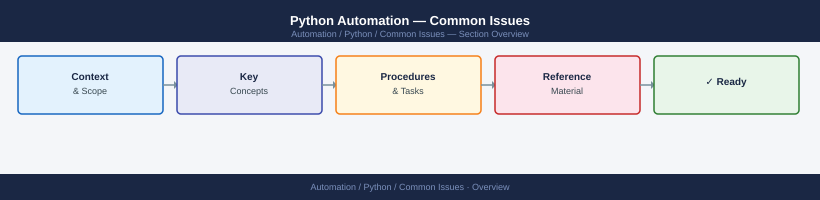
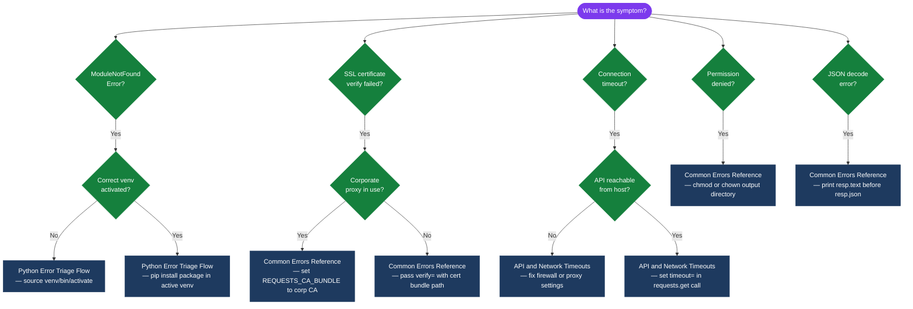
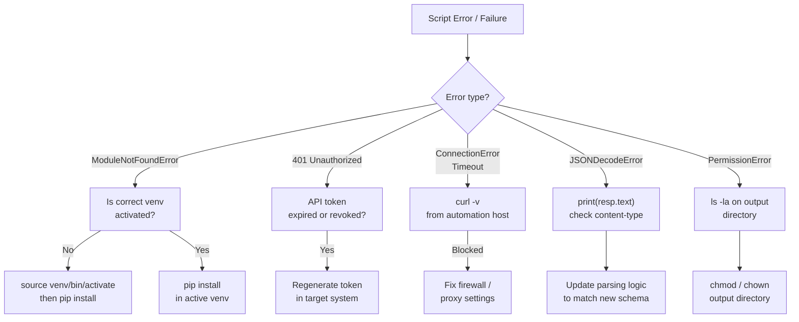

---
tags:
  - python
  - troubleshooting
search:
  boost: 1.5
---
# Python Automation — Common Issues


<div class="kb-summary">
Common Issues reference covering Python Error Triage Flow, API and Network Timeouts, Common Errors Reference.

*Applies to: Python 3.x*
</div>



## Diagnostic Flow



---

## Before you begin

- **Access:** Admin credentials on all affected systems
- **Gather first:** recent error message text, event timestamps, and affected object names
- **Scope:** confirm whether the issue affects a single object, host, cluster, or site
- **Escalation:** open a vendor support ticket before running any destructive step
- **Logging:** document each command and output — required if escalation is needed

---

## Python Error Triage Flow




## API and Network Timeouts

```python
import requests

# Always set a timeout — default is None (hangs forever)
try:
    resp = requests.get('https://api.example.com/data',
                        timeout=(5, 30))  # (connect, read) seconds
    resp.raise_for_status()
except requests.exceptions.ConnectTimeout:
    print("Connection timed out — check host and port")
except requests.exceptions.ReadTimeout:
    print("Server accepted connection but response took too long")
except requests.exceptions.ConnectionError as e:
    print(f"Network error: {e}")
```

## Common Errors Reference

| Error | Cause | Fix |
|---|---|---|
| `ModuleNotFoundError` | Package not installed or wrong venv active | `pip install <pkg>` in correct venv |
| `PermissionError` | Script lacks write access to a path | Use a writable path or run with elevated privileges |
| `JSONDecodeError` | API returned non-JSON (e.g. HTML error page) | Check `resp.text` before calling `resp.json()` |
| `KeyError` | Dict key doesn't exist | Use `.get()` with a default; check API response schema |
| `AttributeError: NoneType` | Function returned None unexpectedly | Add None check; review return values |
| `SSL: CERTIFICATE_VERIFY_FAILED` | Untrusted cert or missing CA bundle | Pass `verify='/path/to/ca-bundle.crt'` or update certifi |

```python
# Check what an API actually returned before parsing
resp = requests.get(url, timeout=10)
print(resp.status_code, resp.headers.get('Content-Type'))
print(resp.text[:500])   # first 500 chars
resp.raise_for_status()
data = resp.json()
```

---

## Verify resolution

- Confirm the original symptom no longer occurs
- Check logs for any residual errors related to the issue
- Monitor for 10–15 minutes to confirm the fix is stable

---

## See also

- [Python — Diagnostics](../diagnostics/)
- [Python — Escalation](../escalation/)
- [Python — Health Checks](../../operations/health-checks/)
