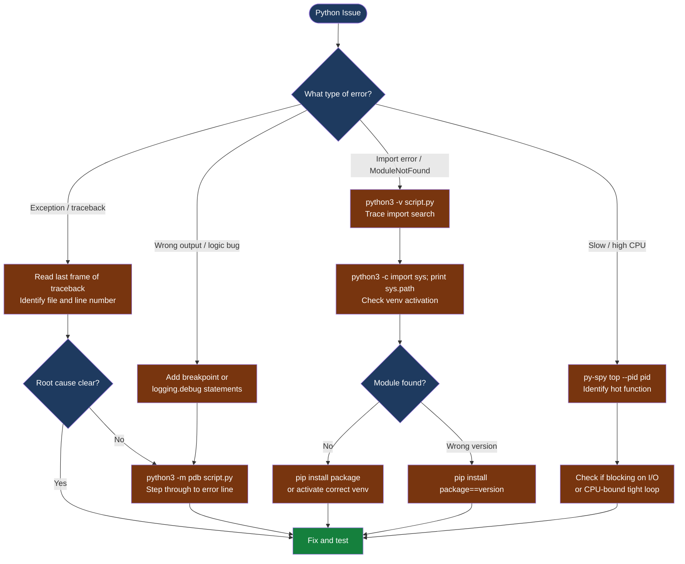

---
tags:
  - python
  - troubleshooting
search:
  boost: 1.5
---
# Python Automation — Diagnostics

<div class="kb-summary">
Python diagnostic commands: read the full traceback, trace imports with python3 -v, step through code with pdb, enable DEBUG logging, profile CPU with py-spy, and isolate environment issues with pip and venv inspection.

*Applies to: Python 3.x*
</div>

```text
┌──────────────────────────────────────── Python — Diagnostics ─────────────────────────────────────────┐
│                                                                                                       │
│   ┌───────────────────────────────────────────────────────────────────────────────────────────────┐   │
│   │   Start here: read full traceback (last frame first) → pdb debug → add DEBUG logging         │    │
│   │   Import errors: python3 -v to trace imports; check sys.path and venv activation              │   │
│   │   Performance: py-spy top --pid <pid> for CPU profiling without code changes                  │   │
│   └───────────────────────────────────────────────────────────────────────────────────────────────┘   │
│                                                                                                       │
│   ┌──────────────────────────────────────────────┐  ┌─────────────────────────────────────────────┐   │
│   │                Error Analysis                │  │                 Debug Tools                 │   │
│   │   Read full traceback (last line first)      │  │   python3 -m pdb script.py                  │   │
│   │   traceback.print_exc() in except block      │  │   breakpoint() in code (3.7+)               │   │
│   │   logging.exception("msg") logs traceback    │  │   py-spy top --pid <pid> (CPU profiler)     │   │
│   │   pip check (detect dependency conflicts)    │  │   python3 -X dev (extra warnings)           │   │
│   │   python3 -W error to promote warnings       │  │   python3 -v (verbose import trace)         │   │
│   └──────────────────────────────────────────────┘  └─────────────────────────────────────────────┘   │
│                                                                                                       │
│  Physical Infrastructure:                                                                             │
│  Python interpreter · venv / conda env · pip packages · OS environment variables                      │
│                                                                                                       │
│  Key terms:                                                                                           │
│  breakpoint()      = built-in (3.7+); drops into pdb at that line; n=next, c=continue, p=print var    │
│  py-spy            = sampling profiler; attaches to a running Python process with no code changes     │
│  python3 -X dev    = development mode; enables ResourceWarning, asyncio debug, fault handler          │
│  -W error          = treat all warnings as errors; catches deprecation before it becomes a break      │
│  venv              = isolated Python environment; each project should have its own venv               │
│  sys.path          = ordered list of directories Python searches for modules when importing           │
│  pdb               = Python Debugger; step-through interactive debugging from the command line        │
│                                                                                                       │
└───────────────────────────────────────────────────────────────────────────────────────────────────────┘
```



## Before you begin

- **Access:** the same user / environment that runs the failing script; do not debug as root if the script runs as a service user
- **Gather first:** the full traceback (copy from stderr, not just the last line), the Python version (`python3 --version`), and whether the issue is in a venv or system Python
- **Scope:** confirm whether the issue is reproducible on demand, intermittent, or environment-specific (only on a specific server / venv)
- **Do not guess:** the last line of a traceback is the exception and message; the second-to-last frame is where in your code it originated — read both before changing anything

---

## Step 1 — Read and capture the full traceback

```bash
# Run the failing script and capture both stdout and stderr
python3 script.py 2>&1 | tee /tmp/python-error-$(date +%F-%H%M).txt

# If the script is already logging, find the log file
grep -n "Traceback\|Error\|Exception" /var/log/myapp/app.log | tail -50
```

```python
# In your except block — log the full traceback including cause chain
import logging
import traceback

try:
    risky_operation()
except Exception as exc:
    logging.exception("risky_operation failed: %s", exc)
    # logging.exception automatically appends the traceback
    # Alternative: explicit traceback capture
    tb = traceback.format_exc()
    print(tb, file=sys.stderr)
```

**Reading a traceback:**
- The **bottom line** is the exception type and message (what failed)
- The frame **just above** it is the exact file and line number in your code where the exception originated
- Work **upward** through the frames to see the call chain that led there

---

## Step 2 — Check the Python environment

```bash
# Confirm which Python interpreter is active
which python3
python3 --version
# Expected: the interpreter in your venv, not /usr/bin/python3

# Check if a venv is activated
echo $VIRTUAL_ENV
# Expected: path to your venv directory; empty = not in a venv

# List installed packages and versions
pip list
pip list --outdated

# Check for dependency conflicts
pip check
# Expected: No broken requirements
# Problem: "package X has requirement Y>=Z, but you have Y W"

# Show where a specific package is installed
pip show requests
# Shows: Name, Version, Location, Requires, Required-by
```

---

## Step 3 — Trace import failures

```bash
# Verbose import tracing — shows every module load attempt
python3 -v script.py 2>&1 | grep -i "import\|error\|not found" | head -100

# Check the module search path (where Python looks for modules)
python3 -c "import sys; print('\n'.join(sys.path))"
# Expected: venv site-packages first; then system site-packages

# Test if a specific module can be imported
python3 -c "import requests; print('requests', requests.__version__)"
# Problem: ModuleNotFoundError → not installed in this interpreter/venv

# Find where a module is installed
python3 -c "import requests; print(requests.__file__)"
```

```python
# Programmatically diagnose a missing module at runtime
import importlib.util

def check_module(name):
    spec = importlib.util.find_spec(name)
    if spec:
        print(f"{name}: found at {spec.origin}")
    else:
        print(f"{name}: NOT FOUND in sys.path")

check_module("requests")
check_module("netapp_ontap")
```

---

## Step 4 — Interactive debugging with pdb

```bash
# Launch script under pdb (stops at first line)
python3 -m pdb script.py

# Key pdb commands:
#   n         — execute next line (step over)
#   s         — step into function call
#   c         — continue until next breakpoint or error
#   p <expr>  — print value of expression (e.g., p my_dict)
#   pp <expr> — pretty-print (for dicts/lists)
#   l         — list 11 lines around current position
#   where     — print full call stack
#   q         — quit pdb

# Post-mortem debugging — inspect state at crash without re-running
python3 -c "
import pdb, traceback
try:
    import script   # replace with your module
except Exception:
    traceback.print_exc()
    pdb.post_mortem()
"
```

```python
# Drop a breakpoint at a specific line in your code (3.7+)
def process_item(item):
    result = transform(item)
    breakpoint()   # execution stops here; drops into pdb
    return result
```

---

## Step 5 — Enable structured DEBUG logging

```python
import logging

# Enable DEBUG logging for the current session
logging.basicConfig(
    level=logging.DEBUG,
    format="%(asctime)s %(levelname)s %(name)s %(message)s",
    datefmt="%Y-%m-%dT%H:%M:%S"
)

# Log at each severity level
logging.debug("variable value: %s", my_var)
logging.info("operation started")
logging.warning("unexpected state: %s", state)
logging.error("operation failed: %s", exc)
logging.exception("full traceback logged automatically above this line")
```

```bash
# Enable DEBUG for a script from the command line without changing code
PYTHONLOGLEVEL=DEBUG python3 script.py 2>&1 | tee /tmp/debug.log

# Enable development mode (ResourceWarning, asyncio debug, malloc debug)
python3 -X dev script.py

# Treat all warnings as errors (catches deprecation before it becomes a break)
python3 -W error script.py
```

---

## Step 6 — Profile CPU and memory

```bash
# Install py-spy (system-wide or in venv)
pip install py-spy

# Attach to a running Python process and show live CPU profile
py-spy top --pid <pid>
# Shows: function name, file, line, % CPU — updates every second

# Record a flamegraph of a script run
py-spy record -o /tmp/profile.svg -- python3 script.py
# Open profile.svg in a browser — wide bars = hot paths

# Memory profiling (line-by-line)
pip install memory_profiler
python3 -m memory_profiler script.py
# Shows: memory used per line; look for lines with large increments
```

---

## Step 7 — Collect diagnostics for escalation

```bash
# All-in-one diagnostic snapshot
{
  echo "=== Python version ==="
  python3 --version
  echo "=== Virtual env ==="
  echo "VIRTUAL_ENV=$VIRTUAL_ENV"
  echo "=== Installed packages ==="
  pip list
  echo "=== Dependency check ==="
  pip check
  echo "=== sys.path ==="
  python3 -c "import sys; print('\n'.join(sys.path))"
  echo "=== Error output ==="
  python3 script.py 2>&1 || true
} > /tmp/python-diag-$(date +%F-%H%M).txt
```

---

## Log locations

| Source | Location | What to look for |
|---|---|---|
| Script stderr | `python3 script.py 2>&1 \| tee /tmp/err.txt` | Traceback, exception type |
| App log file | `/var/log/<appname>/<appname>.log` | logging.error/exception output |
| systemd journal | `journalctl -u <service> --since "1 hour ago"` | Service crash events |
| pdb session | Interactive terminal | Variable state at error line |

---

## See also

- [Python — Common Issues](../common-issues/)
- [Python — Escalation](../escalation/)
- [Python — Health Checks](../../operations/health-checks/)

## Verify resolution

- The original exception no longer occurs when running the same input
- `pip check` shows no broken requirements
- DEBUG logging shows expected state at each step without errors
- If the fix was environment-related: confirm the venv is activated in the service unit or cron job that runs the script in production
