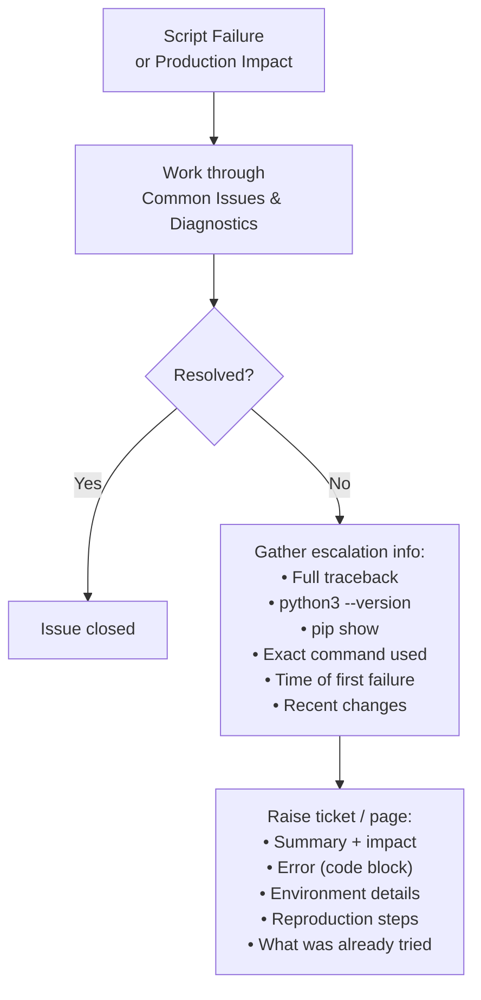

# Python Automation — Escalation

## Escalation Workflow

## When to Escalate

Escalate when:

- The issue persists after working through all steps in Common Issues and Diagnostics
- The error originates in an external API or service outside your control
- A script failure is causing or will cause production impact
- You encounter unexpected data loss or state corruption

## What to Capture Before Escalating

Gather the following before raising a ticket or paging someone:

- Full error message and traceback (copy from log file, not a screenshot)
- Python version: `python3 --version`
- Relevant package versions: `pip show <package>`
- Script name and the exact command used to invoke it
- Time the error first occurred and whether it is intermittent or consistent
- Recent changes: code, API tokens, infrastructure, cron schedule
- Sanitised sample of input data if the script processes external data

## Escalation Checklist

| Step | Done |
|---|---|
| Error message and full traceback captured | |
| Python and package versions recorded | |
| Reproduction steps documented (exact command, environment) | |
| Log files from the failing run attached | |
| Recent changes to the script or its dependencies noted | |
| Impact assessed (which systems or workflows are affected) | |

## Raising the Escalation

Include in the ticket or message:

- **Summary:** One sentence describing what failed and the business impact
- **Error:** Full traceback or log excerpt (use a code block)
- **Environment:** Python version, OS, relevant package versions
- **Reproduction:** Exact steps to reproduce (or confirm it cannot be reproduced)
- **What was tried:** List of diagnostic steps already taken
- **Recent changes:** Any deployments, token rotations, or config changes in the last 48 hours
