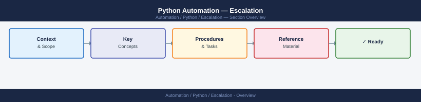

---
tags:
  - python
  - troubleshooting
search:
  boost: 1.5
---
# Python Automation — Escalation

<div class="kb-summary">
Python automation escalation: when to file a CPython bug, how to report a library issue, how to respond to CVEs, and the internal escalation path for script failures, dependency vulnerabilities, and production automation outages.

*Applies to: Python 3.x*
</div>



## Before you begin

- **Access:** Access to the script execution environment and its log output; pip/package manager access to check installed versions
- **Gather first:** full Python traceback (not a screenshot), `python3 --version`, the exact command that invokes the failing script, and `pip list` output
- **Scope:** confirm whether the failure is script-specific, environment-specific (one host), or cross-environment (all hosts running the same script)
- **CVE detected:** if the escalation involves a security vulnerability in a dependency, rotate any affected secrets immediately before investigating further
- **Logging:** add `logging.basicConfig(level=logging.DEBUG)` to capture full HTTP request/response detail before reproducing

---

## Severity Levels (Internal)

| Severity | Definition | Escalation Path |
|---|---|---|
| P1 — Critical | Production automation pipeline completely down; secret exposure suspected; data loss | Immediate: on-call engineer + security team (if secret leak) |
| P2 — High | Critical script failing for all runs; external API broken for all operations; CVE in prod dependency | Same day: automation team + infra team |
| P3 — Medium | Single script or function failing; intermittent errors in non-critical automation | Next business day: automation team |
| P4 — Low | Performance concern; code quality issue; dependency update available but not critical | Sprint backlog item |

## Pre-Escalation Triage Checklist

| Check | Command | Expected |
|---|---|---|
| Python version | `python3 --version` | Expected version (3.10+, 3.11+, etc.) |
| Virtual environment active | `which python3` | Points to venv path, not system Python |
| Dependencies installed | `pip check` | `No broken requirements` |
| CVE status of dependencies | `pip-audit` or `safety check` | No known vulnerabilities |
| Script syntax valid | `python3 -m py_compile <script>.py` | No output (success) |
| Network/API reachable | `curl -s https://api.example.com/health` | HTTP 200 |
| SSL cert valid | `python3 -c "import ssl,urllib.request; urllib.request.urlopen('https://api.example.com')"` | No SSL error |
| Secret available | `echo $SECRET_VAR | wc -c` | Non-zero length |

---

## Step-by-Step Data Collection

### 1. Collect environment information

```bash
# Python and package versions
python3 --version > /tmp/py-env.txt
pip list --format=columns >> /tmp/py-env.txt
pip freeze > /tmp/requirements-current.txt

# Identify the virtual environment and interpreter in use
which python3
echo $VIRTUAL_ENV
python3 -c "import sys; print(sys.prefix); print(sys.path)"

# OS and OpenSSL version (for SSL-related issues)
uname -a
python3 -c "import ssl; print(ssl.OPENSSL_VERSION)"
openssl version
```

### 2. Capture the full traceback

```python
# Add to the failing script before the failing call:
import logging, traceback

logging.basicConfig(
    level=logging.DEBUG,
    format='%(asctime)s %(levelname)s %(name)s %(message)s',
    filename='/tmp/script-debug.log'
)

try:
    # YOUR FAILING CODE HERE
    pass
except Exception as e:
    logging.error("Failure details:\n%s", traceback.format_exc())
    raise
```

```bash
# Or capture all output when running:
python3 -u /path/to/script.py 2>&1 | tee /tmp/script-output-$(date +%F-%H%M%S).log
```

### 3. Identify the failing dependency

```bash
# Show full package info for the suspected package
pip show <package-name>

# Check if a newer version is available
pip index versions <package-name>

# Test in isolation with a minimal script
python3 -c "
import <package>
print(<package>.__version__)
# test the specific failing call
"

# Check for known CVEs
pip install pip-audit
pip-audit -r /tmp/requirements-current.txt
```

### 4. For API errors — capture request/response detail

```python
# Enable HTTP debug logging for requests library
import logging
import http.client

http.client.HTTPConnection.debuglevel = 1
logging.basicConfig()
logging.getLogger().setLevel(logging.DEBUG)
requests_log = logging.getLogger("requests.packages.urllib3")
requests_log.setLevel(logging.DEBUG)
requests_log.propagate = True

# For boto3 (AWS SDK)
import boto3
boto3.set_stream_logger(name='botocore', level=logging.DEBUG)
```

### 5. Write the timeline

```text
Python version: 3.11.9
OS: Ubuntu 22.04.3 LTS
Affected script: /opt/automation/sync-inventory.py
Invocation: /usr/bin/python3 /opt/automation/sync-inventory.py --env prod
Cron schedule: */5 * * * * (every 5 minutes)

Issue first observed: 2026-06-15 13:00 UTC
Last successful run: 2026-06-15 12:55 UTC

Error observed:
  Traceback (most recent call last):
    File "sync-inventory.py", line 87, in <function>
      response = session.get(url, timeout=30)
  requests.exceptions.SSLError: HTTPSConnectionPool(host='api.example.com', port=443):
  Max retries exceeded with url: / (Caused by SSLError(SSLCertVerificationError(...)))

Packages relevant:
  requests==2.31.0 (upgraded 2 hours before failure)
  urllib3==2.0.7 (upgraded 2 hours before failure)
  certifi==2024.2.2

Changes in 2h before issue:
  - pip upgrade ran automatically via pre-deploy hook: requests 2.28.2 → 2.31.0, urllib3 1.26.18 → 2.0.7

Blast radius:
  - Inventory sync completely stopped
  - 5 other scripts using the requests library also failing
```

---

## Escalation Path


---

## What NOT to Do

| Do NOT do this | Why | What to do instead |
|---|---|---|
| Add `verify=False` to requests calls to bypass SSL errors | Disables certificate validation entirely — creates a man-in-the-middle risk in production | Fix the trust store (`certifi`, OS CA bundle) or pin the certificate; never disable verification |
| Use `try: except: pass` to silence the error and continue | Hides the real failure; downstream code runs on invalid or missing data | Log the error and fail explicitly; fix the root cause |
| Run `pip install --upgrade` on a production host without testing | Package upgrades frequently introduce breaking API changes | Use a requirements file with pinned versions; test upgrades in non-production first |
| Commit plaintext secrets to the repository to "fix" the secret access error | Permanent exposure; git history preserves secrets even after deletion | Use environment variables, a secrets manager (Vault, AWS Secrets Manager), or a `.env` file excluded from git |
| Share the full debug log externally without scrubbing | Debug logs often capture HTTP request headers including `Authorization: Bearer <token>` | Scrub all authentication headers and secret values before sharing any log file |

---

## Useful Commands for Case Updates

```bash
# Quick state snapshot — include in every escalation update
python3 --version
pip list --format=columns | head -30
echo "OpenSSL: $(python3 -c 'import ssl; print(ssl.OPENSSL_VERSION)')"

# Reproduce with maximum verbosity and save output
python3 -W all -v /path/to/script.py 2>&1 | tee /tmp/repro-$(date +%F-%H%M%S).log

# Test just the network call in isolation
python3 -c "
import requests, ssl
r = requests.get('https://api.example.com/health', timeout=10)
print(f'Status: {r.status_code}')
print(f'TLS version: {r.raw.version}')
"

# Check if issue is version-specific (install older version in test venv)
python3 -m venv /tmp/test-venv
/tmp/test-venv/bin/pip install requests==2.28.2
/tmp/test-venv/bin/python3 /path/to/script.py 2>&1 | head -20

# CVE scan
pip-audit -r /tmp/requirements-current.txt --format markdown
```

---

## See also

- [Python — Diagnostics](../diagnostics/)
- [Python — Common Issues](../common-issues/)

---

## Verify resolution

- Confirm the script completes successfully (`exit code 0`) for at least 3 consecutive runs
- Check that all downstream systems received the expected data (inventory synced, API calls succeeded)
- If a package was pinned as a workaround, create a follow-up ticket to upgrade when the fix is released
- If a CVE was involved: confirm patched version is deployed; verify secret rotation is complete
