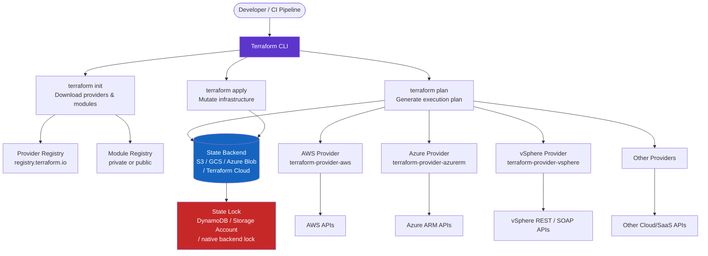

---
tags:
  - architecture
  - terraform
---
# Terraform — How It Works

<div class="kb-summary">
Terraform is a declarative infrastructure-as-code tool that manages resources across hundreds of providers via a consistent workflow. All execution is driven by a single CLI binary — there are no separate agents.

*Applies to: Terraform 1.x*
</div>

---

## High-Level Architecture



---

## Module Registry

| Source | Example |
|---|---|
| Terraform Registry (public) | `source = "terraform-aws-modules/vpc/aws"` |
| Private registry | `source = "app.terraform.io/myorg/vpc/aws"` |
| Git | `source = "git::https://github.com/org/tf-modules.git//vpc?ref=v2.0.0"` |
| Local path | `source = "../modules/vpc"` |

```hcl
module "vpc" {
  source  = "terraform-aws-modules/vpc/aws"
  version = "5.8.0"

  name = "prod-vpc"
  cidr = "10.0.0.0/16"

  azs             = ["eu-west-1a", "eu-west-1b", "eu-west-1c"]
  private_subnets = ["10.0.1.0/24", "10.0.2.0/24", "10.0.3.0/24"]
  public_subnets  = ["10.0.101.0/24", "10.0.102.0/24", "10.0.103.0/24"]

  enable_nat_gateway = true
  single_nat_gateway = false

  tags = local.common_tags
}
```

---

## Core Workflow

```bash
terraform init
terraform fmt -recursive
terraform validate
terraform plan -out=tfplan
terraform apply tfplan
terraform state list
terraform state show aws_vpc.main
terraform import aws_s3_bucket.assets my-existing-bucket-name
```

---

## See also

- [Terraform — Design Standards](../design-standards/)
- [Terraform — Integrations](../integrations/)
- [Terraform — Deploy](../../deploy/)
