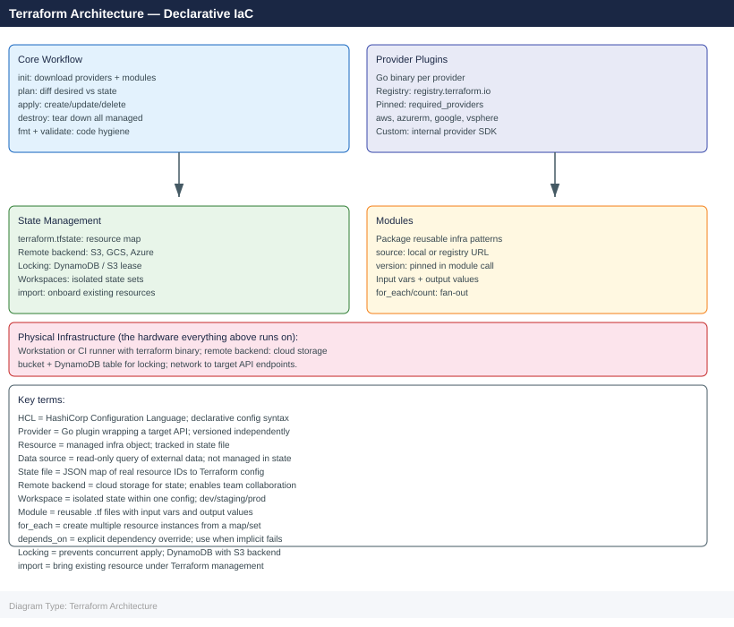
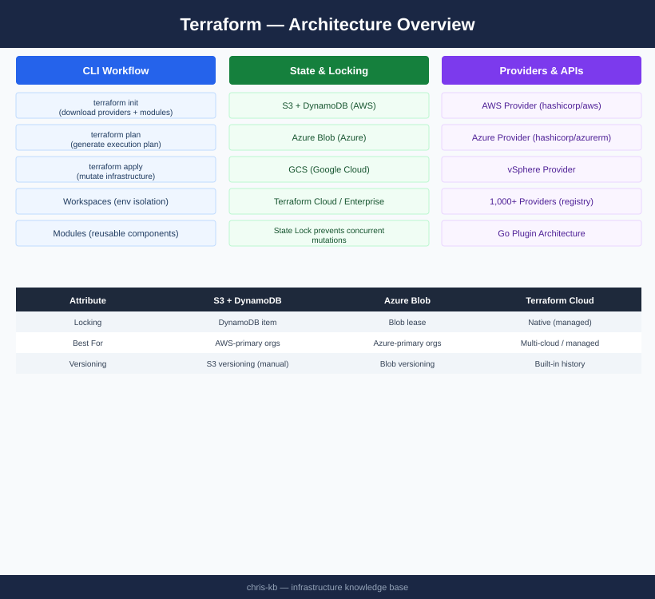

---
tags:
  - architecture
  - terraform
description: "Declarative IaC tool with Go provider plugins for 1000+ APIs; single CLI binary drives init/plan/apply/destroy workflow; remote state backend with locking..."
---
# Terraform — Architecture

Declarative IaC tool with Go provider plugins for 1000+ APIs; single CLI binary drives init/plan/apply/destroy workflow; remote state backend with locking prevents concurrent mutations; modules package reusable infrastructure components.

*Applies to: Terraform 1.x*

<a class="kb-card" href="how-it-works/">
  <strong>How It Works</strong>
  CLI workflow, state backend, provider plugins, workspace model, and module registry.
</a>

<a class="kb-card" href="integrations/">
  <strong>Integrations</strong>
  Integration with other platforms and external systems.
</a>

<a class="kb-card" href="design-standards/">
  <strong>Design Standards</strong>
  Sizing guidelines, design standards, and best practices.
</a>

## State Backends

| Backend | State storage | Locking mechanism | Best for |
|---|---|---|---|
| S3 + DynamoDB | AWS S3 | DynamoDB item | AWS-primary organisations |
| GCS | Google Cloud Storage | GCS object lock | GCP-primary organisations |
| Azure Blob | Azure Storage Account | Blob lease | Azure-primary organisations |
| Terraform Cloud / Enterprise | Hosted | Native | Multi-cloud, managed service |

## High-Level Architecture

