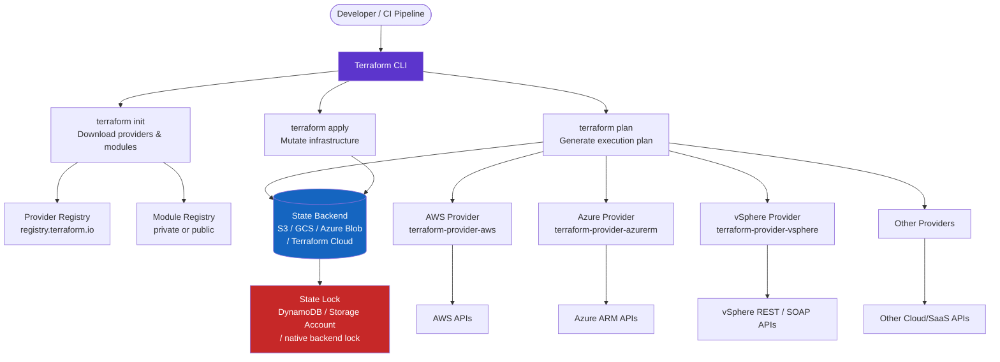

# Terraform — Architecture Overview

Terraform is a declarative infrastructure-as-code tool that manages resources across hundreds of providers via a consistent workflow. Understanding its internal architecture is essential for building reliable, scalable IaC pipelines.

---

## High-Level Architecture



---

## Terraform CLI

The CLI is the single binary that orchestrates the entire workflow. There are no separate agents — all execution is local (or in CI).

| Command | Purpose |
|---|---|
| `terraform init` | Initialise working directory: download providers, configure backend |
| `terraform validate` | Check configuration syntax and internal consistency |
| `terraform fmt` | Format `.tf` files to canonical style |
| `terraform plan` | Show changes required to reach desired state |
| `terraform apply` | Apply the plan; mutate real infrastructure |
| `terraform destroy` | Plan and apply deletion of all managed resources |
| `terraform state` | Inspect and manipulate state directly |
| `terraform import` | Import existing resources into state |
| `terraform output` | Print output values from state |
| `terraform workspace` | Manage workspaces |

---

## State Backend

The state file is Terraform's source of truth for what resources it manages. The backend determines where this file is stored and how concurrent access is controlled.

### Local Backend (development only)

```hcl
# Default — state stored in terraform.tfstate in the working directory
# No locking — NEVER use in shared/CI environments
terraform {
  backend "local" {
    path = "terraform.tfstate"
  }
}
```

### Remote Backends

| Backend | State storage | Locking mechanism | Best for |
|---|---|---|---|
| S3 + DynamoDB | AWS S3 | DynamoDB item | AWS-primary organisations |
| GCS | Google Cloud Storage | GCS object lock | GCP-primary organisations |
| Azure Blob | Azure Storage Account | Blob lease | Azure-primary organisations |
| Terraform Cloud / Enterprise | Hosted | Native | Multi-cloud, managed service |
| HTTP | Custom endpoint | Custom | On-prem / custom solutions |

### S3 Backend (AWS)

```hcl
terraform {
  required_version = ">= 1.7.0"

  backend "s3" {
    bucket         = "my-org-terraform-state"
    key            = "platform/networking/terraform.tfstate"
    region         = "eu-west-1"
    encrypt        = true
    kms_key_id     = "arn:aws:kms:eu-west-1:123456789012:key/mrk-abc123"
    dynamodb_table = "terraform-state-lock"
  }
}
```

```bash
# Create the DynamoDB lock table (one-time setup)
aws dynamodb create-table \
  --table-name terraform-state-lock \
  --attribute-definitions AttributeName=LockID,AttributeType=S \
  --key-schema AttributeName=LockID,KeyType=HASH \
  --billing-mode PAY_PER_REQUEST \
  --region eu-west-1
```

### Azure Blob Backend

```hcl
terraform {
  backend "azurerm" {
    resource_group_name  = "rg-terraform-state"
    storage_account_name = "myorgtfstate"
    container_name       = "tfstate"
    key                  = "platform/networking/terraform.tfstate"
    use_oidc             = true  # Use OIDC for CI authentication
  }
}
```

---

## Workspace Model

Workspaces allow multiple independent state files within the same backend path. They are suited for lightweight environment separation (dev/staging/prod) in simple configurations. For complex multi-environment setups, separate state paths (and separate directories/modules) are preferred.

```bash
# List workspaces
terraform workspace list

# Create a new workspace
terraform workspace new staging

# Switch workspace
terraform workspace select prod

# Current workspace in configuration
variable "environment" {
  default = terraform.workspace
}
```

```hcl
# Use workspace name in resource naming
resource "aws_s3_bucket" "app" {
  bucket = "my-app-${terraform.workspace}-assets"
  # dev → my-app-dev-assets
  # prod → my-app-prod-assets
}
```

> Workspaces share the same configuration code and provider credentials. For strict isolation (separate AWS accounts, different permissions), use separate root modules with separate backends, not just workspaces.

---

## Provider Plugin Architecture

Providers are separate binaries (Go plugins) downloaded by `terraform init`. Terraform communicates with providers over a local gRPC socket.

```hcl
terraform {
  required_providers {
    aws = {
      source  = "hashicorp/aws"
      version = "~> 5.40"
    }
    azurerm = {
      source  = "hashicorp/azurerm"
      version = "~> 3.100"
    }
    vsphere = {
      source  = "hashicorp/vsphere"
      version = "~> 2.7"
    }
  }
}

provider "aws" {
  region = var.aws_region
  # Credentials via env vars: AWS_ACCESS_KEY_ID, AWS_SECRET_ACCESS_KEY
  # Or IAM role (recommended in CI): no credentials in config
}

provider "azurerm" {
  features {}
  use_oidc = true   # OIDC federation for CI — no stored secrets
}

provider "vsphere" {
  vsphere_server = var.vsphere_server
  user           = var.vsphere_user
  password       = var.vsphere_password
  allow_unverified_ssl = false
}
```

### Provider cache (shared across workspaces)

```bash
# Set provider cache directory to avoid re-downloading
export TF_PLUGIN_CACHE_DIR="$HOME/.terraform.d/plugin-cache"
mkdir -p "$TF_PLUGIN_CACHE_DIR"

# Or in .terraformrc
cat > ~/.terraformrc <<EOF
plugin_cache_dir = "$HOME/.terraform.d/plugin-cache"
EOF
```

---

## Module Registry

Modules package reusable infrastructure components. They can be sourced from:

| Source | Example |
|---|---|
| Terraform Registry (public) | `source = "terraform-aws-modules/vpc/aws"` |
| Private registry (Terraform Cloud/Enterprise) | `source = "app.terraform.io/myorg/vpc/aws"` |
| Git | `source = "git::https://github.com/org/tf-modules.git//vpc?ref=v2.0.0"` |
| Local path | `source = "../modules/vpc"` |

```hcl
module "vpc" {
  source  = "terraform-aws-modules/vpc/aws"
  version = "5.8.0"

  name = "prod-vpc"
  cidr = "10.0.0.0/16"

  azs             = ["eu-west-1a", "eu-west-1b", "eu-west-1c"]
  private_subnets = ["10.0.1.0/24", "10.0.2.0/24", "10.0.3.0/24"]
  public_subnets  = ["10.0.101.0/24", "10.0.102.0/24", "10.0.103.0/24"]

  enable_nat_gateway = true
  single_nat_gateway = false

  tags = local.common_tags
}
```

---

## Core Workflow

```bash
# 1. Initialise (required after adding providers or modules)
terraform init

# 2. Format code
terraform fmt -recursive

# 3. Validate syntax
terraform validate

# 4. Plan — review before applying
terraform plan -out=tfplan

# 5. Apply the saved plan
terraform apply tfplan

# 6. Inspect state
terraform state list
terraform state show aws_vpc.main

# 7. Import an existing resource
terraform import aws_s3_bucket.assets my-existing-bucket-name
```

---

## In this section

<div class="kb-grid kb-grid-3">
<a class="kb-card" href="components/"><strong>Components</strong><span>Core components, services, and technical specifications.</span></a>
<a class="kb-card" href="integrations/"><strong>Integrations</strong><span>Integration with other platforms and external systems.</span></a>
<a class="kb-card" href="standards/"><strong>Standards</strong><span>Sizing guidelines, design standards, and best practices.</span></a>
</div>
