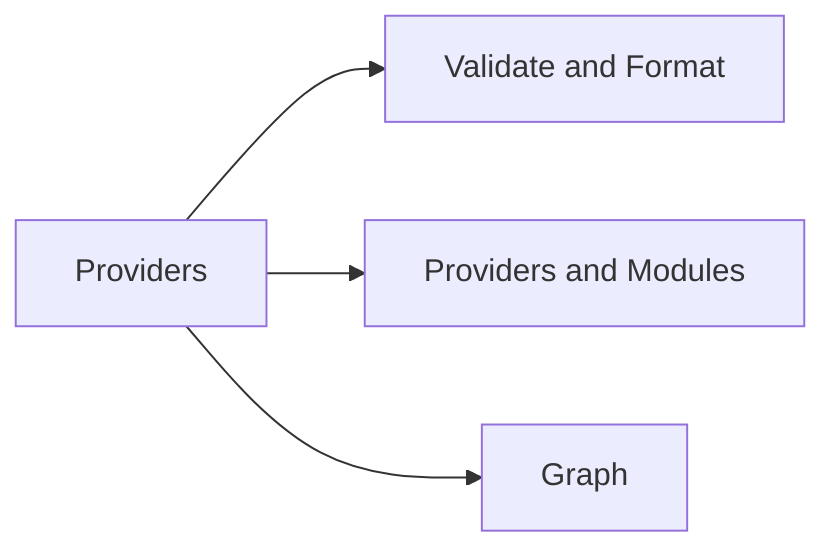

# Validate, Format & Providers

> Part of the [Terraform CLI Reference](../).



---

## Validate & Format

```bash
# Validate config syntax
terraform validate

# Format code
terraform fmt
terraform fmt -recursive
terraform fmt -check             # Exit non-zero if changes needed
terraform fmt -diff              # Show diffs
```

## Providers & Modules

```bash
# List required providers
terraform providers

# Lock provider versions
terraform providers lock

# Download modules
terraform get
terraform get -update

# Show module tree
terraform providers schema -json
```

## Graph

```bash
# Generate dependency graph (dot format)
terraform graph | dot -Tsvg > graph.svg
terraform graph -type=plan | dot -Tpng > plan.png
```
