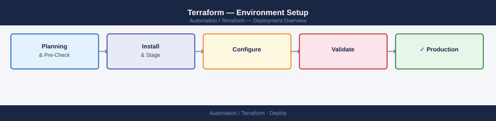

---
tags:
  - deployment
  - terraform
search:
  boost: 1.5
---

## Before you begin

- **Access:** admin credentials for the target system and any upstream dependencies (DNS, NTP, vCenter, directory services)
- **Timing:** safe to run during a scheduled maintenance window; allow 1-2 hours for initial deployment
- **Dependencies:** network connectivity verified; DNS resolvable; NTP configured; any licence keys available
- **Logging:** record every IP address, hostname, and credential set assigned during this deployment

---

# Terraform — Environment Setup



This guide covers setting up a production-ready Terraform environment: installation, remote state backend, provider credentials, module structure, workspaces per environment, CI/CD integration, and drift detection.

---

## Prerequisites

| Requirement | Notes |
|-------------|-------|
| Terraform | 1.6+ recommended |
| Cloud CLI | `aws`, `az`, or both — for provider authentication |
| Git | Version-controlled root module |
| Backend storage | S3 bucket (AWS) or Azure Storage Account (Azure) — created before `terraform init` |
| CI/CD system | GitHub Actions, GitLab CI, or Jenkins |

---

## Install Terraform

**macOS (Homebrew):**

```bash
brew tap hashicorp/tap
brew install hashicorp/tap/terraform
```

**Linux (apt):**

```bash
wget -O - https://apt.releases.hashicorp.com/gpg | sudo gpg --dearmor -o /usr/share/keyrings/hashicorp-archive-keyring.gpg
echo "deb [signed-by=/usr/share/keyrings/hashicorp-archive-keyring.gpg] https://apt.releases.hashicorp.com $(lsb_release -cs) main" | sudo tee /etc/apt/sources.list.d/hashicorp.list
sudo apt update && sudo apt install terraform
```

**Linux (binary download):**

```bash
curl -fsSL https://releases.hashicorp.com/terraform/1.8.5/terraform_1.8.5_linux_amd64.zip -o terraform.zip
unzip terraform.zip && sudo mv terraform /usr/local/bin/
```

Verify installation:

```bash
terraform version
```

Expected output: `Terraform v1.8.x` or higher.

Install `tfenv` if you need to manage multiple Terraform versions across projects:

```bash
brew install tfenv
tfenv install 1.8.5
tfenv use 1.8.5
```

---

## Configure Backend (Remote State)

Remote state enables team collaboration, state locking, and auditability. Never use local state in shared environments.

**AWS S3 backend:**

First, create the S3 bucket and DynamoDB lock table (one-time setup):

```bash
aws s3api create-bucket \
    --bucket tf-state-prod-<account-id> \
    --region us-east-1

aws s3api put-bucket-versioning \
    --bucket tf-state-prod-<account-id> \
    --versioning-configuration Status=Enabled

aws dynamodb create-table \
    --table-name tf-state-lock \
    --attribute-definitions AttributeName=LockID,AttributeType=S \
    --key-schema AttributeName=LockID,KeyType=HASH \
    --billing-mode PAY_PER_REQUEST
```

In `main.tf`:

```hcl
terraform {
  backend "s3" {
    bucket         = "tf-state-prod-<account-id>"
    key            = "infra/terraform.tfstate"
    region         = "us-east-1"
    dynamodb_table = "tf-state-lock"
    encrypt        = true
  }
}
```

**Azure Storage Account backend:**

```bash
az storage account create \
    --name tfstateprod<suffix> \
    --resource-group rg-platform-terraform \
    --sku Standard_LRS \
    --kind StorageV2

az storage container create \
    --name tfstate \
    --account-name tfstateprod<suffix>
```

In `main.tf`:

```hcl
terraform {
  backend "azurerm" {
    resource_group_name  = "rg-platform-terraform"
    storage_account_name = "tfstateprod<suffix>"
    container_name       = "tfstate"
    key                  = "infra/terraform.tfstate"
  }
}
```

Initialise the backend:

```bash
terraform init
```

On success: `Backend "s3" (or "azurerm") initialised successfully.`

---

## Configure Provider Credentials

Providers authenticate using environment variables or credential files. Never hard-code credentials in `.tf` files.

**AWS:**

```bash
# Option 1 — AWS CLI (interactive)
aws configure

# Option 2 — Environment variables (CI/CD)
export AWS_ACCESS_KEY_ID="AKIA..."
export AWS_SECRET_ACCESS_KEY="..."
export AWS_DEFAULT_REGION="us-east-1"
```

In `providers.tf`:

```hcl
provider "aws" {
  region = var.aws_region
}
```

**Azure:**

```bash
# Interactive login
az login

# Service principal (CI/CD)
export ARM_CLIENT_ID="..."
export ARM_CLIENT_SECRET="..."
export ARM_TENANT_ID="..."
export ARM_SUBSCRIPTION_ID="..."
```

In `providers.tf`:

```hcl
provider "azurerm" {
  features {}
}
```

**VMware vSphere:**

```bash
export VSPHERE_USER="administrator@vsphere.local"
export VSPHERE_PASSWORD="..."
export VSPHERE_SERVER="vcenter.corp.local"
```

In `providers.tf`:

```hcl
provider "vsphere" {
  allow_unverified_ssl = false
}
```

Verify provider configuration:

```bash
terraform providers
```

All required providers should be listed with their versions.

---

## Initialise a New Module

Structure a root module before writing resources.

```bash
mkdir infra && cd infra
```

Create the standard file layout:

```text
infra/
├── main.tf          # Core resource definitions
├── variables.tf     # Input variable declarations
├── outputs.tf       # Output value declarations
├── providers.tf     # Provider and backend configuration
├── versions.tf      # Terraform and provider version constraints
└── terraform.tfvars # Variable values (never commit secrets here)
```

`versions.tf` — pin provider versions to avoid unexpected upgrades:

```hcl
terraform {
  required_version = ">= 1.6"
  required_providers {
    aws = {
      source  = "hashicorp/aws"
      version = "~> 5.0"
    }
    azurerm = {
      source  = "hashicorp/azurerm"
      version = "~> 3.0"
    }
  }
}
```

Initialise the module:

```bash
terraform init
terraform providers
terraform validate
```

`terraform validate` should return `Success! The configuration is valid.`

---

## Configure Workspace per Environment

Workspaces keep state files separate for each environment while sharing the same root module and backend bucket.

```bash
terraform workspace new dev
terraform workspace new staging
terraform workspace new prod
```

List workspaces:

```bash
terraform workspace list
```

Switch to an environment:

```bash
terraform workspace select prod
```

Reference the workspace name in resource names to avoid collisions:

```hcl
resource "aws_s3_bucket" "app_data" {
  bucket = "app-data-${terraform.workspace}-${var.account_id}"
}
```

Use a `terraform.tfvars` file per workspace or use `-var-file`:

```bash
terraform plan -var-file="envs/prod.tfvars"
terraform apply -var-file="envs/prod.tfvars"
```

---

## Set Up CI/CD Integration

Automate plan on pull request and apply on merge. The example below uses GitHub Actions.

Create `.github/workflows/terraform.yml`:

```yaml
name: Terraform

on:
  pull_request:
    branches: [main]
  push:
    branches: [main]

env:
  AWS_ACCESS_KEY_ID: ${{ secrets.AWS_ACCESS_KEY_ID }}
  AWS_SECRET_ACCESS_KEY: ${{ secrets.AWS_SECRET_ACCESS_KEY }}
  AWS_DEFAULT_REGION: us-east-1

jobs:
  plan:
    if: github.event_name == 'pull_request'
    runs-on: ubuntu-latest
    steps:
      - uses: actions/checkout@v4
      - uses: hashicorp/setup-terraform@v3
        with:
          terraform_version: 1.8.5
      - run: terraform init
        working-directory: infra
      - run: terraform plan -out=tfplan
        working-directory: infra

  apply:
    if: github.event_name == 'push' && github.ref == 'refs/heads/main'
    runs-on: ubuntu-latest
    steps:
      - uses: actions/checkout@v4
      - uses: hashicorp/setup-terraform@v3
        with:
          terraform_version: 1.8.5
      - run: terraform init
        working-directory: infra
      - run: terraform apply -auto-approve
        working-directory: infra
```

Store credentials as GitHub Actions secrets:
- `AWS_ACCESS_KEY_ID`
- `AWS_SECRET_ACCESS_KEY`

For Azure, set `ARM_CLIENT_ID`, `ARM_CLIENT_SECRET`, `ARM_TENANT_ID`, `ARM_SUBSCRIPTION_ID` as secrets.

---

## Enable Drift Detection (Scheduled Plan)

Drift occurs when infrastructure changes outside Terraform. A scheduled plan detects divergence between the state file and actual cloud resources.

Add a scheduled workflow in GitHub Actions:

```yaml
name: Terraform Drift Detection

on:
  schedule:
    - cron: '0 6 * * *'   # Daily at 06:00 UTC

env:
  AWS_ACCESS_KEY_ID: ${{ secrets.AWS_ACCESS_KEY_ID }}
  AWS_SECRET_ACCESS_KEY: ${{ secrets.AWS_SECRET_ACCESS_KEY }}
  AWS_DEFAULT_REGION: us-east-1

jobs:
  drift-check:
    runs-on: ubuntu-latest
    steps:
      - uses: actions/checkout@v4
      - uses: hashicorp/setup-terraform@v3
        with:
          terraform_version: 1.8.5
      - run: terraform init
        working-directory: infra
      - name: Check for drift
        working-directory: infra
        run: |
          terraform plan -detailed-exitcode -out=tfplan
          EXIT_CODE=$?
          if [ $EXIT_CODE -eq 2 ]; then
            echo "DRIFT DETECTED — infrastructure has changed outside Terraform"
            exit 1
          fi
```

Exit code meanings:
- `0` — no changes (no drift)
- `1` — error
- `2` — changes detected (drift)

The workflow fails on exit code 2, triggering a GitHub Actions alert. Connect the workflow failure to your alerting channel (Slack, PagerDuty, email) via GitHub notifications or a webhook step.

---

## Verify

- Confirm the service or component is running and reachable
- Check management UI for any errors or warnings
- Run a basic functional test (login, read, write) to confirm end-to-end operation

---

## See also

- [Terraform — Procedures](../operations/procedures/)
- [Terraform — Common Issues](../troubleshooting/common-issues/)
- [Terraform — How It Works](../architecture/how-it-works/)
