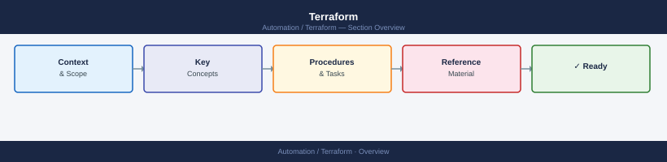

---
tags:
  - terraform
---
# Terraform

Terraform infrastructure-as-code knowledge base covering provider plugin architecture, state backend configuration, workspace model, module design, CI/CD integration, and troubleshooting for multi-cloud and on-premises environments.

*Applies to: Terraform 1.x*

<a class="kb-card" href="architecture/">
  <strong>Architecture</strong>
  How it works, integrations, and design standards.
</a>

<a class="kb-card" href="deploy/">
  <strong>Deploy</strong>
  Installation, initial configuration, and deployment procedures.
</a>

<a class="kb-card" href="operations/">
  <strong>Operations</strong>
  CLI reference, scripts, procedures, and state management.
</a>

<a class="kb-card" href="security/">
  <strong>Security</strong>
  Authentication, access control, secrets, and hardening.
</a>

<a class="kb-card" href="troubleshooting/">
  <strong>Troubleshooting</strong>
  Common issues, diagnostics, and escalation.
</a>

