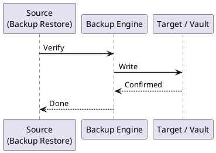

---
tags:
  - operations
  - terraform
---
# Terraform — Backup & Restore

```bash
# Local state — copy with timestamp
cp terraform.tfstate "terraform.tfstate.bak-$(date +%Y%m%d-%H%M%S)"

# Remote state (S3) — copy to versioned archive bucket
aws s3 cp s3://my-tf-state/project/terraform.tfstate \
    s3://my-tf-state-backup/project/terraform.tfstate.$(date +%Y%m%d-%H%M%S)

# Pull remote state locally for inspection
terraform state pull > terraform.tfstate.local-$(date +%Y%m%d)
```



## Before you begin

- **Access:** Provider credentials configured (`terraform login` or env vars)
- **Timing:** safe to run during business hours unless a step is marked ⚠ (causes interruption)
- **Dependencies:** no active upgrades or migrations on the same infrastructure
- **Logging:** capture command output — paste into the change record on completion

---

---

## Verify

- Confirm the operation completed without errors in the log or management UI
- Verify the expected state change is visible (service running, object created, config applied)
- Document the outcome in the change record

---

## See also

- [Terraform — Procedures](../procedures/)
- [Terraform — Health Checks](../health-checks/)
- [Terraform — Common Issues](../../troubleshooting/common-issues/)
