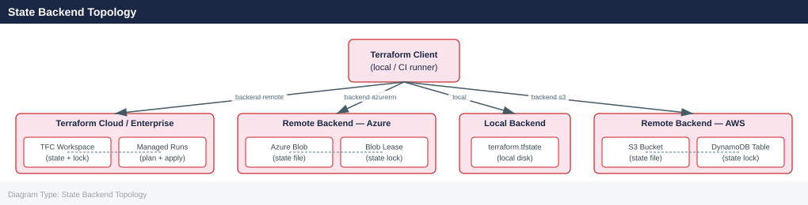

---
tags:
  - operations
  - terraform
description: "Terraform is HashiCorp's infrastructure-as-code tool. You describe your desired infrastructure in .tf files, and Terraform figures out what to create..."
---
# Terraform CLI Reference

<div class="kb-summary">
Terraform is HashiCorp's infrastructure-as-code tool. You describe your desired infrastructure in `.tf` files, and Terraform figures out what to create, change, or delete to reach that state.

*Applies to: Terraform 1.x*
</div>

 State is stored in a `.tfstate` file — it's Terraform's record of what it has actually deployed.

> Install with `brew install terraform` (macOS), `apt install terraform` (Debian), or download from terraform.io. Run `terraform init` in any new working directory before other commands.

## Before you begin

- **Access:** Provider credentials configured (`terraform login` or env vars)
- **Timing:** safe to run during business hours unless a step is marked ⚠ (causes interruption)
- **Dependencies:** no active upgrades or migrations on the same infrastructure
- **Logging:** capture command output — paste into the change record on completion

---

## State Backend Topology



---

## Validate, Format & Providers

Check syntax, auto-format code, and inspect provider dependencies. Run `validate` and `fmt -check` in CI before planning.

```bash
# Validate configuration syntax
terraform validate

# Auto-format code to canonical style
terraform fmt
terraform fmt -recursive            # format all subdirectories
terraform fmt -check                # exit non-zero if any files need formatting (CI use)
terraform fmt -diff                 # show what would change without writing

# Provider management
terraform providers                 # list required providers and their versions
terraform providers lock            # lock provider versions in .terraform.lock.hcl
terraform get                       # download modules referenced in configuration
terraform get -update               # update modules to latest allowed version

# Dependency graph (requires graphviz)
terraform graph | dot -Tsvg > graph.svg
terraform graph -type=plan | dot -Tpng > plan.png
```


```text title="Expected output"
Success! The configuration is valid.

(no output — command completes silently)
(no output — command completes silently)
(no output — command completes silently)

Providers required by this configuration:

  provider[registry.terraform.io/hashicorp/aws]
    version = "~> 5.0"
    constraints = "~> 5.0"
    hashes = [
      "h1:R+ObqmweUWxJ/9tIore2p+VHxfDJN51eKtyrnLul5s=",
      "zh:1d2b7693efadc0b1fd92145b510ce65c32c06ccd901617270bcc287f5e1f854",
    ]

  provider[registry.terraform.io/hashicorp/null]
    version = "~> 3.2"
    constraints = "~> 3.2"

(no output — command completes silently)

Downloading 1.2.0 from registry.terraform.io/terraform-aws-modules/vpc/aws...
- vpc in .terraform/modules/vpc

(no output — command completes silently)

digraph {
  compound = true
  newrank = true
  subgraph "root" {
    "[root] aws_vpc.main" [label = "aws_vpc.main", shape = "box"]
    "[root] aws_subnet.private" [label = "aws_subnet.private", shape = "box"]
    "[root] aws_subnet.private" -> "[root] aws_vpc.main"
  }
}
```

!!! warning "Common errors"
    | Error | Fix |
    |---|---|
    | `Error: Invalid or unsupported characters in filename` | Remove special characters from .tf file names; Terraform only accepts alphanumeric, hyphens, and underscores. |
    | `Error: Module not found` | Verify the module source path in your configuration and run `terraform get` to download missing modules before validating. |
    | `Error: dot: command not found` | Install graphviz with `apt-get install graphviz` (Ubuntu/Debian) or `brew install graphviz` (macOS) before piping terraform graph output to dot. |
---

## State & Output

State is Terraform's source of truth about what's deployed. Use `state` commands carefully — modifying state incorrectly can cause Terraform to recreate resources or lose track of existing ones.

```bash
# List all resources tracked in state
terraform state list
terraform state list module.name    # resources in a specific module

# Show a resource's current state
terraform state show resource_type.name
terraform state show 'resource_type.name["key"]'

# Move a resource (rename without destroying)
terraform state mv resource_type.old resource_type.new

# Remove a resource from state (without deleting the real resource)
terraform state rm resource_type.name

# Backup and restore state
terraform state pull > backup.tfstate
terraform state push backup.tfstate

# Release a stuck state lock
terraform force-unlock <lock_id>

# Import an existing resource into Terraform management
terraform import resource_type.name <resource_id>
terraform import -var-file=prod.tfvars resource_type.name <id>

# Generate config from existing resources (Terraform 1.5+)
terraform plan -generate-config-out=generated.tf

# Outputs
terraform output
terraform output <output_name>
terraform output -json
terraform output -raw <output_name>   # plain string without quotes
```


```text title="Expected output"
aws_instance.web_server
aws_instance.db_server
aws_security_group.main
module.vpc.aws_vpc.primary
module.vpc.aws_subnet.private[0]
module.vpc.aws_subnet.private[1]

# resource_type.name = {
  "ami"           = "ami-0c55b159cbfafe1f0"
  "availability_zone" = "us-east-1a"
  "id"            = "i-0abcd1234efgh5678"
  "instance_type" = "t3.medium"
  "private_ip"    = "10.0.1.42"
  "tags" = {
    "Name" = "production-web"
  }
}

(no output — command completes silently)

(no output — command completes silently)

State pulled and saved to backup.tfstate

Successfully released lock ID: 7f8e9d0c-1a2b-3c4d-5e6f-7g8h9i0j1k2l

aws_instance.imported_server: Importing from ID `i-0xyz9876abcd5432`...
aws_instance.imported_server: Import complete!

Generated configuration written to generated.tf

database_url = "postgresql://prod-db.c9akciq32.us-east-1.rds.amazonaws.com:5432/maindb"
api_endpoint = "https://api.example.com"

{
  "database_url": "postgresql://prod-db.c9akciq32.us-east-1.rds.amazonaws.com:5432/maindb",
  "api_endpoint": "https://api.example.com"
}

postgresql://prod-db.c9akciq32.us-east-1.rds.amazonaws.com:5432/maindb
```

!!! warning "Common errors"
    | Error | Fix |
    |---|---|
    | `Error: resource resource_type.name not found in state` | Verify the resource exists in state with `terraform state list` and use the exact name including module paths. |
    | `Error: Error acquiring the state lock: ConflictException: Resource of type 'LockID' with identifier '<lock_id>' does not exist` | Confirm the lock ID is correct by checking the error message in your logs or cloud provider console before attempting force-unlock. |
    | `Error: resource_type.name: resource already exists in state` | Use `terraform state rm` to remove the conflicting resource from state before importing, or choose a different resource address. |
---

## Workspaces

Workspaces let you manage multiple independent deployments (e.g., dev, staging, prod) from the same configuration with separate state files. Not available with all backends.

```bash
# List workspaces
terraform workspace list

# Create and switch
terraform workspace new <name>
terraform workspace select <name>

# Show current workspace
terraform workspace show

# Delete (must switch away first)
terraform workspace delete <name>
```


```text title="Expected output"
* default
  staging
  production

(no output — command completes silently)

(no output — command completes silently)

staging

(no output — command completes silently)
```

!!! warning "Common errors"
    | Error | Fix |
    |---|---|
    | `Error: workspace "production" does not exist` | Verify the workspace name with `terraform workspace list` before selecting. |
    | `Error: workspace cannot be deleted while it is the current workspace` | Switch to a different workspace with `terraform workspace select <other-name>` before deleting. |
---

## Console, Debug & Patterns

The interactive console evaluates expressions against your current state. Debug logging helps trace provider API calls when something isn't working.

```bash
# Interactive console (evaluate expressions against current state)
terraform console
# > module.name.output_value
# > var.my_var
# > length(var.list)

# Debug logging
TF_LOG=DEBUG terraform plan
TF_LOG=TRACE terraform apply
TF_LOG_PATH=./debug.log terraform plan

# Common workflow patterns
# Full cycle (plan → save → apply saved plan)
terraform init && terraform plan -out=tfplan && terraform apply tfplan

# Refresh-only (sync state with reality without changing resources)
terraform apply -refresh-only

# Import an existing resource then verify nothing would change
terraform import resource_type.name <id> && terraform plan

# CI/CD pattern (non-interactive)
terraform init -input=false
terraform plan -input=false -out=tfplan
terraform apply -input=false tfplan
```


```text title="Expected output"
> module.vpc.subnet_id
"subnet-0a1b2c3d4e5f6g7h8"
> var.environment
"production"
> length(var.availability_zones)
3
> 

2024-10-15T14:23:45.123Z [DEBUG] Initializing the backend...
2024-10-15T14:23:46.456Z [DEBUG] Backend initialized successfully
2024-10-15T14:23:47.789Z [DEBUG] Terraform has been successfully initialized!
2024-10-15T14:23:48.012Z [DEBUG] Refreshing Terraform state in-memory prior to plan...
2024-10-15T14:23:49.345Z [TRACE] Evaluating variable "instance_count"...

Initializing the backend...
Initializing provider plugins...
Terraform has been successfully initialized!

Terraform used the selected providers to generate the following execution plan. Resource actions are indicated with the following symbols:
  + create
  - destroy
  ~ modify

Plan: 3 to add, 0 to destroy, 1 to modify.

Saved a plan to: tfplan

aws_instance.web[0]: Importing from ID "i-0123456789abcdef0"...
aws_instance.web[0]: Import complete!

Apply complete! Resources: 0 added, 0 destroyed, 0 modified.
```

!!! warning "Common errors"
    | Error | Fix |
    |---|---|
    | `Error: No configuration files` | Run `terraform init` first to initialize the working directory and download provider plugins. |
    | `Error: Failed to read state file: stat .terraform/terraform.tfstate: no such file or directory` | Ensure the backend is properly configured and initialized with `terraform init`, or check that the state file path is correct. |
    | `Error: resource_type.name: resource not found` | Verify the resource address syntax matches your configuration (e.g., `aws_instance.example`) and that the resource exists in your Terraform code before importing. |
---

## Verify

- Confirm the operation completed without errors in the log or management UI
- Verify the expected state change is visible (service running, object created, config applied)
- Document the outcome in the change record

---

## See also

- [Terraform — Procedures](../procedures/)
- [Terraform — Scripts](../scripts/)
- [Terraform — Health Checks](../health-checks/)
