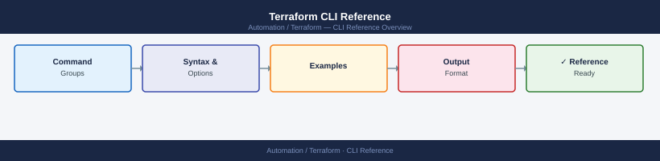
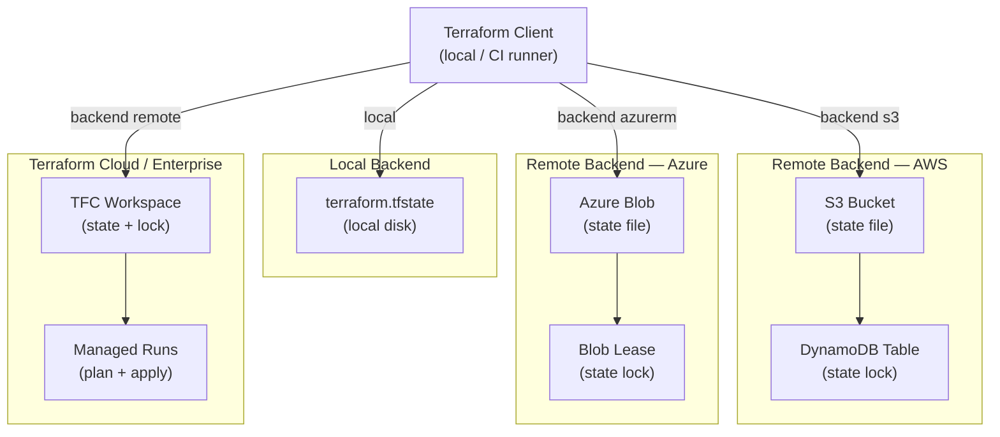

---
tags:
  - operations
  - terraform
---
# Terraform CLI Reference


<div class="kb-summary">
Terraform is HashiCorp's infrastructure-as-code tool. You describe your desired infrastructure in `.tf` files, and Terraform figures out what to create, change, or delete to reach that state.

*Applies to: Terraform 1.x*
</div>



 State is stored in a `.tfstate` file — it's Terraform's record of what it has actually deployed.

> Install with `brew install terraform` (macOS), `apt install terraform` (Debian), or download from terraform.io. Run `terraform init` in any new working directory before other commands.

## Before you begin

- **Access:** Provider credentials configured (`terraform login` or env vars)
- **Timing:** safe to run during business hours unless a step is marked ⚠ (causes interruption)
- **Dependencies:** no active upgrades or migrations on the same infrastructure
- **Logging:** capture command output — paste into the change record on completion

---

## State Backend Topology




---

## Validate, Format & Providers

Check syntax, auto-format code, and inspect provider dependencies. Run `validate` and `fmt -check` in CI before planning.

```bash
# Validate configuration syntax
terraform validate

# Auto-format code to canonical style
terraform fmt
terraform fmt -recursive            # format all subdirectories
terraform fmt -check                # exit non-zero if any files need formatting (CI use)
terraform fmt -diff                 # show what would change without writing

# Provider management
terraform providers                 # list required providers and their versions
terraform providers lock            # lock provider versions in .terraform.lock.hcl
terraform get                       # download modules referenced in configuration
terraform get -update               # update modules to latest allowed version

# Dependency graph (requires graphviz)
terraform graph | dot -Tsvg > graph.svg
terraform graph -type=plan | dot -Tpng > plan.png
```

---

## State & Output

State is Terraform's source of truth about what's deployed. Use `state` commands carefully — modifying state incorrectly can cause Terraform to recreate resources or lose track of existing ones.

```bash
# List all resources tracked in state
terraform state list
terraform state list module.name    # resources in a specific module

# Show a resource's current state
terraform state show resource_type.name
terraform state show 'resource_type.name["key"]'

# Move a resource (rename without destroying)
terraform state mv resource_type.old resource_type.new

# Remove a resource from state (without deleting the real resource)
terraform state rm resource_type.name

# Backup and restore state
terraform state pull > backup.tfstate
terraform state push backup.tfstate

# Release a stuck state lock
terraform force-unlock <lock_id>

# Import an existing resource into Terraform management
terraform import resource_type.name <resource_id>
terraform import -var-file=prod.tfvars resource_type.name <id>

# Generate config from existing resources (Terraform 1.5+)
terraform plan -generate-config-out=generated.tf

# Outputs
terraform output
terraform output <output_name>
terraform output -json
terraform output -raw <output_name>   # plain string without quotes
```

---

## Workspaces

Workspaces let you manage multiple independent deployments (e.g., dev, staging, prod) from the same configuration with separate state files. Not available with all backends.

```bash
# List workspaces
terraform workspace list

# Create and switch
terraform workspace new <name>
terraform workspace select <name>

# Show current workspace
terraform workspace show

# Delete (must switch away first)
terraform workspace delete <name>
```

---

## Console, Debug & Patterns

The interactive console evaluates expressions against your current state. Debug logging helps trace provider API calls when something isn't working.

```bash
# Interactive console (evaluate expressions against current state)
terraform console
# > module.name.output_value
# > var.my_var
# > length(var.list)

# Debug logging
TF_LOG=DEBUG terraform plan
TF_LOG=TRACE terraform apply
TF_LOG_PATH=./debug.log terraform plan

# Common workflow patterns
# Full cycle (plan → save → apply saved plan)
terraform init && terraform plan -out=tfplan && terraform apply tfplan

# Refresh-only (sync state with reality without changing resources)
terraform apply -refresh-only

# Import an existing resource then verify nothing would change
terraform import resource_type.name <id> && terraform plan

# CI/CD pattern (non-interactive)
terraform init -input=false
terraform plan -input=false -out=tfplan
terraform apply -input=false tfplan
```

---

## Verify

- Confirm the operation completed without errors in the log or management UI
- Verify the expected state change is visible (service running, object created, config applied)
- Document the outcome in the change record

---

## See also

- [Terraform — Procedures](../procedures/)
- [Terraform — Scripts](../scripts/)
- [Terraform — Health Checks](../health-checks/)
