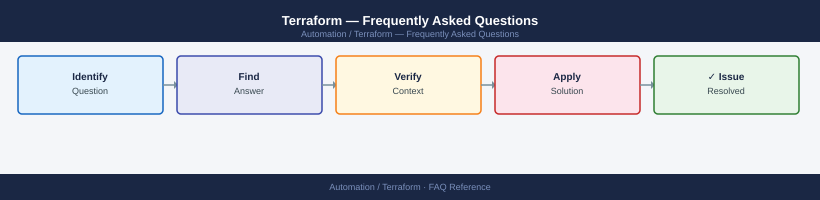

---
tags:
  - terraform
  - faq
  - operations
---
# Terraform — Frequently Asked Questions

Common questions about Terraform operations, configuration, and troubleshooting. For step-by-step procedures, see the <a href="index.md">Operations</a> section.

## General

**Q: What version of Terraform is recommended for new deployments?**
A: Terraform 1.7+ (OpenTofu 1.7+ if using the OSS fork). Pin the version in `.terraform-version` or `required_version` in `terraform.tf`. Check with `terraform version`.

**Q: How do I check the current Terraform version?**
A: `terraform version`

## Configuration

**Q: What is the default state backend and when should it change?**
A: Local state (`terraform.tfstate`) is the default but unsuitable for teams. Use remote state immediately: S3+DynamoDB for AWS, Azure Blob for Azure, or Terraform Cloud. Never commit `.tfstate` to Git.

**Q: How do I enable state locking to prevent concurrent runs?**
A: State locking is automatic with S3+DynamoDB backend (set `dynamodb_table` in the backend config). For Terraform Cloud, locking is built-in. Local state has no locking.

## Operations

**Q: How do I upgrade Terraform provider versions without disruption?**
A: Update `required_providers` version constraint, run `terraform init -upgrade`, then `terraform plan` to review changes. Test in dev first. Use `~>` constraints (e.g., `~> 5.0`) to allow patch updates.

**Q: What is the correct procedure to import an existing resource into Terraform state?**
A: Run `terraform import <resource_type>.<name> <provider_id>`. Verify with `terraform plan` — it should show no changes if the config matches. Document the import in a comment.

## Troubleshooting

**Q: Plan shows 'Warning: Deprecated attribute'. What does it mean?**
A: A provider attribute has been renamed or removed in a newer version. Update the resource block to use the new attribute name. Check the provider changelog for migration guidance.

**Q: Large plans take too long — where do I start?**
A: Use `-target` to scope applies to specific resources during debugging. Split large monolithic state into smaller workspaces. Use `terraform plan -parallelism=20` (default 10) for faster refreshes.

## Backup and Recovery

**Q: How often should I back up Terraform state?**
A: Remote backends (S3, Azure Blob) support versioning — enable it. For Terraform Cloud, history is kept automatically. Never rely on local state in production.

**Q: Can I restore a single resource in state without a full restore?**
A: Yes — use `terraform state rm <resource>` to remove a drifted resource, then `terraform import` to re-import the current real-world state. Alternatively, restore a previous state version from S3 versioning.

## See Also

- [Terraform Operations](index.md)
- [Terraform Troubleshooting](../../troubleshooting/index.md)
