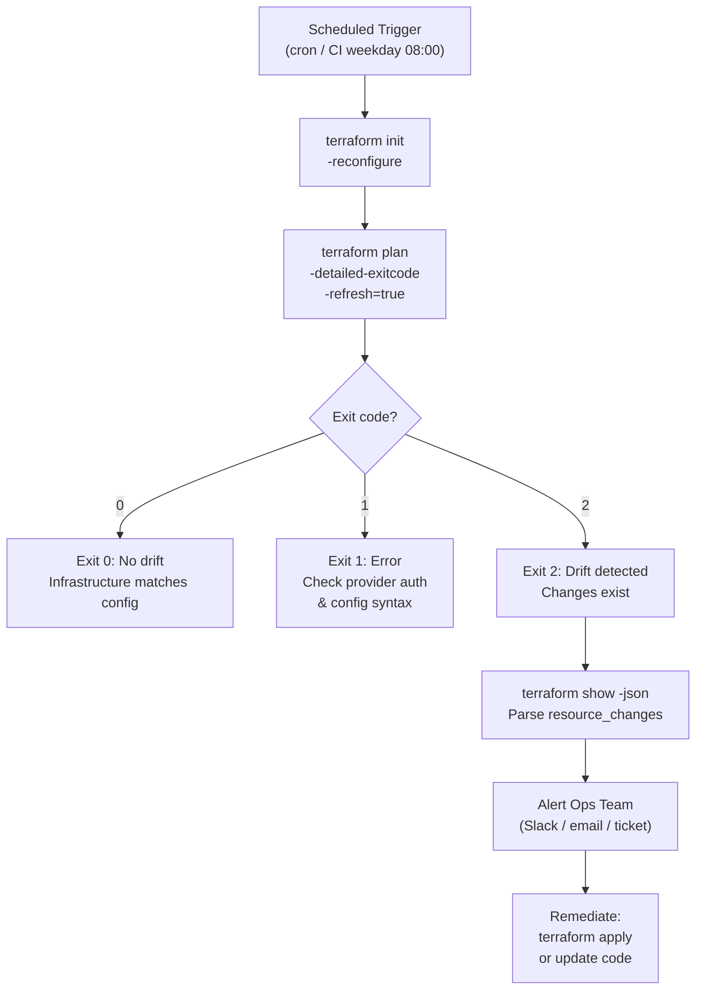

# Terraform — Health Checks


<div class="kb-summary">
Health Checks reference covering Drift Detection Flow, Daily Checks.
</div>

## Drift Detection Flow


┌────────────────────────────────────── Terraform — Health Checks ──────────────────────────────────────┐
│   ┌───────────────────────────────────────────────────────────────────────────────────────────────┐   │
│   │ Terraform health checks: state drift, stale lock, provider version currency, CI pipeline pass │   │
│   │   Drift detection: terraform plan on schedule; alert if non-empty plan in stable environment  │   │
│   │       Stale lock: terraform force-unlock <lock-id> after confirming no apply is running       │   │
│   └───────────────────────────────────────────────────────────────────────────────────────────────┘   │
│                                                                                                       │
│   ┌──────────────────────────────────────────────┐  ┌─────────────────────────────────────────────┐   │
│   │                 State Health                 │  │               Pipeline Health               │   │
│   │        terraform plan (expect empty)         │  │         fmt -check: no format drift         │   │
│   │       Check for stale lock in DynamoDB       │  │          validate: no config errors         │   │
│   │            S3 versioning enabled             │  │            tflint: zero warnings            │   │
│   │        terraform version (up to date)        │  │            checkov: zero failures           │   │
│   │       Provider plugin version currency       │  │          Plan approved before apply         │   │
│   └──────────────────────────────────────────────┘  └─────────────────────────────────────────────┘   │
│                                                                                                       │
│   ┌───────────────────────────────────────────────────────────────────────────────────────────────┐   │
│   │   Drift          = when actual infra state diverges from Terraform state; plan shows changes  │   │
│   │   force-unlock   = removes DynamoDB lock entry; only run if certain no apply is in progress   │   │
│   │    Scheduled plan = run terraform plan -detailed-exitcode in CI; exit 2 = changes detected    │   │
│   └───────────────────────────────────────────────────────────────────────────────────────────────┘   │
└───────────────────────────────────────────────────────────────────────────────────────────────────────┘

### Using terraform plan for Drift Detection

```bash
# Standard drift detection run
terraform plan -detailed-exitcode

# Exit codes:
# 0 = no changes (no drift)
# 1 = error
# 2 = changes detected (drift or config changes)

# Capture in a script
terraform plan -detailed-exitcode -out=tfplan
STATUS=$?
if [ $STATUS -eq 2 ]; then
  echo "Drift or pending changes detected"
elif [ $STATUS -eq 0 ]; then
  echo "Infrastructure matches configuration — no drift"
fi
```

### terraform import

Import real resources into state that were created outside Terraform.

```bash
# Import an existing AWS EC2 instance
terraform import aws_instance.web01 i-0abcd1234efgh5678

# Import with a module path
terraform import module.network.aws_vpc.main vpc-0a1b2c3d4e5f

# Import an Azure resource
terraform import azurerm_resource_group.rg /subscriptions/SUB_ID/resourceGroups/my-rg
```

After import, add the matching resource block to your `.tf` files, then run `terraform plan` to verify state matches configuration.

### moved Blocks

The `moved` block updates state when you rename or move resources without recreating them.

```hcl
# terraform/moved.tf
moved {
  from = aws_instance.old_name
  to   = aws_instance.new_name
}

moved {
  from = aws_security_group.sg
  to   = module.network.aws_security_group.sg
}
```

```bash
# Verify no unintended changes after adding moved blocks
terraform plan
# Should show: "0 to add, 0 to change, 0 to destroy"
```

### Scheduled Drift Detection

Run drift checks on a schedule in CI/CD to get early warnings.

```yaml
# .github/workflows/drift-check.yml
name: Terraform Drift Check

on:
  schedule:
    - cron: '0 8 * * 1-5'   # weekdays at 08:00 UTC
  workflow_dispatch:

jobs:
  drift:
    runs-on: ubuntu-24.04
    steps:
      - uses: actions/checkout@v4
      - uses: hashicorp/setup-terraform@v3

      - name: Terraform Init
        run: terraform init
        working-directory: infra/

      - name: Check for Drift
        id: plan
        run: terraform plan -detailed-exitcode -refresh=true -no-color
        working-directory: infra/
        continue-on-error: true

      - name: Notify on Drift
        if: steps.plan.outputs.exitcode == '2'
        run: |
          echo "DRIFT DETECTED — manual review required"
          # Add Slack/Teams notification here
        env:
          exitcode: ${{ steps.plan.outputs.exitcode }}
```

### Drift Causes and Remediation

| Drift cause | Detection | Remediation |
|---|---|---|
| Manual console change | `terraform plan` shows difference | Re-apply config or import and update code |
| Resource auto-modified by cloud provider | `terraform plan -refresh=true` | Update code to match or accept with `-refresh-only` |
| Resource deleted outside Terraform | Plan shows resource will be recreated | Import if it exists; allow recreation if intentional |
| State file out of date | Refresh shows many differences | Run `terraform apply -refresh-only` then review |

---

## Daily Checks

| Check | Command | Notes |
|---|---|---|
| [ ] Review `terraform plan` output in CI pipeline for any unexpected o | `terraform plan` |  |
| [ ] Confirm remote backend (S3, Azure Blob, or Terraform Cloud) is acc |  |  |
| [ ] Review active workspace | `terraform workspace list` | confirm correct workspace is selected |
| [ ] Check `.terraform.lock.hcl` for expired provider versions or depre | `.terraform.lock.hcl` |  |
| [ ] Review open pull requests that modify Terraform code for pending u |  |  |
| [ ] Check for stale state lock files that may indicate a stuck or aban |  |  |
| [ ] Confirm sensitive variable sources (Vault, SSM Parameter Store, en |  |  |
