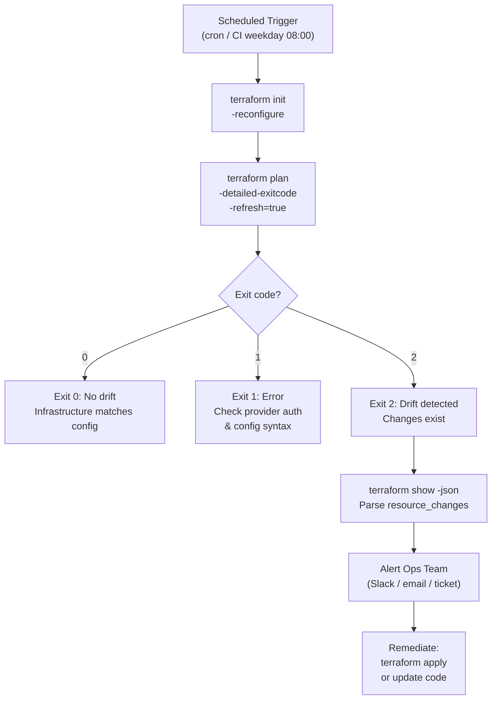

---
tags:
  - operations
  - terraform
---
# Terraform — Health Checks


<div class="kb-summary">
Health Checks reference covering Drift Detection Flow, Daily Checks.
</div>

## Run This Routine

```bash
# 1. Terraform version
terraform version

# 2. Provider versions
terraform providers

# 3. State file integrity — verify count matches expected resources
terraform state list | wc -l

# 4. Plan drift check — exit 0 = no changes, exit 2 = changes detected
terraform plan -detailed-exitcode; echo "Exit: $?"

# 5. Workspace list
terraform workspace list

# 6. Backend connectivity — should succeed without errors
terraform init -backend=true

# 7. Validate configuration
terraform validate

# 8. State lock check — inspect backend for stale locks; this is informational
terraform force-unlock --help
```
```text
┌────────────────────────────────────── Terraform — Health Checks ──────────────────────────────────────┐
│   ┌───────────────────────────────────────────────────────────────────────────────────────────────┐   │
│   │ Terraform health checks: state drift, stale lock, provider version currency, CI pipeline pass │   │
│   │   Drift detection: terraform plan on schedule; alert if non-empty plan in stable environment  │   │
│   │       Stale lock: terraform force-unlock <lock-id> after confirming no apply is running       │   │
│   └───────────────────────────────────────────────────────────────────────────────────────────────┘   │
│                                                                                                       │
│   ┌──────────────────────────────────────────────┐  ┌─────────────────────────────────────────────┐   │
│   │                 State Health                 │  │               Pipeline Health               │   │
│   │        terraform plan (expect empty)         │  │         fmt -check: no format drift         │   │
│   │       Check for stale lock in DynamoDB       │  │          validate: no config errors         │   │
│   │            S3 versioning enabled             │  │            tflint: zero warnings            │   │
│   │        terraform version (up to date)        │  │            checkov: zero failures           │   │
│   │       Provider plugin version currency       │  │          Plan approved before apply         │   │
│   └──────────────────────────────────────────────┘  └─────────────────────────────────────────────┘   │
│                                                                                                       │
│   ┌───────────────────────────────────────────────────────────────────────────────────────────────┐   │
│   │   Drift          = when actual infra state diverges from Terraform state; plan shows changes  │   │
│   │   force-unlock   = removes DynamoDB lock entry; only run if certain no apply is in progress   │   │
│   │    Scheduled plan = run terraform plan -detailed-exitcode in CI; exit 2 = changes detected    │   │
│   └───────────────────────────────────────────────────────────────────────────────────────────────┘   │
└───────────────────────────────────────────────────────────────────────────────────────────────────────┘
```

Compare the output against the expected resource count tracked in your runbook. A sudden drop or spike indicates a state manipulation issue.

**Inspect a specific resource**

```bash
terraform state show <resource_address>
```

**Remove a stale resource from state (non-destructive)**

```bash
terraform state rm <resource_address>
```

Use only when a resource has been manually deleted outside Terraform and the state entry is orphaned.

**Pull remote state to inspect locally**

```bash
terraform state pull > state-snapshot.json
```

Review `state-snapshot.json` for unexpected `null` values, duplicate serial numbers, or missing resource blocks.

**Key health indicators**

| Indicator | Healthy | Action Required |
|---|---|---|
| Resource count | Matches expected | Investigate additions or removals |
| Serial number | Incrementing | Reset or re-init if repeated |
| Lock file present | None (steady state) | Force-unlock if stale |
| State file age | Updated on last apply | Re-run plan to verify |

---

## Provider Drift

Provider version drift occurs when local `.terraform.lock.hcl` entries diverge from what is declared in `required_providers`, or when a provider registry releases a new version that was not pinned.

**Check configured providers and their sources**

```bash
terraform providers
```

**Review lock file constraints**

```bash
cat .terraform.lock.hcl
```

Confirm that the `version` and `constraints` fields in the lock file match the versions declared in `versions.tf` or the root module.

**Re-initialise and upgrade providers (controlled)**

```bash
terraform init -upgrade
```

Run this only during a planned maintenance window. After upgrading, run `terraform plan` to verify no unintended resource changes are introduced by the new provider version.

**Key health indicators**

| Indicator | Healthy | Action Required |
|---|---|---|
| Lock file present | Yes, committed to VCS | Re-init and commit |
| Provider version pinned | `~>` or exact version | Add version constraint |
| Plan after provider upgrade | No changes | Review provider changelog |

---

## Workspace Management

Workspaces isolate state between environments (e.g., `dev`, `staging`, `prod`). Confirm that the correct workspace is active before any operation.

**List all workspaces**

```bash
terraform workspace list
```

The active workspace is marked with `*`.

**Show current workspace**

```bash
terraform workspace show
```

**Switch workspace**

```bash
terraform workspace select <workspace_name>
```

**Confirm state is scoped to the correct workspace**

```bash
terraform state list
```

Run this immediately after switching workspaces to verify the resource list matches the expected environment.

**Key health indicators**

| Indicator | Healthy | Action Required |
|---|---|---|
| Active workspace | Matches target environment | Switch before running plan/apply |
| State per workspace | Separate, non-overlapping | Audit if resources appear in wrong workspace |
| Workspace naming | Consistent convention | Rename or document deviations |

---

## Backend Connectivity

The remote backend (S3, Terraform Cloud, Azure Blob, GCS, etc.) must be reachable and properly authenticated for state reads, writes, and locking.

**Test backend connectivity**

```bash
terraform init -backend=true
```

A clean init with no errors confirms backend credentials and network access are valid.

**Check backend configuration**

```bash
cat backend.tf
```

Verify that the bucket/container name, region, and key path are correct for the current environment.

**Validate credentials (AWS example)**

```bash
aws sts get-caller-identity
```

Replace with the equivalent CLI check for your cloud provider (e.g., `az account show` for Azure, `gcloud auth list` for GCP).

**Force-unlock a stale lock (use with caution)**

```bash
terraform force-unlock <lock-id>
```

Obtain the lock ID from the backend error message or by inspecting the lock object directly in the backend store. Only unlock if you have confirmed no active `apply` is running.

**Key health indicators**

| Indicator | Healthy | Action Required |
|---|---|---|
| `terraform init` exit code | 0 | Check credentials and network |
| Backend lock file | Absent (steady state) | Investigate running operations |
| Credential expiry | Valid | Rotate or renew before expiry |
| Backend region/endpoint | Correct for environment | Update `backend.tf` |

---

## Drift Detection Flow


### terraform import

Import real resources into state that were created outside Terraform.

```bash
# Import an existing AWS EC2 instance
terraform import aws_instance.web01 i-0abcd1234efgh5678

# Import with a module path
terraform import module.network.aws_vpc.main vpc-0a1b2c3d4e5f

# Import an Azure resource
terraform import azurerm_resource_group.rg /subscriptions/SUB_ID/resourceGroups/my-rg
```

After import, add the matching resource block to your `.tf` files, then run `terraform plan` to verify state matches configuration.

### moved Blocks

The `moved` block updates state when you rename or move resources without recreating them.

```hcl
# terraform/moved.tf
moved {
  from = aws_instance.old_name
  to   = aws_instance.new_name
}

moved {
  from = aws_security_group.sg
  to   = module.network.aws_security_group.sg
}
```

```bash
# Verify no unintended changes after adding moved blocks
terraform plan
# Should show: "0 to add, 0 to change, 0 to destroy"
```

### Scheduled Drift Detection

Run drift checks on a schedule in CI/CD to get early warnings.

```yaml
# .github/workflows/drift-check.yml
name: Terraform Drift Check

on:
  schedule:
    - cron: '0 8 * * 1-5'   # weekdays at 08:00 UTC
  workflow_dispatch:

jobs:
  drift:
    runs-on: ubuntu-24.04
    steps:
      - uses: actions/checkout@v4
      - uses: hashicorp/setup-terraform@v3

      - name: Terraform Init
        run: terraform init
        working-directory: infra/

      - name: Check for Drift
        id: plan
        run: terraform plan -detailed-exitcode -refresh=true -no-color
        working-directory: infra/
        continue-on-error: true

      - name: Notify on Drift
        if: steps.plan.outputs.exitcode == '2'
        run: |
          echo "DRIFT DETECTED — manual review required"
          # Add Slack/Teams notification here
        env:
          exitcode: ${{ steps.plan.outputs.exitcode }}
```

### Drift Causes and Remediation

| Drift cause | Detection | Remediation |
|---|---|---|
| Manual console change | `terraform plan` shows difference | Re-apply config or import and update code |
| Resource auto-modified by cloud provider | `terraform plan -refresh=true` | Update code to match or accept with `-refresh-only` |
| Resource deleted outside Terraform | Plan shows resource will be recreated | Import if it exists; allow recreation if intentional |
| State file out of date | Refresh shows many differences | Run `terraform apply -refresh-only` then review |

---

## Daily Checks

| Check | Command | Notes |
|---|---|---|
| [ ] Review `terraform plan` output in CI pipeline for any unexpected o | `terraform plan` |  |
| [ ] Confirm remote backend (S3, Azure Blob, or Terraform Cloud) is acc |  |  |
| [ ] Review active workspace | `terraform workspace list` | confirm correct workspace is selected |
| [ ] Check `.terraform.lock.hcl` for expired provider versions or depre | `.terraform.lock.hcl` |  |
| [ ] Review open pull requests that modify Terraform code for pending u |  |  |
| [ ] Check for stale state lock files that may indicate a stuck or aban |  |  |
| [ ] Confirm sensitive variable sources (Vault, SSM Parameter Store, en |  |  |
