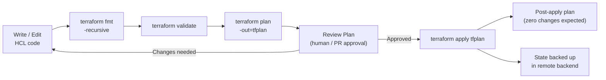

# Terraform — Procedures


<div class="kb-summary">
Procedures reference covering Standard Apply Workflow, Plan Workflows, Change Readiness, Maintenance Window, Post-Change Validation and 1 more sections.
</div>

## Standard Apply Workflow


```text
┌─────────────────────────────────────── Terraform — Procedures ────────────────────────────────────────┐
│   ┌───────────────────────────────────────────────────────────────────────────────────────────────┐   │
│   │     TF procedures: new module creation, import existing infra, state migration, workspaces    │   │
│   │  New module: write main.tf, variables.tf, outputs.tf, versions.tf; add examples/; add tests/  │   │
│   │    Import: terraform import resource.type.name <resource-id>; then terraform plan to verify   │   │
│   └───────────────────────────────────────────────────────────────────────────────────────────────┘   │
│                                                                                                       │
│   ┌──────────────────────────────────────────────┐  ┌─────────────────────────────────────────────┐   │
│   │           Import Existing Resource           │  │               State Migration               │   │
│   │        1. Write resource block in .tf        │  │    1. terraform state pull > old.tfstate    │   │
│   │         2. terraform import addr id          │  │        2. Modify state JSON if needed       │   │
│   │       3. terraform plan (expect empty)       │  │     3. terraform state push new.tfstate     │   │
│   │       4. Adjust config to match state        │  │          4. terraform plan (verify)         │   │
│   │               5. Commit to git               │  │          5. Run apply to reconcile          │   │
│   └──────────────────────────────────────────────┘  └─────────────────────────────────────────────┘   │
│                                                                                                       │
│   ┌───────────────────────────────────────────────────────────────────────────────────────────────┐   │
│   │         terraform import = adds existing resource to state; does not generate .tf code        │   │
│   │         Config generation = terraform plan -generate-config-out=generated.tf (TF 1.5+)        │   │
│   │        state migration   = moving state between backends; terraform init -migrate-state       │   │
│   └───────────────────────────────────────────────────────────────────────────────────────────────┘   │
└───────────────────────────────────────────────────────────────────────────────────────────────────────┘
```

Use `-target` sparingly — it creates drift between the plan and real state if overused.

### Passing Variables at Apply Time

```bash
# Inline variable values
terraform apply -var="instance_type=t3.medium" -var="region=eu-west-1"

# From a var file
terraform apply -var-file="envs/production.tfvars"

# From environment variables (TF_VAR_ prefix)
export TF_VAR_db_password="s3cretpassword"
terraform apply
```

### Apply in CI/CD Pipelines

```yaml
# GitHub Actions example
- name: Terraform Init
  run: terraform init
  working-directory: infra/

- name: Terraform Plan
  id: plan
  run: terraform plan -out=tfplan -no-color
  working-directory: infra/
  env:
    AWS_ACCESS_KEY_ID: ${{ secrets.AWS_ACCESS_KEY_ID }}
    AWS_SECRET_ACCESS_KEY: ${{ secrets.AWS_SECRET_ACCESS_KEY }}

- name: Terraform Apply
  if: github.ref == 'refs/heads/main'
  run: terraform apply -auto-approve tfplan
  working-directory: infra/
```

### Apply Behaviour Reference

| Flag | Effect |
|---|---|
| `-auto-approve` | Skip interactive confirmation |
| `-target=resource` | Limit apply to specific resource(s) |
| `-var="key=val"` | Pass a variable inline |
| `-var-file=file.tfvars` | Load variables from a file |
| `-parallelism=N` | Concurrent resource operations (default 10) |
| `-refresh=false` | Skip state refresh (faster, less safe) |
| `-compact-warnings` | Summarise warnings instead of full detail |

---

## Plan Workflows

### terraform plan Basics

`terraform plan` generates an execution plan showing what changes Terraform will make.

```bash
# Basic plan — shows changes, does not apply
terraform plan

# Plan with variable file
terraform plan -var-file="envs/prod.tfvars"

# Plan with inline variable
terraform plan -var="instance_count=3"

# Plan with exit codes (useful in scripts)
terraform plan -detailed-exitcode
# 0 = no changes, 1 = error, 2 = changes pending
```

### Saving Plan Files

Saving a plan guarantees the apply step executes exactly what was reviewed.

```bash
# Save plan to a binary file
terraform plan -out=tfplan

# View a saved plan in human-readable form
terraform show tfplan

# View as JSON for scripting / audit
terraform show -json tfplan > plan.json

# Extract resource changes from JSON plan
terraform show -json tfplan | \
  jq '.resource_changes[] | {address, actions: .change.actions}'

# Apply from a saved plan (no confirmation prompt)
terraform apply tfplan
```

### Reading Plan Output

Understanding the plan output symbols:

| Symbol | Meaning |
|---|---|
| `+` green | Resource will be created |
| `-` red | Resource will be destroyed |
| `~` yellow | Resource will be updated in-place |
| `-/+` | Resource must be destroyed and recreated |
| `<=` | Data source will be read |

```bash
# Example plan output snippet
  # aws_instance.web will be updated in-place
  ~ resource "aws_instance" "web" {
        id            = "i-0abc12345def"
      ~ instance_type = "t3.small" -> "t3.medium"
        # (all other attributes unchanged)
    }

Plan: 0 to add, 1 to change, 0 to destroy.
```

### Plan Review Checklist

Before approving and applying a plan, verify:

- No unexpected destroys (`-` or `-/+` on production resources)
- Resource counts match expectations
- No sensitive variable values exposed in plain text
- `instance_type`, `ami`, `cidr_block` changes are intentional
- Dependencies between resources are reflected correctly
- Module outputs used by other resources are still valid

```bash
# Highlight destroy operations in a saved JSON plan
terraform show -json tfplan | \
  jq '.resource_changes[] | select(.change.actions[] == "delete") | .address'
```

### Plan in CI/CD

```yaml
# GitHub Actions — post plan output to PR comment
- name: Terraform Plan
  id: plan
  run: terraform plan -no-color -out=tfplan 2>&1 | tee plan_output.txt
  working-directory: infra/
  continue-on-error: true

- name: Post Plan to PR
  uses: actions/github-script@v7
  with:
    script: |
      const fs = require('fs');
      const plan = fs.readFileSync('infra/plan_output.txt', 'utf8');
      const output = `#### Terraform Plan\n\`\`\`\n${plan.slice(0, 60000)}\n\`\`\``;
      github.rest.issues.createComment({
        issue_number: context.issue.number,
        owner: context.repo.owner,
        repo: context.repo.repo,
        body: output
      });
```

### Useful Plan Flags

```bash
# Limit plan to specific resources
terraform plan -target=module.database

# Skip refreshing state (faster, use when you know state is current)
terraform plan -refresh=false

# Show only the plan, no preceding status messages
terraform plan -no-color 2>&1 | grep -E '^\s*(#|\+|~|-|Plan)'

# Generate a graph of the plan
terraform graph | dot -Tsvg > plan.svg
```

---

## Change Readiness

- [ ] `terraform plan` output reviewed and all proposed changes are intentional and approved
- [ ] State is not currently locked by another operation
- [ ] Correct workspace is selected for the target environment
- [ ] Sensitive variables (Vault/SSM/env) are accessible and not expired
- [ ] Remote backend is accessible and state file is current
- [ ] State file snapshot or manual backup taken before destructive operations
- [ ] Rollback plan documented (previous state file version identified in backend)
- [ ] CI pipeline passing on the branch to be applied

| Item | Status | Notes |
|---|---|---|
| `terraform plan` reviewed | | Approver name |
| State not locked | | Confirmed / Lock ID if present |
| Correct workspace | | Workspace name |
| State backup | | Backend version ID or manual copy |
| Rollback plan | | Previous state version reference |

---

## Maintenance Window

1. Notify team of the planned Terraform change and scope (workspace, resources affected).
2. Back up the state file — record the current backend version ID or copy state locally.
3. Confirm the state is not locked before starting.
4. Run `terraform plan -out=tfplan` and review the output one final time.
5. Execute `terraform apply tfplan`; monitor output for errors.
6. For destructive operations (`terraform state rm`, `terraform destroy`), pause after each resource and validate.
7. Use `terraform import` for any resources created out-of-band that must be brought under management.
8. Run `terraform plan` after apply to confirm zero changes remain.

---

## Post-Change Validation

- [ ] `terraform plan` shows zero changes after apply — state is consistent with infrastructure
- [ ] Resources are accessible and healthy in the provider console (AWS/Azure/GCP)
- [ ] State is not locked
- [ ] CI pipeline is passing on the applied branch
- [ ] Remote backend state file updated timestamp reflects the apply
- [ ] No deprecated resource warnings in `terraform validate` output
- [ ] Sensitive variable sources still accessible after the change
- [ ] Rollback state backup retained until the change is confirmed stable

---

## Incident Triage

- [ ] Check if state is locked — identify the lock holder and determine if it is stale
- [ ] Run `terraform plan` to detect drift between state and actual infrastructure
- [ ] Run `terraform show` to inspect the current recorded state for the affected resource
- [ ] Check provider API connectivity (AWS, Azure, GCP CLI auth working)
- [ ] Review recent `terraform apply` logs in CI for the last successful and failed runs
- [ ] If state is corrupt or inconsistent, restore from the last known-good state backup
- [ ] Use `terraform state list` and `terraform state show <resource>` to inspect specific resources

| Question | Answer |
|---|---|
| Is state locked? | `terraform force-unlock <lock-id>` if stale |
| Is there drift? | `terraform plan` output |
| Which resource is affected? | `terraform state show <resource>` |
| Is the provider API reachable? | Test with AWS/Azure/GCP CLI |
| Was a recent apply the cause? | Check CI apply logs |
