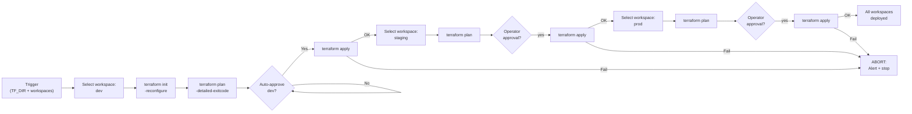

# Terraform — Scripts


<div class="kb-summary">
Scripts reference covering Purpose, Multi-Workspace Deploy Pipeline, Windows: Terraform Plan and Apply (CMD Batch), Windows: Terraform State Audit (PowerShell).
</div>

## Purpose

Use this page for practical Terraform scripts, field-tested commands, known issues, and operational notes.

## Multi-Workspace Deploy Pipeline


```
┌───────────────────────────────────────── Terraform — Scripts ─────────────────────────────────────────┐
│   ┌───────────────────────────────────────────────────────────────────────────────────────────────┐   │
│   │     Terraform utility scripts: drift report, stale lock check, state backup, plan summary     │   │
│   └───────────────────────────────────────────────────────────────────────────────────────────────┘   │
│                                                                                                       │
│   ┌──────────────────────────────────────────────┐  ┌─────────────────────────────────────────────┐   │
│   │              Operations Scripts              │  │                CI/CD Scripts                │   │
│   │        drift_check.sh (plan + alert)         │  │            tf_plan_pr_comment.py            │   │
│   │          backup_state.sh (S3 copy)           │  │               tf_apply_gate.sh              │   │
│   │        unlock_stale.sh (force-unlock)        │  │               tf_fmt_check.sh               │   │
│   │       list_drift.py (parse plan JSON)        │  │              checkov_report.sh              │   │
│   └──────────────────────────────────────────────┘  └─────────────────────────────────────────────┘   │
│                                                                                                       │
│   ┌───────────────────────────────────────────────────────────────────────────────────────────────┐   │
│   │      Plan JSON     = terraform plan -out=tfplan; terraform show -json tfplan > plan.json      │   │
│   │    PR comment    = use GitHub API or atlantis to post plan output as PR comment for review    │   │
│   │         -detailed-exitcode= exit 0: no changes, exit 1: error, exit 2: changes present        │   │
│   └───────────────────────────────────────────────────────────────────────────────────────────────┘   │
└───────────────────────────────────────────────────────────────────────────────────────────────────────┘
```

**What you should see**

The script works through each workspace (dev, staging, prod) in order. For each workspace it prints a header, runs init and plan, then prompts `Apply changes for workspace '<name>'? [yes/no]:`. Type `yes` and press Enter to apply. If any workspace fails the script stops immediately and prints an alert with remediation instructions. A timestamped log file is written to `/var/log/` throughout.

---

## Windows: Terraform Plan and Apply (CMD Batch)

Automates the full Terraform workflow on Windows: checks for terraform.exe, runs init, validate, and plan, prompts for confirmation, applies if confirmed, and logs everything to a timestamped file.

~~~bat
@echo off
REM tf-plan-apply.bat
REM Usage: Edit the TF_DIR and TF_VAR_ values below, then run from Command Prompt.

setlocal enabledelayedexpansion

REM -----------------------------------------------------------------------
REM EDIT THESE VALUES
REM -----------------------------------------------------------------------
set TF_DIR=C:\terraform\my-project
set TF_WORKSPACE=default

REM Terraform variables — add or remove as needed for your project
set TF_VAR_region=us-east-1
set TF_VAR_environment=dev
set TF_VAR_app_name=myapp
REM -----------------------------------------------------------------------

for /f "tokens=1-6 delims=/:. " %%a in ("%date% %time%") do (
    set LOGFILE=%USERPROFILE%\Desktop\tf-apply-%%a%%b%%c-%%d%%e%%f.log
)

echo.
echo === Terraform Plan and Apply ===
echo Directory : %TF_DIR%
echo Workspace : %TF_WORKSPACE%
echo Log       : %LOGFILE%
echo.

echo [1/6] Checking for terraform.exe...
terraform -version >nul 2>&1
if errorlevel 1 (
    echo ERROR: terraform.exe not found in PATH.
    echo Download from https://terraform.io/downloads, extract to C:\Tools, add C:\Tools to PATH.
    pause
    exit /b 1
)
echo terraform found.
echo.

echo [2/6] Changing to project directory...
if not exist "%TF_DIR%" (
    echo ERROR: Directory not found: %TF_DIR%
    pause
    exit /b 1
)
cd /d "%TF_DIR%"
echo.

echo [3/6] Running terraform init...
terraform init -reconfigure -input=false 2>&1
if errorlevel 1 ( echo ERROR: terraform init failed. & pause & exit /b 1 )
echo.

echo [4/6] Running terraform validate...
terraform validate 2>&1
if errorlevel 1 ( echo ERROR: terraform validate failed. & pause & exit /b 1 )
echo.

echo [5/6] Running terraform plan...
terraform plan -out=tfplan.bin -input=false 2>&1
if errorlevel 1 ( echo ERROR: terraform plan failed. & pause & exit /b 1 )
echo.

echo [6/6] Review the plan output above.
set /p CONFIRM=Type YES to apply (anything else cancels): 
if /i "%CONFIRM%" neq "YES" (
    echo Apply cancelled.
    del tfplan.bin 2>nul
    pause
    exit /b 0
)

echo.
echo Applying...
terraform apply tfplan.bin 2>&1
del tfplan.bin 2>nul
if errorlevel 1 ( echo ERROR: terraform apply failed. & pause & exit /b 1 )

echo.
echo Apply complete.
pause
endlocal
~~~

### How to run this script — step by step

**Before you start — what you need**
- Windows 10 or later
- Terraform installed and available as `terraform.exe`
- AWS credentials set as environment variables or in `%USERPROFILE%\.aws\credentials`
- A Terraform project folder with your `.tf` configuration files

**Step 1 — Save the file**

1. Open **Notepad** on your Windows PC
2. Copy the entire code block above
3. Save as **All Files**, name it `tf-plan-apply.bat`, save to your Desktop

**Step 2 — Fill in your details**

| Variable | What to enter | Where to find it |
|---|---|---|
| `TF_DIR` | Full path to your Terraform project folder | The folder containing your `.tf` files |
| `TF_WORKSPACE` | Terraform workspace name (default `default`) | Run `terraform workspace list` in your project |
| `TF_VAR_region` | AWS region (e.g. `us-east-1`) | Your AWS console region |
| `TF_VAR_environment` | Environment name (e.g. `dev`, `prod`) | Your naming convention |
| `TF_VAR_app_name` | Your application name | Your internal naming convention |

**Step 3 — Run the script**

```bash
cd C:\Users\YourName\Desktop
tf-plan-apply.bat
```

**What you should see**

The script runs through 6 numbered steps. After the plan output you are prompted to type `YES` to apply. A log file is saved to your Desktop with a timestamp in the filename.

---

## Windows: Terraform State Audit (PowerShell)

Reads the current Terraform state, lists all resources with their type and provider, groups by resource type with counts, and flags tainted resources.

~~~powershell
# tf-state-audit.ps1
# Run from inside your Terraform project directory.
# Usage: cd C:\path\to\terraform\project ; .\tf-state-audit.ps1

#Requires -Version 5.1

$ErrorActionPreference = "Stop"
$Timestamp  = Get-Date -Format "yyyyMMdd-HHmmss"
$ReportFile = Join-Path $env:USERPROFILE "Desktop\tf-state-audit-$Timestamp.txt"

function Write-Report {
    param([string]$Line)
    Write-Host $Line
    Add-Content -Path $ReportFile -Value $Line
}

Write-Report "=== Terraform State Audit ==="
Write-Report "Run at  : $(Get-Date -Format 'yyyy-MM-dd HH:mm:ss')"
Write-Report "Folder  : $(Get-Location)"
Write-Report ""

try {
    $tfVer = terraform -version 2>&1 | Select-Object -First 1
    Write-Report "Terraform : $tfVer"
} catch {
    Write-Host "ERROR: terraform not found in PATH." -ForegroundColor Red
    exit 1
}

Write-Host "[1/4] Reading state with terraform show -json..." -ForegroundColor Yellow
$state = terraform show -json 2>&1 | ConvertFrom-Json

Write-Host "[2/4] Extracting resources..." -ForegroundColor Yellow
$resources = @()
if ($state.values.root_module.resources) { $resources += $state.values.root_module.resources }
if ($state.values.root_module.child_modules) {
    foreach ($m in $state.values.root_module.child_modules) {
        if ($m.resources) { $resources += $m.resources }
    }
}

if ($resources.Count -eq 0) {
    Write-Report "No resources found in state."
    exit 0
}

Write-Host "[3/4] Building resource list..." -ForegroundColor Yellow
Write-Report "=== All Resources ($($resources.Count) total) ==="
Write-Report ("{0,-60} {1,-35} {2}" -f "Address", "Type", "Provider")
Write-Report ("-" * 110)

$tainted = @()
foreach ($r in $resources) {
    Write-Report ("{0,-60} {1,-35} {2}" -f $r.address, $r.type, $r.provider_name)
    if ($r.tainted -eq $true) { $tainted += $r.address }
}

Write-Host "[4/4] Grouping by type..." -ForegroundColor Yellow
Write-Report ""
Write-Report "=== Resource Count by Type ==="
$resources | Group-Object -Property type | Sort-Object Count -Descending | ForEach-Object {
    Write-Report ("{0,-45} {1}" -f $_.Name, $_.Count)
}

Write-Report ""
Write-Report "=== Tainted Resources ==="
if ($tainted.Count -eq 0) {
    Write-Report "None."
} else {
    Write-Report "WARNING: $($tainted.Count) tainted resource(s) found."
    $tainted | ForEach-Object { Write-Report "  TAINTED: $_" }
}

Write-Report ""
Write-Report "Report saved to : $ReportFile"
Write-Host "Audit complete. Report: $ReportFile" -ForegroundColor Green
~~~

### How to run this script — step by step

**Before you start — what you need**
- Windows 10 or later with Terraform installed and in your PATH
- A Terraform project directory where `terraform apply` has been run at least once

**Step 1 — Save the file**

Save the script as `tf-state-audit.ps1` in your Terraform project folder or Desktop.

**Step 2 — Open PowerShell and navigate to your Terraform project**

```bash
cd C:\path\to\your\terraform\project
Set-ExecutionPolicy -Scope Process -ExecutionPolicy Bypass
.\tf-state-audit.ps1
```

**What you should see**

A table of all resources in state (address, type, provider), a count grouped by resource type, and a tainted resources section. A `.txt` report is saved to your Desktop.
