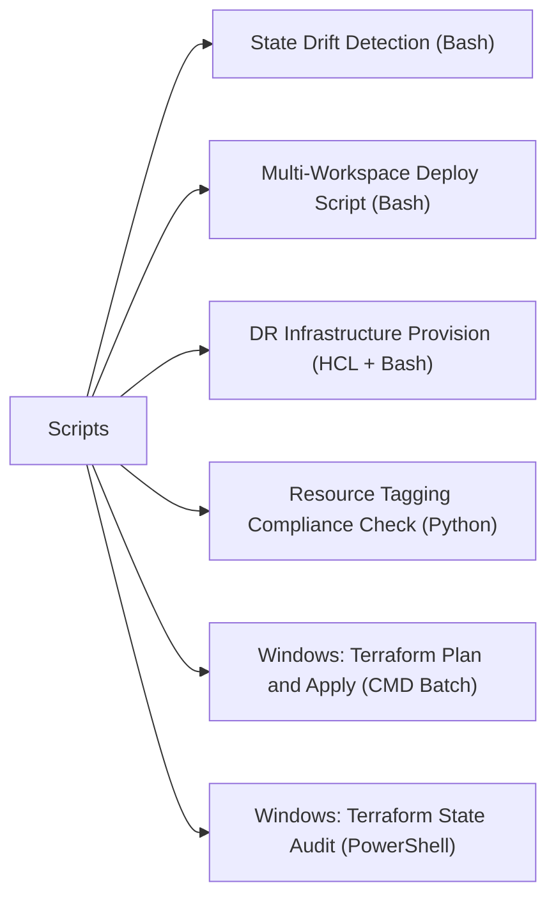

# Scripts

> Part of the [Terraform](../) reference.

---



## State Drift Detection (Bash)

Wrapper around `terraform plan` that detects configuration drift in a given workspace, parses the change summary, and alerts if drift is found. Suitable for scheduled execution.

~~~bash
#!/usr/bin/env bash
# tf-drift-detect.sh
# Usage: TF_DIR=<path> TF_WORKSPACE=<workspace> ./tf-drift-detect.sh
#
# Exit codes: 0=no drift, 1=drift detected or error

set -euo pipefail

TF_DIR="${TF_DIR:?TF_DIR is required}"
TF_WORKSPACE="${TF_WORKSPACE:-default}"
PLANFILE="/tmp/tfplan-$(date +%Y%m%d%H%M%S).out"
ALERT_WEBHOOK="${ALERT_WEBHOOK:-}"   # Optional: Slack/Teams webhook URL
LOGFILE="/var/log/tf-drift-$(date +%Y%m%d-%H%M%S).log"

log() {
    local msg="[$(date '+%Y-%m-%d %H:%M:%S')] $*"
    echo "${msg}"
    echo "${msg}" >> "${LOGFILE}"
}

cleanup() { rm -f "${PLANFILE}" "${PLANFILE}.json"; }
trap cleanup EXIT

log "=== Terraform Drift Detection ==="
log "Directory : ${TF_DIR}"
log "Workspace : ${TF_WORKSPACE}"

cd "${TF_DIR}"

# --- Step 1: Select workspace ---
log "Step 1: Selecting workspace '${TF_WORKSPACE}'..."
terraform workspace select "${TF_WORKSPACE}" 2>&1 | tee -a "${LOGFILE}"

# --- Step 2: Init ---
log "Step 2: Running terraform init -reconfigure..."
terraform init -reconfigure -input=false 2>&1 | tee -a "${LOGFILE}"

# --- Step 3: Plan with detailed exit code ---
log "Step 3: Running terraform plan..."
set +e
terraform plan -detailed-exitcode -input=false -out="${PLANFILE}" 2>&1 | tee -a "${LOGFILE}"
PLAN_RC=$?
set -e

# --- Step 4: Interpret exit code ---
case "${PLAN_RC}" in
    0)
        log "RESULT: No changes. Infrastructure matches configuration."
        exit 0
        ;;
    1)
        log "RESULT: ERROR — terraform plan encountered an error."
        exit 1
        ;;
    2)
        log "RESULT: DRIFT DETECTED — configuration changes exist."
        ;;
    *)
        log "RESULT: Unexpected plan exit code: ${PLAN_RC}"
        exit 1
        ;;
esac

# --- Step 5: Parse change summary ---
log "Step 5: Parsing resource change summary..."
terraform show -json "${PLANFILE}" > "${PLANFILE}.json"

SUMMARY=$(python3 - <<EOF
import json, sys

with open('${PLANFILE}.json') as f:
    plan = json.load(f)

changes = plan.get('resource_changes', [])
to_add     = [c['address'] for c in changes if 'create' in c.get('change', {}).get('actions', [])]
to_change  = [c['address'] for c in changes if 'update' in c.get('change', {}).get('actions', [])]
to_destroy = [c['address'] for c in changes if 'delete' in c.get('change', {}).get('actions', [])]

print(f"Add: {len(to_add)}, Change: {len(to_change)}, Destroy: {len(to_destroy)}")
print()
for r in to_add:
    print(f"  + {r}")
for r in to_change:
    print(f"  ~ {r}")
for r in to_destroy:
    print(f"  - {r}")
EOF
)

log "Change summary:"
echo "${SUMMARY}" | while IFS= read -r line; do log "  ${line}"; done

# --- Step 6: Send alert if webhook configured ---
if [[ -n "${ALERT_WEBHOOK}" ]]; then
    log "Step 6: Sending drift alert..."
    PAYLOAD=$(python3 -c "
import json
msg = 'Terraform drift detected in workspace ${TF_WORKSPACE} (${TF_DIR}):\n${SUMMARY}'
print(json.dumps({'text': msg}))
")
    curl -s -X POST -H "Content-Type: application/json" \
        -d "${PAYLOAD}" "${ALERT_WEBHOOK}" > /dev/null
    log "Alert sent to webhook."
fi

log "Log: ${LOGFILE}"
exit 1
~~~

#### How to run this script — step by step

**Before you start — what you need**
- A Linux or macOS machine (or Windows with Git Bash installed from gitforwindows.org)
- Terraform installed and in your PATH (download from terraform.io/downloads)
- Python 3 installed (used inside the script to parse the plan JSON)
- A Terraform project directory with valid configuration files
- Optionally: a Slack or Teams webhook URL for drift alerts

**Step 1 — Save the file**

1. On Linux/macOS open a text editor, or on Windows open **Notepad**
2. Copy the entire code block above
3. Save it as `tf-drift-detect.sh`
4. On Linux/macOS make it executable: `chmod +x tf-drift-detect.sh`

**Step 2 — Fill in your details**

Set these environment variables before running (or export them in your shell):

| Variable | What to enter | Where to find it |
|---|---|---|
| `TF_DIR` | Full path to your Terraform project folder | The folder containing your `.tf` files |
| `TF_WORKSPACE` | Terraform workspace name | Run `terraform workspace list` in your project |
| `ALERT_WEBHOOK` | Slack or Teams incoming webhook URL | Slack/Teams app integration settings — leave blank to skip alerts |

**Step 3 — Open a terminal**

- **On Linux/macOS:** Open Terminal
- **On Windows:** Install Git for Windows (gitforwindows.org) then open Git Bash

**Step 4 — Run the script**

```
cd ~/Desktop
TF_DIR=/path/to/your/terraform TF_WORKSPACE=default ./tf-drift-detect.sh
```

**What you should see**

The script prints timestamped log lines as it selects the workspace, runs `terraform init`, and runs `terraform plan`. If no drift is found it prints `RESULT: No changes` and exits. If drift exists it prints a change summary listing resources to add (`+`), modify (`~`), or destroy (`-`), sends an alert if a webhook is configured, and exits with code 1. A log file is written to `/var/log/` with a timestamp in the name.

---

## Multi-Workspace Deploy Script (Bash)

Deploy Terraform across dev, staging, and prod workspaces in sequence. Prompts for approval before each workspace (unless auto-approve is configured for dev). Stops and alerts on any workspace failure.

~~~bash
#!/usr/bin/env bash
# tf-multi-workspace-deploy.sh
# Usage: TF_DIR=<path> ./tf-multi-workspace-deploy.sh [--destroy]
#
# Set AUTO_APPROVE_DEV=true to skip approval for dev workspace.

set -euo pipefail

TF_DIR="${TF_DIR:?TF_DIR is required}"
WORKSPACES=("dev" "staging" "prod")
AUTO_APPROVE_DEV="${AUTO_APPROVE_DEV:-false}"
DESTROY=false
LOGFILE="/var/log/tf-deploy-$(date +%Y%m%d-%H%M%S).log"

for arg in "$@"; do
    [[ "$arg" == "--destroy" ]] && DESTROY=true
done

log() {
    local msg="[$(date '+%Y-%m-%d %H:%M:%S')] $*"
    echo "${msg}"
    echo "${msg}" >> "${LOGFILE}"
}

alert_failure() {
    local ws="$1"
    log "ALERT: Deployment failed in workspace '${ws}'. Stopping pipeline."
    log "Review errors above and check state with: terraform workspace select ${ws} && terraform plan"
}

cd "${TF_DIR}"

log "=== Terraform Multi-Workspace Deploy ==="
log "Directory   : ${TF_DIR}"
log "Workspaces  : ${WORKSPACES[*]}"
${DESTROY} && log "MODE: DESTROY" || log "MODE: APPLY"

for WS in "${WORKSPACES[@]}"; do
    log ""
    log "--- Workspace: ${WS} ---"

    # Select workspace
    log "Selecting workspace '${WS}'..."
    terraform workspace select "${WS}" 2>&1 | tee -a "${LOGFILE}"

    # Init
    log "Running terraform init..."
    terraform init -reconfigure -input=false 2>&1 | tee -a "${LOGFILE}"

    # Plan
    PLANFILE="/tmp/tfplan-${WS}-$(date +%Y%m%d%H%M%S).out"
    if ${DESTROY}; then
        log "Planning destroy for workspace '${WS}'..."
        terraform plan -destroy -detailed-exitcode -input=false -out="${PLANFILE}" 2>&1 | tee -a "${LOGFILE}" || true
    else
        log "Planning for workspace '${WS}'..."
        terraform plan -detailed-exitcode -input=false -out="${PLANFILE}" 2>&1 | tee -a "${LOGFILE}" || true
    fi

    # Approval
    AUTO_APPROVE=false
    if [[ "${WS}" == "dev" ]] && [[ "${AUTO_APPROVE_DEV}" == "true" ]]; then
        AUTO_APPROVE=true
        log "Auto-approve enabled for dev workspace."
    fi

    if ! ${AUTO_APPROVE}; then
        echo ""
        read -r -p "Apply changes for workspace '${WS}'? [yes/no]: " CONFIRM
        if [[ "${CONFIRM}" != "yes" ]]; then
            log "Skipped workspace '${WS}' by operator choice."
            rm -f "${PLANFILE}"
            continue
        fi
    fi

    # Apply or Destroy
    if ${DESTROY}; then
        log "Running terraform destroy for workspace '${WS}'..."
        if ! terraform apply -destroy -auto-approve -input=false "${PLANFILE}" 2>&1 | tee -a "${LOGFILE}"; then
            alert_failure "${WS}"
            exit 1
        fi
    else
        log "Running terraform apply for workspace '${WS}'..."
        if ! terraform apply -auto-approve -input=false "${PLANFILE}" 2>&1 | tee -a "${LOGFILE}"; then
            alert_failure "${WS}"
            exit 1
        fi
    fi

    rm -f "${PLANFILE}"
    log "Workspace '${WS}': SUCCESS"
done

log ""
log "=== All workspaces processed successfully. ==="
log "Log: ${LOGFILE}"
~~~

#### How to run this script — step by step

**Before you start — what you need**
- A Linux or macOS machine (or Windows with Git Bash installed from gitforwindows.org)
- Terraform installed and in your PATH
- Three Terraform workspaces already created: `dev`, `staging`, `prod` (create with `terraform workspace new <name>`)
- A Terraform project directory with valid configuration files
- Operator access to approve changes interactively (or set `AUTO_APPROVE_DEV=true` to skip dev approval)

**Step 1 — Save the file**

1. Copy the entire code block above into a text editor
2. Save it as `tf-multi-workspace-deploy.sh`
3. Make it executable: `chmod +x tf-multi-workspace-deploy.sh`

**Step 2 — Fill in your details**

| Variable | What to enter | Where to find it |
|---|---|---|
| `TF_DIR` | Full path to your Terraform project folder | The folder containing your `.tf` files |
| `AUTO_APPROVE_DEV` | Set to `true` to skip manual approval for dev | Omit or set `false` for interactive approval |
| `--destroy` flag | Pass as argument to run a destroy instead of apply | Only use intentionally |

**Step 3 — Open a terminal**

- **On Linux/macOS:** Open Terminal
- **On Windows:** Install Git for Windows (gitforwindows.org) then open Git Bash

**Step 4 — Run the script**

```
cd ~/Desktop
TF_DIR=/path/to/your/terraform ./tf-multi-workspace-deploy.sh
```

To run a destroy instead:

```
TF_DIR=/path/to/your/terraform ./tf-multi-workspace-deploy.sh --destroy
```

**What you should see**

The script works through each workspace (dev, staging, prod) in order. For each workspace it prints a header, runs init and plan, then prompts `Apply changes for workspace '<name>'? [yes/no]:`. Type `yes` and press Enter to apply. If any workspace fails the script stops immediately and prints an alert with remediation instructions. A timestamped log file is written to `/var/log/` throughout.

---

## DR Infrastructure Provision (HCL + Bash)

Terraform templates for provisioning DR infrastructure on AWS (EC2 from AMI, RDS from snapshot, ALB) plus a Bash wrapper that runs the apply and outputs DR endpoints.

**`variables.tf`**

~~~hcl
# variables.tf — DR Infrastructure

variable "dr_region" {
  description = "AWS region for DR infrastructure"
  type        = string
  default     = "us-west-2"
}

variable "dr_ami_id" {
  description = "AMI ID to launch DR EC2 instances from"
  type        = string
}

variable "dr_instance_type" {
  description = "EC2 instance type for DR app servers"
  type        = string
  default     = "t3.large"
}

variable "dr_instance_count" {
  description = "Number of DR app server instances"
  type        = number
  default     = 2
}

variable "rds_snapshot_identifier" {
  description = "RDS snapshot ARN/identifier to restore from"
  type        = string
}

variable "rds_instance_class" {
  description = "RDS instance class for DR database"
  type        = string
  default     = "db.t3.medium"
}

variable "vpc_id" {
  description = "VPC ID for DR resources"
  type        = string
}

variable "subnet_ids" {
  description = "Subnet IDs for DR resources (at least 2 AZs)"
  type        = list(string)
}

variable "environment" {
  description = "Environment tag value"
  type        = string
  default     = "dr"
}

variable "app_name" {
  description = "Application name for tagging"
  type        = string
}
~~~

#### How to use this file — step by step

**Before you start — what you need**
- Terraform installed (terraform.io/downloads)
- An AWS account with permissions to create EC2, RDS, ALB, and VPC resources
- An existing VPC ID and at least two subnet IDs in different availability zones
- An AMI ID (from your source region) and an RDS snapshot ARN to restore from

**Step 1 — Save the file**

1. Open a text editor
2. Copy the entire code block above
3. Save it as `variables.tf` in your Terraform project folder

**Step 2 — Fill in your details**

Create a `terraform.tfvars` file in the same folder and set these values:

| Variable | What to enter | Where to find it |
|---|---|---|
| `dr_region` | AWS region for DR (e.g. `us-west-2`) | AWS console region selector |
| `dr_ami_id` | AMI ID for your DR EC2 instances | AWS EC2 → AMIs |
| `dr_instance_type` | EC2 instance size (default `t3.large`) | AWS instance type list |
| `dr_instance_count` | Number of DR app servers (default `2`) | Your DR runbook |
| `rds_snapshot_identifier` | RDS snapshot ARN to restore from | AWS RDS → Snapshots |
| `rds_instance_class` | RDS instance class (default `db.t3.medium`) | AWS RDS instance types |
| `vpc_id` | VPC ID for DR resources | AWS VPC → Your VPCs |
| `subnet_ids` | List of subnet IDs (at least 2 AZs) | AWS VPC → Subnets |
| `app_name` | Short name for your application (used in tags) | Your internal naming convention |

**Step 3 — Open a terminal**

Open Command Prompt or Terminal. Install Terraform from terraform.io/downloads and add it to your PATH.

**Step 4 — Run Terraform**

```
cd /path/to/your/terraform/project
terraform init
terraform plan
```

**What you should see**

`terraform plan` lists all variables with their types and descriptions. No resources are created at this stage — this file only declares inputs. Errors here indicate missing required values (those without `default`); add them to your `terraform.tfvars`.

**`main.tf`**

~~~hcl
# main.tf — DR Infrastructure

terraform {
  required_providers {
    aws = {
      source  = "hashicorp/aws"
      version = "~> 5.0"
    }
  }
}

provider "aws" {
  region = var.dr_region
}

# --- Security Group for app servers ---
resource "aws_security_group" "dr_app" {
  name        = "${var.app_name}-dr-app-sg"
  description = "DR app server security group"
  vpc_id      = var.vpc_id

  ingress {
    from_port   = 443
    to_port     = 443
    protocol    = "tcp"
    cidr_blocks = ["0.0.0.0/0"]
  }

  ingress {
    from_port   = 80
    to_port     = 80
    protocol    = "tcp"
    cidr_blocks = ["0.0.0.0/0"]
  }

  egress {
    from_port   = 0
    to_port     = 0
    protocol    = "-1"
    cidr_blocks = ["0.0.0.0/0"]
  }

  tags = {
    Name        = "${var.app_name}-dr-app-sg"
    Environment = var.environment
    Application = var.app_name
    Owner       = "infra"
    CostCenter  = "dr"
  }
}

# --- EC2 Instances from AMI ---
resource "aws_instance" "dr_app" {
  count         = var.dr_instance_count
  ami           = var.dr_ami_id
  instance_type = var.dr_instance_type
  subnet_id     = element(var.subnet_ids, count.index % length(var.subnet_ids))

  vpc_security_group_ids = [aws_security_group.dr_app.id]

  # Start stopped — operator activates during DR event
  # Remove this if instances should be running continuously
  # monitoring = true

  tags = {
    Name        = "${var.app_name}-dr-app-${count.index + 1}"
    Environment = var.environment
    Application = var.app_name
    Owner       = "infra"
    CostCenter  = "dr"
  }
}

# --- RDS restored from snapshot ---
resource "aws_db_instance" "dr_db" {
  identifier              = "${var.app_name}-dr-db"
  snapshot_identifier     = var.rds_snapshot_identifier
  instance_class          = var.rds_instance_class
  skip_final_snapshot     = true
  publicly_accessible     = false
  vpc_security_group_ids  = [aws_security_group.dr_app.id]
  db_subnet_group_name    = aws_db_subnet_group.dr.name
  apply_immediately       = true

  tags = {
    Name        = "${var.app_name}-dr-db"
    Environment = var.environment
    Application = var.app_name
    Owner       = "infra"
    CostCenter  = "dr"
  }
}

resource "aws_db_subnet_group" "dr" {
  name       = "${var.app_name}-dr-db-subnet-group"
  subnet_ids = var.subnet_ids

  tags = {
    Environment = var.environment
    Application = var.app_name
    Owner       = "infra"
    CostCenter  = "dr"
  }
}

# --- Application Load Balancer ---
resource "aws_lb" "dr_alb" {
  name               = "${var.app_name}-dr-alb"
  internal           = false
  load_balancer_type = "application"
  security_groups    = [aws_security_group.dr_app.id]
  subnets            = var.subnet_ids

  tags = {
    Name        = "${var.app_name}-dr-alb"
    Environment = var.environment
    Application = var.app_name
    Owner       = "infra"
    CostCenter  = "dr"
  }
}

resource "aws_lb_target_group" "dr_app" {
  name     = "${var.app_name}-dr-tg"
  port     = 80
  protocol = "HTTP"
  vpc_id   = var.vpc_id

  health_check {
    path                = "/health"
    interval            = 30
    healthy_threshold   = 2
    unhealthy_threshold = 3
  }
}

resource "aws_lb_listener" "dr_https" {
  load_balancer_arn = aws_lb.dr_alb.arn
  port              = "443"
  protocol          = "HTTPS"
  ssl_policy        = "ELBSecurityPolicy-TLS13-1-2-2021-06"
  # certificate_arn = "<your-ACM-cert-ARN>"

  default_action {
    type             = "forward"
    target_group_arn = aws_lb_target_group.dr_app.arn
  }
}

resource "aws_lb_target_group_attachment" "dr_app" {
  count            = var.dr_instance_count
  target_group_arn = aws_lb_target_group.dr_app.arn
  target_id        = aws_instance.dr_app[count.index].id
  port             = 80
}
~~~

#### How to use this file — step by step

**Before you start — what you need**
- `variables.tf` (from above) already saved in the same folder
- Terraform installed and AWS credentials configured (via `aws configure` or environment variables)
- ACM certificate ARN if you want HTTPS on the load balancer (optional — the listener line is commented out)

**Step 1 — Save the file**

1. Copy the entire code block above
2. Save it as `main.tf` in the same folder as `variables.tf`

**Step 2 — Fill in your details**

Most values come from `variables.tf` or `terraform.tfvars`. One optional change in this file:

| Line | What to change | Why |
|---|---|---|
| `# certificate_arn = "<your-ACM-cert-ARN>"` | Uncomment and paste your ACM cert ARN | Required for HTTPS on the ALB; leave commented to skip HTTPS |

**Step 3 — Open a terminal**

Open Command Prompt on Windows or Terminal on Linux/macOS. Install Terraform from terraform.io/downloads.

**Step 4 — Run Terraform**

```
cd /path/to/your/terraform/project
terraform init
terraform validate
terraform plan
terraform apply
```

**What you should see**

`terraform validate` confirms the file syntax is correct. `terraform plan` shows the full list of resources to be created: security group, EC2 instances, RDS instance, subnet group, ALB, target group, listener, and target group attachments. `terraform apply` creates them in AWS and prints progress. The total creation time is typically 10–20 minutes, mostly waiting for RDS to restore from snapshot.

**`outputs.tf`**

~~~hcl
# outputs.tf — DR Infrastructure

output "dr_alb_dns_name" {
  description = "DNS name of the DR Application Load Balancer"
  value       = aws_lb.dr_alb.dns_name
}

output "dr_app_instance_ids" {
  description = "EC2 instance IDs of DR app servers"
  value       = aws_instance.dr_app[*].id
}

output "dr_db_endpoint" {
  description = "RDS endpoint for the DR database"
  value       = aws_db_instance.dr_db.endpoint
}

output "dr_db_port" {
  description = "RDS port for the DR database"
  value       = aws_db_instance.dr_db.port
}
~~~

#### How to use this file — step by step

**Before you start — what you need**
- `main.tf` and `variables.tf` already saved in the same folder
- Infrastructure already applied with `terraform apply`

**Step 1 — Save the file**

1. Copy the entire code block above
2. Save it as `outputs.tf` in the same folder as `main.tf`

**Step 2 — Fill in your details**

No changes are needed. Outputs are read automatically from the resources Terraform creates.

**Step 3 — Open a terminal**

Open Command Prompt or Terminal with Terraform in your PATH.

**Step 4 — Read outputs after apply**

```
cd /path/to/your/terraform/project
terraform output
```

Or read a single value:

```
terraform output dr_alb_dns_name
```

**What you should see**

After a successful `terraform apply`, running `terraform output` prints three values: the ALB DNS name (a long AWS hostname you can test in a browser), a list of EC2 instance IDs for the DR app servers, and the RDS endpoint hostname and port. These are the values you need to update your DR runbook and DNS failover records.

**Bash wrapper**

~~~bash
#!/usr/bin/env bash
# tf-dr-provision.sh
# Usage: TF_DIR=<path> ./tf-dr-provision.sh
# Expects terraform.tfvars or env vars for variable values.

set -euo pipefail

TF_DIR="${TF_DIR:?TF_DIR is required}"
LOGFILE="/var/log/tf-dr-provision-$(date +%Y%m%d-%H%M%S).log"

log() {
    local msg="[$(date '+%Y-%m-%d %H:%M:%S')] $*"
    echo "${msg}"
    echo "${msg}" >> "${LOGFILE}"
}

log "=== DR Infrastructure Provision ==="
log "Directory: ${TF_DIR}"
cd "${TF_DIR}"

log "Running terraform init..."
terraform init -reconfigure -input=false 2>&1 | tee -a "${LOGFILE}"

log "Running terraform apply..."
terraform apply -auto-approve -input=false 2>&1 | tee -a "${LOGFILE}"

log ""
log "=== DR Endpoints ==="
ALB_DNS=$(terraform output -raw dr_alb_dns_name 2>/dev/null || echo "not available")
DB_ENDPOINT=$(terraform output -raw dr_db_endpoint 2>/dev/null || echo "not available")

log "ALB DNS    : ${ALB_DNS}"
log "DB Endpoint: ${DB_ENDPOINT}"
log ""
log "Provision complete. Log: ${LOGFILE}"

echo ""
echo "DR_ALB_ENDPOINT=${ALB_DNS}"
echo "DR_DB_ENDPOINT=${DB_ENDPOINT}"
~~~

#### How to run this script — step by step

**Before you start — what you need**
- A Linux or macOS machine (or Windows with Git Bash from gitforwindows.org)
- Terraform installed and in your PATH
- AWS credentials configured (`aws configure` or environment variables `AWS_ACCESS_KEY_ID`, `AWS_SECRET_ACCESS_KEY`, `AWS_DEFAULT_REGION`)
- The `variables.tf`, `main.tf`, and `outputs.tf` files saved in a project folder
- A `terraform.tfvars` file with your variable values, or TF_VAR_ environment variables set

**Step 1 — Save the file**

1. Copy the entire code block above
2. Save it as `tf-dr-provision.sh` in your project folder or any convenient location
3. Make it executable: `chmod +x tf-dr-provision.sh`

**Step 2 — Fill in your details**

| Variable | What to enter | Where to find it |
|---|---|---|
| `TF_DIR` | Full path to the folder containing your `.tf` files | The folder where you saved `main.tf` etc. |

All Terraform variable values should be in `terraform.tfvars` in the same folder, or exported as `TF_VAR_<name>` environment variables before running.

**Step 3 — Open a terminal**

- **On Linux/macOS:** Open Terminal
- **On Windows:** Install Git for Windows (gitforwindows.org) then open Git Bash

**Step 4 — Run the script**

```
cd ~/Desktop
TF_DIR=/path/to/your/terraform ./tf-dr-provision.sh
```

**What you should see**

The script runs `terraform init` then `terraform apply -auto-approve` (no manual confirmation prompt — it applies immediately). Progress lines are printed with timestamps and written to a log file in `/var/log/`. After apply completes, the script reads and prints the ALB DNS name and RDS endpoint. These are also printed as plain `KEY=VALUE` lines at the very end so you can easily copy them into your DR runbook.

---

## Resource Tagging Compliance Check (Python)

Parse `terraform show -json` output from the current state file and verify that every resource carries the required tags: Owner, Environment, CostCenter, Application.

~~~python
#!/usr/bin/env python3
# tf-tag-compliance.py
# Usage: python3 tf-tag-compliance.py [--state terraform.tfstate]
#        Or pipe: terraform show -json terraform.tfstate | python3 tf-tag-compliance.py
#
# Can be used as a pre-commit hook or CI gate.
# Exit codes: 0=all compliant, 1=violations found

import json
import sys
import subprocess
import argparse

REQUIRED_TAGS = {"Owner", "Environment", "CostCenter", "Application"}


def load_state(state_file: str | None) -> dict:
    if state_file:
        result = subprocess.run(
            ["terraform", "show", "-json", state_file],
            capture_output=True, text=True, check=True
        )
        return json.loads(result.stdout)
    else:
        # Read from stdin if piped
        if not sys.stdin.isatty():
            return json.load(sys.stdin)
        # Default: use current workspace state
        result = subprocess.run(
            ["terraform", "show", "-json"],
            capture_output=True, text=True, check=True
        )
        return json.loads(result.stdout)


def get_resource_tags(resource: dict) -> dict:
    values = resource.get("values", {})
    return values.get("tags", {}) or {}


def check_resources(state: dict) -> list[dict]:
    results = []
    resources = state.get("values", {}).get("root_module", {}).get("resources", [])

    # Also check child modules
    child_modules = state.get("values", {}).get("root_module", {}).get("child_modules", [])
    for module in child_modules:
        resources.extend(module.get("resources", []))

    for resource in resources:
        res_type    = resource.get("type", "")
        res_name    = resource.get("name", "")
        res_address = resource.get("address", f"{res_type}.{res_name}")
        mode        = resource.get("mode", "managed")

        # Only check managed resources
        if mode != "managed":
            continue

        # Data sources and some resource types don't support tags
        if res_type.startswith("aws_iam_policy_document") or res_type.startswith("random_"):
            continue

        tags         = get_resource_tags(resource)
        missing_tags = REQUIRED_TAGS - set(tags.keys())
        compliant    = len(missing_tags) == 0

        results.append({
            "address":     res_address,
            "type":        res_type,
            "compliant":   compliant,
            "present_tags": list(tags.keys()),
            "missing_tags": sorted(missing_tags),
        })

    return results


def main():
    parser = argparse.ArgumentParser(description="Terraform tag compliance checker")
    parser.add_argument("--state", default=None, help="Path to terraform state file")
    args = parser.parse_args()

    try:
        state = load_state(args.state)
    except subprocess.CalledProcessError as e:
        sys.exit(f"ERROR: Failed to read Terraform state: {e.stderr}")
    except json.JSONDecodeError as e:
        sys.exit(f"ERROR: Invalid JSON from terraform show: {e}")

    results = check_resources(state)

    if not results:
        print("No managed resources found in state.")
        sys.exit(0)

    print()
    print("=== Terraform Resource Tagging Compliance ===")
    print(f"Required tags: {', '.join(sorted(REQUIRED_TAGS))}")
    print()
    print(f"{'Resource':<55} {'Compliant':<10} {'Missing Tags'}")
    print("-" * 90)

    violations = []
    for r in results:
        status  = "PASS" if r["compliant"] else "FAIL"
        missing = ", ".join(r["missing_tags"]) if r["missing_tags"] else ""
        flag    = "  <-- NON-COMPLIANT" if not r["compliant"] else ""
        print(f"{r['address']:<55} {status:<10} {missing}{flag}")
        if not r["compliant"]:
            violations.append(r)

    print()
    print(f"Total resources checked : {len(results)}")
    print(f"Compliant               : {len(results) - len(violations)}")
    print(f"Non-compliant           : {len(violations)}")

    if violations:
        print()
        print("Non-compliant resources:")
        for v in violations:
            print(f"  {v['address']}")
            print(f"    Missing: {', '.join(v['missing_tags'])}")
        sys.exit(1)
    else:
        print()
        print("RESULT: All resources are tag-compliant.")
        sys.exit(0)


if __name__ == "__main__":
    main()
~~~

#### How to run this script — step by step

**Before you start — what you need**
- Python 3.8 or later installed
- Terraform installed and in your PATH
- AWS credentials configured with read access to your Terraform state
- A Terraform project that has been initialised and has state (i.e. `terraform apply` has been run at least once)

**Step 1 — Save the file**

1. Open **Notepad** on Windows (or any text editor on Linux/macOS)
2. Copy the entire code block above
3. Save it as `tf-tag-compliance.py` — save it to your Desktop or the same folder as your Terraform project

**Step 2 — Fill in your details**

The required tags are defined at the top of the script:

| Variable | What to enter | Where to find it |
|---|---|---|
| `REQUIRED_TAGS` | Set of tag keys every resource must have | Edit the set in the script to match your organisation's tagging policy |

The default required tags are: `Owner`, `Environment`, `CostCenter`, `Application`. Add or remove tags from this set to match your policy.

**Step 3 — Open a terminal**

Open **Command Prompt** on Windows (search in Start menu). Install Python from python.org first if needed.

**Step 4 — Run the script**

From inside your Terraform project directory (where your `.tf` files live):

```
cd C:\Users\YourName\Desktop\my-terraform-project
python tf-tag-compliance.py
```

Or point it at a specific state file:

```
python tf-tag-compliance.py --state terraform.tfstate
```

Or pipe from `terraform show`:

```
terraform show -json | python tf-tag-compliance.py
```

**What you should see**

The script prints a table with one row per managed resource. Each row shows the resource address (e.g. `aws_instance.dr_app[0]`), a `PASS` or `FAIL` status, and the names of any missing tags. A summary at the bottom counts total resources checked, compliant, and non-compliant. Non-compliant resources are listed again below the table with their missing tags. The script exits with code `0` if everything is compliant, or `1` if violations are found — making it suitable for use as a CI/CD gate or pre-commit hook.

---

## Windows: Terraform Plan and Apply (CMD Batch)

Automates the full Terraform workflow on Windows: checks for terraform.exe, runs init, validate, and plan, prompts for confirmation, applies if confirmed, and logs everything to a timestamped file. Terraform variables are passed as environment variables.

~~~bat
@echo off
REM tf-plan-apply.bat
REM Usage: Edit the TF_DIR and TF_VAR_ values below, then run from Command Prompt.
REM        All Terraform variables are passed as TF_VAR_ environment variables.

setlocal enabledelayedexpansion

REM -----------------------------------------------------------------------
REM EDIT THESE VALUES
REM -----------------------------------------------------------------------
set TF_DIR=C:\terraform\my-project
set TF_WORKSPACE=default

REM Terraform variables — add or remove as needed for your project
set TF_VAR_region=us-east-1
set TF_VAR_environment=dev
set TF_VAR_app_name=myapp
REM set TF_VAR_dr_ami_id=ami-0abcdef1234567890
REM set TF_VAR_vpc_id=vpc-0123456789abcdef0
REM -----------------------------------------------------------------------

REM Build timestamped log file path on Desktop
for /f "tokens=1-6 delims=/:. " %%a in ("%date% %time%") do (
    set LOGFILE=%USERPROFILE%\Desktop\tf-apply-%%a%%b%%c-%%d%%e%%f.log
)

echo.
echo === Terraform Plan and Apply ===
echo Directory : %TF_DIR%
echo Workspace : %TF_WORKSPACE%
echo Log       : %LOGFILE%
echo.
echo %date% %time% === Terraform Plan and Apply === >> "%LOGFILE%"
echo Directory: %TF_DIR% >> "%LOGFILE%"
echo Workspace: %TF_WORKSPACE% >> "%LOGFILE%"

REM --- Step 1: Check terraform is in PATH ---
echo [1/6] Checking for terraform.exe...
terraform -version >nul 2>&1
if errorlevel 1 (
    echo.
    echo ERROR: terraform.exe not found in PATH.
    echo.
    echo To install Terraform on Windows:
    echo   1. Download the Windows ZIP from https://terraform.io/downloads
    echo   2. Extract terraform.exe to C:\Tools\  (create the folder if needed)
    echo   3. Add C:\Tools to your PATH:
    echo        - Search "Environment Variables" in Start menu
    echo        - Click "Environment Variables..."
    echo        - Under "System variables" find "Path", click Edit
    echo        - Click New and enter:  C:\Tools
    echo        - Click OK on all windows, then restart Command Prompt
    echo.
    pause
    exit /b 1
)
terraform -version >> "%LOGFILE%"
echo terraform found.
echo.

REM --- Step 2: Change to project directory ---
echo [2/6] Changing to project directory...
if not exist "%TF_DIR%" (
    echo ERROR: Directory not found: %TF_DIR%
    echo        Update TF_DIR at the top of this script.
    pause
    exit /b 1
)
cd /d "%TF_DIR%"
echo Changed to %TF_DIR%
echo.

REM --- Step 3: terraform init ---
echo [3/6] Running terraform init...
echo --- terraform init --- >> "%LOGFILE%"
terraform init -reconfigure -input=false 2>&1 | tee "%LOGFILE%.init.tmp"
type "%LOGFILE%.init.tmp" >> "%LOGFILE%"
del "%LOGFILE%.init.tmp" 2>nul
if errorlevel 1 (
    echo ERROR: terraform init failed. Check log: %LOGFILE%
    pause
    exit /b 1
)
echo init complete.
echo.

REM --- Step 4: terraform validate ---
echo [4/6] Running terraform validate...
echo --- terraform validate --- >> "%LOGFILE%"
terraform validate 2>&1 | tee "%LOGFILE%.val.tmp"
type "%LOGFILE%.val.tmp" >> "%LOGFILE%"
del "%LOGFILE%.val.tmp" 2>nul
if errorlevel 1 (
    echo ERROR: terraform validate failed. Fix configuration errors above.
    pause
    exit /b 1
)
echo validate passed.
echo.

REM --- Step 5: terraform plan ---
echo [5/6] Running terraform plan...
echo --- terraform plan --- >> "%LOGFILE%"
terraform plan -out=tfplan.bin -input=false 2>&1 | tee "%LOGFILE%.plan.tmp"
type "%LOGFILE%.plan.tmp" >> "%LOGFILE%"
del "%LOGFILE%.plan.tmp" 2>nul
if errorlevel 1 (
    echo ERROR: terraform plan failed. Check log: %LOGFILE%
    pause
    exit /b 1
)
echo.

REM --- Step 6: Confirm and apply ---
echo [6/6] Review the plan output above.
set /p CONFIRM=Type YES to apply (anything else cancels): 
echo User input: %CONFIRM% >> "%LOGFILE%"

if /i "%CONFIRM%" neq "YES" (
    echo Apply cancelled. Plan file tfplan.bin retained for manual review.
    echo %date% %time% Apply cancelled by operator. >> "%LOGFILE%"
    del tfplan.bin 2>nul
    pause
    exit /b 0
)

echo.
echo Applying...
echo --- terraform apply --- >> "%LOGFILE%"
terraform apply tfplan.bin 2>&1 | tee "%LOGFILE%.apply.tmp"
type "%LOGFILE%.apply.tmp" >> "%LOGFILE%"
del "%LOGFILE%.apply.tmp" 2>nul
del tfplan.bin 2>nul

if errorlevel 1 (
    echo ERROR: terraform apply failed. Check log: %LOGFILE%
    pause
    exit /b 1
)

echo.
echo Apply complete.
echo %date% %time% Apply complete. >> "%LOGFILE%"
echo Log saved to: %LOGFILE%
echo.
pause
endlocal
~~~

#### How to run this script — step by step

**Before you start — what you need**
- Windows 10 or later
- Terraform installed and available as `terraform.exe` — the script will tell you exactly what to do if it is not found
- AWS credentials set as environment variables or in `%USERPROFILE%\.aws\credentials`
- A Terraform project folder with your `.tf` configuration files

**Step 1 — Save the file**

1. Open **Notepad** on your Windows PC (search in the Start menu)
2. Copy the entire code block above
3. Click **File → Save As**
4. Set "Save as type" to **All Files**
5. Name it `tf-plan-apply.bat` and save it to your Desktop

**Step 2 — Fill in your details**

Open the file and change these values near the top:

| Variable | What to enter | Where to find it |
|---|---|---|
| `TF_DIR` | Full path to your Terraform project folder | The folder containing your `.tf` files |
| `TF_WORKSPACE` | Terraform workspace name (default `default`) | Run `terraform workspace list` in your project |
| `TF_VAR_region` | AWS region (e.g. `us-east-1`) | Your AWS console region |
| `TF_VAR_environment` | Environment name (e.g. `dev`, `prod`) | Your naming convention |
| `TF_VAR_app_name` | Your application name | Your internal naming convention |

Add more `TF_VAR_` lines for any additional variables your specific Terraform configuration requires.

**Step 3 — Open a terminal**

Open Command Prompt: press `Windows key`, type `cmd`, press Enter.

**Step 4 — Run the script**

```
cd C:\Users\YourName\Desktop
tf-plan-apply.bat
```

Or double-click the file in File Explorer.

**What you should see**

The script prints numbered steps as it runs. Steps 1–5 run automatically. After the plan output, you are prompted to type `YES` to continue — type exactly `YES` in capitals and press Enter to apply, or anything else to cancel. After a successful apply the script prints "Apply complete." and saves a full log to your Desktop with a timestamp in the filename (e.g. `tf-apply-20260506-143022.log`).

---

## Windows: Terraform State Audit (PowerShell)

Reads the current Terraform state, lists all resources with their type and provider, groups by resource type with counts, flags any tainted resources, and saves a report to a timestamped file on your Desktop.

~~~powershell
# tf-state-audit.ps1
# Run from inside your Terraform project directory (where your .tf files are).
# Usage: cd C:\path\to\terraform\project ; .\tf-state-audit.ps1

#Requires -Version 5.1

$ErrorActionPreference = "Stop"

# Output report file on Desktop
$Timestamp  = Get-Date -Format "yyyyMMdd-HHmmss"
$ReportFile = Join-Path $env:USERPROFILE "Desktop\tf-state-audit-$Timestamp.txt"

function Write-Report {
    param([string]$Line)
    Write-Host $Line
    Add-Content -Path $ReportFile -Value $Line
}

Write-Report ""
Write-Report "=== Terraform State Audit ==="
Write-Report "Run at  : $(Get-Date -Format 'yyyy-MM-dd HH:mm:ss')"
Write-Report "Folder  : $(Get-Location)"
Write-Report ""

# --- Step 1: Check terraform is available ---
try {
    $tfVer = terraform -version 2>&1 | Select-Object -First 1
    Write-Report "Terraform : $tfVer"
} catch {
    Write-Host "ERROR: terraform not found in PATH." -ForegroundColor Red
    Write-Host "Download from https://terraform.io/downloads, extract to C:\Tools, and add C:\Tools to your PATH." -ForegroundColor Yellow
    Read-Host "Press Enter to exit"
    exit 1
}

Write-Report ""

# --- Step 2: Capture state as JSON ---
Write-Host "[1/4] Reading state with terraform show -json..." -ForegroundColor Yellow
try {
    $jsonOutput = terraform show -json 2>&1
    $state = $jsonOutput | ConvertFrom-Json
} catch {
    Write-Host "ERROR: Failed to read or parse Terraform state." -ForegroundColor Red
    Write-Host "Make sure you are in a Terraform project directory and 'terraform init' has been run." -ForegroundColor Yellow
    Read-Host "Press Enter to exit"
    exit 1
}

# --- Step 3: Extract resource list ---
Write-Host "[2/4] Extracting resources..." -ForegroundColor Yellow

$resources = @()

# Root module resources
$rootResources = $state.values.root_module.resources
if ($rootResources) {
    foreach ($r in $rootResources) {
        $resources += $r
    }
}

# Child module resources
$childModules = $state.values.root_module.child_modules
if ($childModules) {
    foreach ($m in $childModules) {
        if ($m.resources) {
            foreach ($r in $m.resources) {
                $resources += $r
            }
        }
    }
}

if ($resources.Count -eq 0) {
    Write-Report "No resources found in state. Has 'terraform apply' been run?"
    Write-Report ""
    Write-Report "Report saved to: $ReportFile"
    Read-Host "Press Enter to exit"
    exit 0
}

# --- Step 4: Full resource list ---
Write-Host "[3/4] Building resource list..." -ForegroundColor Yellow
Write-Report "=== All Resources in State ($($resources.Count) total) ==="
Write-Report ("{0,-60} {1,-35} {2}" -f "Name/Address", "Type", "Provider")
Write-Report ("-" * 110)

$taintedResources = @()

foreach ($r in $resources) {
    $address  = if ($r.address)       { $r.address }       else { "$($r.type).$($r.name)" }
    $type     = if ($r.type)          { $r.type }          else { "(unknown)" }
    $provider = if ($r.provider_name) { $r.provider_name } else { "(unknown)" }

    Write-Report ("{0,-60} {1,-35} {2}" -f $address, $type, $provider)

    # Check for tainted status
    if ($r.tainted -eq $true) {
        $taintedResources += $address
    }
}

# --- Step 5: Group by resource type ---
Write-Host "[4/4] Grouping by type..." -ForegroundColor Yellow
Write-Report ""
Write-Report "=== Resource Count by Type ==="
Write-Report ("{0,-45} {1}" -f "Resource Type", "Count")
Write-Report ("-" * 55)

$grouped = $resources | Group-Object -Property type | Sort-Object Count -Descending
foreach ($g in $grouped) {
    Write-Report ("{0,-45} {1}" -f $g.Name, $g.Count)
}

# --- Step 6: Tainted resources ---
Write-Report ""
Write-Report "=== Tainted Resources ==="
if ($taintedResources.Count -eq 0) {
    Write-Report "None. No tainted resources found."
} else {
    Write-Report "WARNING: $($taintedResources.Count) tainted resource(s) found. These will be destroyed and recreated on next apply."
    Write-Report ""
    foreach ($t in $taintedResources) {
        Write-Report "  TAINTED: $t"
    }
    Write-Report ""
    Write-Report "To remove the taint: terraform untaint <resource_address>"
    Write-Report "To force recreate  : leave tainted and run terraform apply"
}

# --- Summary ---
Write-Report ""
Write-Report "=== Summary ==="
Write-Report "Total resources : $($resources.Count)"
Write-Report "Resource types  : $($grouped.Count)"
Write-Report "Tainted         : $($taintedResources.Count)"
Write-Report ""
Write-Report "Report saved to : $ReportFile"

Write-Host ""
Write-Host "Audit complete. Report: $ReportFile" -ForegroundColor Green
Write-Host ""
Read-Host "Press Enter to exit"
~~~

#### How to run this script — step by step

**Before you start — what you need**
- Windows 10 or later
- Terraform installed and in your PATH (download from terraform.io/downloads)
- A Terraform project directory where `terraform apply` has been run at least once (state must exist)
- AWS or other provider credentials configured so Terraform can read the state backend

**Step 1 — Save the file**

1. Open **Notepad** on your Windows PC (search in the Start menu)
2. Copy the entire code block above
3. Click **File → Save As**
4. Set "Save as type" to **All Files**
5. Name it `tf-state-audit.ps1` and save it to your Desktop

**Step 2 — Fill in your details**

No values need to change. The report file path defaults to your Desktop with a timestamp in the name. The script reads the current directory's state automatically.

**Step 3 — Open a terminal**

Press `Windows key`, type `PowerShell`, right-click **Windows PowerShell**, select **Run as Administrator**.

Navigate to your Terraform project folder:

```
cd C:\path\to\your\terraform\project
```

**Step 4 — Allow scripts to run**

```
Set-ExecutionPolicy -Scope Process -ExecutionPolicy Bypass
```

**Step 5 — Run the script**

```
.\tf-state-audit.ps1
```

Or if you saved it to your Desktop and want to run it against a project folder:

```
Set-Location C:\path\to\your\terraform\project
C:\Users\YourName\Desktop\tf-state-audit.ps1
```

**What you should see**

The script prints four numbered stages. It then outputs a full table of all resources in state (address, type, provider), followed by a count table grouped by resource type, and a tainted resources section. Any tainted resources are highlighted with a `TAINTED:` prefix and instructions for handling them. A summary row counts totals. Everything is also written to a `.txt` report file on your Desktop (e.g. `tf-state-audit-20260506-143055.txt`) that you can share or archive.
