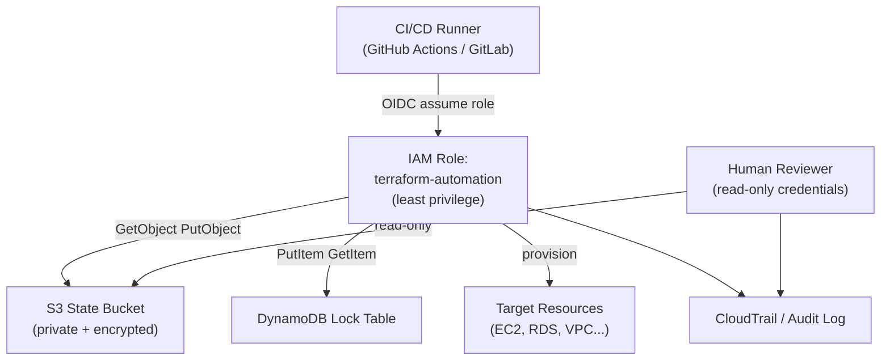

---
tags:
  - security
  - terraform
---
# Terraform — Access Control


<div class="kb-summary">
Access Control reference covering Terraform RBAC and Backend Access Model, Least Privilege IAM for Terraform, Workspace and Environment Separation, Access Control Reference.

*Applies to: Terraform 1.x*
</div>

## Terraform RBAC and Backend Access Model


```text
┌───────────────────────────────────── Terraform — Access Control ──────────────────────────────────────┐
│   ┌───────────────────────────────────────────────────────────────────────────────────────────────┐   │
│   │   Terraform access control: who can plan/apply, state file access, provider credential scope  │   │
│   │   Separate IAM roles: read-only (plan) and read-write (apply); apply requires approval in CI  │   │
│   │ S3 state bucket: restrict GetObject/PutObject to Terraform IAM role only; block public access │   │
│   └───────────────────────────────────────────────────────────────────────────────────────────────┘   │
│                                                                                                       │
│   ┌──────────────────────────────────────────────┐  ┌─────────────────────────────────────────────┐   │
│   │               IAM Role Design                │  │              CI Access Control              │   │
│   │        tf-plan-role: read-only to AWS        │  │          Plan: any branch, auto-run         │   │
│   │       tf-apply-role: write permissions       │  │           Apply: main branch only           │   │
│   │         S3: GetObject/PutObject/List         │  │       Required reviewers before apply       │   │
│   │         DynamoDB: PutItem/DeleteItem         │  │        OIDC trust: repo+branch filter       │   │
│   └──────────────────────────────────────────────┘  └─────────────────────────────────────────────┘   │
│                                                                                                       │
│   ┌───────────────────────────────────────────────────────────────────────────────────────────────┐   │
│   │      OIDC trust  = AWS OIDC provider; trust policy sub: repo:org/repo:ref:refs/heads/main     │   │
│   │       Plan role   = read-only; cannot modify state or infrastructure; safe for PR checks      │   │
│   │             Apply role  = write; assumed only after PR approval and merge to main             │   │
│   └───────────────────────────────────────────────────────────────────────────────────────────────┘   │
└───────────────────────────────────────────────────────────────────────────────────────────────────────┘
```

## Workspace and Environment Separation

Use separate credentials and backends per environment to prevent a staging Terraform run from modifying production.

```hcl
# Use workspace-specific state paths
terraform {
  backend "s3" {
    bucket = "myorg-terraform-state"
    key    = "env/${terraform.workspace}/terraform.tfstate"
    region = "eu-west-1"
  }
}
```

## Access Control Reference

| Area | Practice |
|---|---|
| State bucket | Private, encrypted, access restricted to Terraform role |
| State locking | DynamoDB or equivalent backend locking enabled |
| IAM role | Dedicated per-environment role with least privilege |
| CI/CD | Credentials injected via secrets; not stored in code |
| Human access | Use read-only credentials for review; write credentials for planned applies only |
