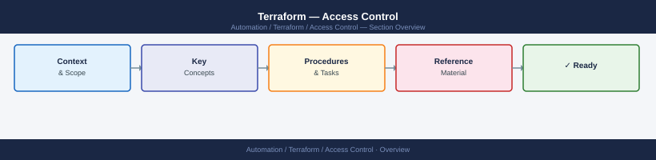
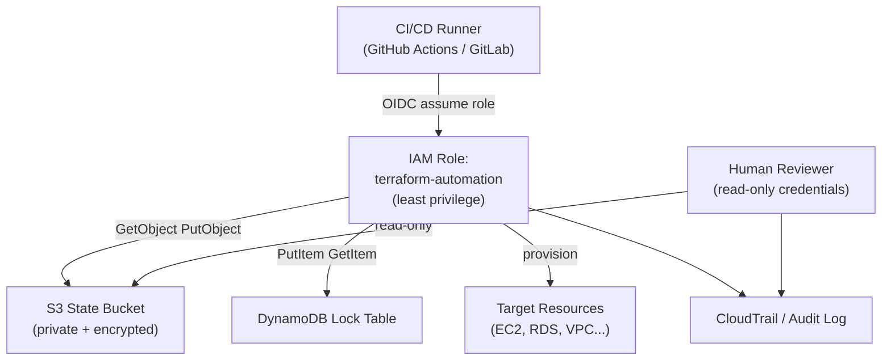

---
tags:
  - security
  - terraform
---
# Terraform — Access Control


<div class="kb-summary">
Access Control reference covering Terraform RBAC and Backend Access Model, Least Privilege IAM for Terraform, Workspace and Environment Separation, Access Control Reference.

*Applies to: Terraform 1.x*
</div>



```d2
direction: down

root: "Access Control\nAccess Control" {shape: hexagon}
terraform_rbac_and_backend_access_mo: "Terraform RBAC and Backend Access Model" {shape: rectangle}
workspace_and_environment_separation: "Workspace and Environment Separation" {shape: rectangle}
access_control_reference: "Access Control Reference" {shape: rectangle}
resources: Protected Resources {shape: cylinder}

root -> terraform_rbac_and_backend_access_mo: role
terraform_rbac_and_backend_access_mo -> resources: scoped
root -> workspace_and_environment_separation: role
workspace_and_environment_separation -> resources: scoped
root -> access_control_reference: role
access_control_reference -> resources: scoped
```

## Before you begin

- **Access:** Provider credentials configured (`terraform login` or env vars)
- **Change management:** security changes require CAB approval in most environments
- **Rollback plan:** document current state before any security control change
- **Testing:** validate in a non-production environment first where possible

---

## Terraform RBAC and Backend Access Model




## Workspace and Environment Separation

Use separate credentials and backends per environment to prevent a staging Terraform run from modifying production.

```hcl
# Use workspace-specific state paths
terraform {
  backend "s3" {
    bucket = "myorg-terraform-state"
    key    = "env/${terraform.workspace}/terraform.tfstate"
    region = "eu-west-1"
  }
}
```

## Access Control Reference

| Area | Practice |
|---|---|
| State bucket | Private, encrypted, access restricted to Terraform role |
| State locking | DynamoDB or equivalent backend locking enabled |
| IAM role | Dedicated per-environment role with least privilege |
| CI/CD | Credentials injected via secrets; not stored in code |
| Human access | Use read-only credentials for review; write credentials for planned applies only |

---

## See also

- [Terraform — Authentication](../authentication/)
- [Terraform — Hardening](../hardening/)
- [Terraform — Encryption](../encryption/)
