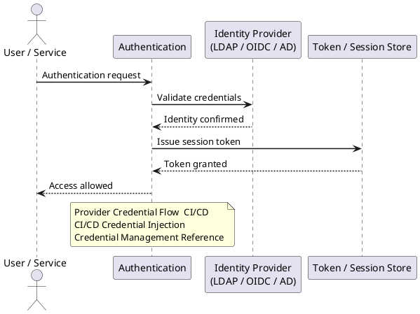

---
tags:
  - security
  - terraform
description: "Authentication reference covering Provider Credential Flow — CI/CD, CI/CD Credential Injection, Credential Management Reference."
---
# Terraform — Authentication

<div class="kb-summary">
Authentication reference covering Provider Credential Flow — CI/CD, CI/CD Credential Injection, Credential Management Reference.

*Applies to: Terraform 1.x*
</div>



## Before you begin

- **Access:** Provider credentials configured (`terraform login` or env vars)
- **Change management:** security changes require CAB approval in most environments
- **Rollback plan:** document current state before any security control change
- **Testing:** validate in a non-production environment first where possible

---

## Provider Credential Flow — CI/CD

```d2
direction: right

ciPipeline: "CI/CD Pipeline\n(GitHub Actions / GitLab" {shape: rectangle}
ciSecrets: "CI/CD Secrets\n(repository secrets" {shape: rectangle}
oidcToken: "OIDC Token\n(short-lived" {shape: rectangle}
iamRole: "Cloud IAM Role\n(assume via OIDC" {shape: rectangle}
envVars: "Environment Variables\n(AWS_ / ARM_ / GOOGLE_" {shape: rectangle}
tfProvider: "Terraform Provider\n(aws / azurerm / google" {shape: rectangle}
cloudAPI: "Cloud API\n(EC2 / ARM / GCP" {shape: rectangle}

ciPipeline -> ciSecrets
ciPipeline -> oidcToken
oidcToken -> iamRole
ciSecrets -> envVars
iamRole -> envVars
envVars -> tfProvider
tfProvider -> cloudAPI
```

### Google Cloud

```bash
# Application Default Credentials
gcloud auth application-default login

# Or via service account key (CI/CD)
export GOOGLE_APPLICATION_CREDENTIALS=/path/to/service-account.json
```


```text title="Expected output"
Go to the following link in your browser:

    https://accounts.google.com/o/oauth2/auth?client_id=764086051850-6qr4p6gpi6hn506pt8ejuq83di341hur.apps.googleusercontent.com&...

Enter verification code: ••••••••
Authenticated with account: admin@example.com
Your current project is set to: my-project-prod
Credentials saved to: /home/terraform/.config/gcloud/application_default_credentials.json
```

!!! warning "Common errors"
    | Error | Fix |
    |---|---|
    | `ERROR: (gcloud.auth.application-default.login) User cancelled the web authorization flow.` | Re-run the command and complete the browser authentication flow, or use a service account key instead. |
    | `ERROR: Could not open browser. Please visit the URL above manually.` | Copy the provided URL into your browser manually, then paste the verification code back into the terminal. |
    | `gcloud: command not found` | Install the Google Cloud SDK by following https://cloud.google.com/sdk/docs/install or add it to your PATH. |
## CI/CD Credential Injection

Credentials should be stored as CI/CD secrets and injected at runtime — never committed to source control.

```yaml
# GitHub Actions example — inject AWS credentials as secrets
- name: Configure AWS credentials
  uses: aws-actions/configure-aws-credentials@v4
  with:
    aws-access-key-id: ${{ secrets.AWS_ACCESS_KEY_ID }}
    aws-secret-access-key: ${{ secrets.AWS_SECRET_ACCESS_KEY }}
    aws-region: eu-west-1
```

## Credential Management Reference

| Provider | Recommended method | CI/CD approach |
|---|---|---|
| AWS | IAM role (EC2/ECS) or OIDC | GitHub OIDC → IAM role (no static keys) |
| Azure | Managed Identity | Service principal via env vars |
| GCP | Workload Identity | Service account via OIDC |
| HashiCorp Vault | Vault agent | Vault token via CI secret |

---

## See also

- [Terraform — Access Control](../access-control/)
- [Terraform — Hardening](../hardening/)
- [Terraform — Encryption](../encryption/)
