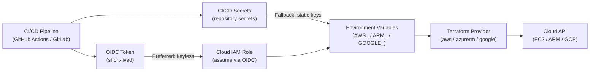

# Terraform — Authentication

## Provider Credential Flow — CI/CD


```

```hcl
# provider.tf — uses environment variables automatically
provider "aws" {
  region = "eu-west-1"
  # Do not hardcode access_key or secret_key here
}
```

### Azure

```bash
# Service principal — preferred for CI/CD
export ARM_CLIENT_ID=...
export ARM_CLIENT_SECRET=...
export ARM_SUBSCRIPTION_ID=...
export ARM_TENANT_ID=...

# Verify authentication
az account show
```

### Google Cloud

```bash
# Application Default Credentials
gcloud auth application-default login

# Or via service account key (CI/CD)
export GOOGLE_APPLICATION_CREDENTIALS=/path/to/service-account.json
```

## CI/CD Credential Injection

Credentials should be stored as CI/CD secrets and injected at runtime — never committed to source control.

```yaml
# GitHub Actions example — inject AWS credentials as secrets
- name: Configure AWS credentials
  uses: aws-actions/configure-aws-credentials@v4
  with:
    aws-access-key-id: ${{ secrets.AWS_ACCESS_KEY_ID }}
    aws-secret-access-key: ${{ secrets.AWS_SECRET_ACCESS_KEY }}
    aws-region: eu-west-1
```

## Credential Management Reference

| Provider | Recommended method | CI/CD approach |
|---|---|---|
| AWS | IAM role (EC2/ECS) or OIDC | GitHub OIDC → IAM role (no static keys) |
| Azure | Managed Identity | Service principal via env vars |
| GCP | Workload Identity | Service account via OIDC |
| HashiCorp Vault | Vault agent | Vault token via CI secret |
