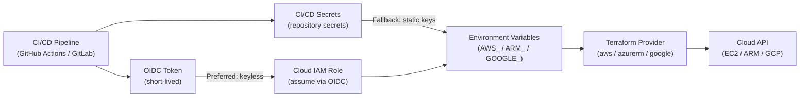

---
tags:
  - security
  - terraform
---
# Terraform — Authentication


<div class="kb-summary">
Authentication reference covering Provider Credential Flow — CI/CD, CI/CD Credential Injection, Credential Management Reference.

*Applies to: Terraform 1.x*
</div>

## Provider Credential Flow — CI/CD


```text
┌───────────────────────────────────── Terraform — Authentication ──────────────────────────────────────┐
│   ┌───────────────────────────────────────────────────────────────────────────────────────────────┐   │
│   │ Terraform provider authentication: OIDC (CI), IAM instance profile (EC2), CLI profile (local) │   │
│   │          AWS: aws provider picks up credential chain; for CI use OIDC role assumption         │   │
│   │      vSphere: vsphere_user + vsphere_password via env vars; or vault-managed credentials      │   │
│   └───────────────────────────────────────────────────────────────────────────────────────────────┘   │
│                                                                                                       │
│   ┌──────────────────────────────────────────────┐  ┌─────────────────────────────────────────────┐   │
│   │              Cloud Auth (OIDC)               │  │                Local Dev Auth               │   │
│   │         GitHub OIDC → AWS AssumeRole         │  │        aws configure (named profile)        │   │
│   │         azure/login OIDC → federated         │  │         export TF_VAR_vsphere_pw=...        │   │
│   │         GCP: Workload Identity OIDC          │  │         export AWS_PROFILE=myprofile        │   │
│   │         No stored access keys in CI          │  │       Vault: vault login then TF runs       │   │
│   └──────────────────────────────────────────────┘  └─────────────────────────────────────────────┘   │
│                                                                                                       │
│   ┌───────────────────────────────────────────────────────────────────────────────────────────────┐   │
│   │       Credential chain= Terraform AWS provider uses same chain as boto3/aws CLI for auth      │   │
│   │      TF_VAR_       = env var prefix; TF_VAR_vsphere_password maps to var.vsphere_password     │   │
│   │  Vault agent    = injects secrets into env before terraform runs; no secrets in process args  │   │
│   └───────────────────────────────────────────────────────────────────────────────────────────────┘   │
└───────────────────────────────────────────────────────────────────────────────────────────────────────┘
```

### Google Cloud

```bash
# Application Default Credentials
gcloud auth application-default login

# Or via service account key (CI/CD)
export GOOGLE_APPLICATION_CREDENTIALS=/path/to/service-account.json
```

## CI/CD Credential Injection

Credentials should be stored as CI/CD secrets and injected at runtime — never committed to source control.

```yaml
# GitHub Actions example — inject AWS credentials as secrets
- name: Configure AWS credentials
  uses: aws-actions/configure-aws-credentials@v4
  with:
    aws-access-key-id: ${{ secrets.AWS_ACCESS_KEY_ID }}
    aws-secret-access-key: ${{ secrets.AWS_SECRET_ACCESS_KEY }}
    aws-region: eu-west-1
```

## Credential Management Reference

| Provider | Recommended method | CI/CD approach |
|---|---|---|
| AWS | IAM role (EC2/ECS) or OIDC | GitHub OIDC → IAM role (no static keys) |
| Azure | Managed Identity | Service principal via env vars |
| GCP | Workload Identity | Service account via OIDC |
| HashiCorp Vault | Vault agent | Vault token via CI secret |
