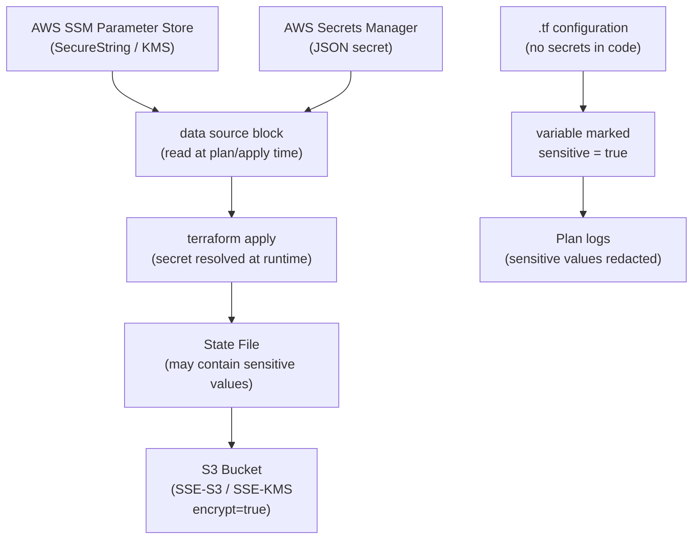

# Terraform — Encryption


<div class="kb-summary">
Encryption reference covering Secrets and Encryption Architecture, Secrets Management with Terraform, Sensitive Variable Handling, Encryption Reference.
</div>

## Secrets and Encryption Architecture


┌─────────────────────────────────────── Terraform — Encryption ────────────────────────────────────────┐
│   ┌───────────────────────────────────────────────────────────────────────────────────────────────┐   │
│   │   TF encryption: state at rest (S3 SSE-KMS), transit TLS, mark secrets as sensitive outputs   │   │
│   │   State encryption: server-side via S3 SSE-KMS; TF 1.7+ client-side: terraform encryption{}   │   │
│   │      Sensitive outputs: never stored as plaintext in state; mark outputs sensitive = true     │   │
│   └───────────────────────────────────────────────────────────────────────────────────────────────┘   │
│                                                                                                       │
│   ┌──────────────────────────────────────────────┐  ┌─────────────────────────────────────────────┐   │
│   │               State Encryption               │  │             Sensitive Variables             │   │
│   │          S3 SSE-KMS on state bucket          │  │      variable "x" { sensitive = true }      │   │
│   │         Terraform 1.7+ encryption{}          │  │       output "x" { sensitive = true }       │   │
│   │        AES-GCM key from KMS or Vault         │  │        Redacted in plan and apply log       │   │
│   │          All TF API calls: TLS 1.2+          │  │      Still stored in state (encrypted)      │   │
│   └──────────────────────────────────────────────┘  └─────────────────────────────────────────────┘   │
│                                                                                                       │
│   ┌───────────────────────────────────────────────────────────────────────────────────────────────┐   │
│   │    encryption block= TF 1.7+: encrypt state at Terraform level before S3; defence-in-depth    │   │
│   │ SSE-KMS        = S3 server-side encryption with AWS KMS managed key; transparent to Terraform │   │
│   │  sensitive = true= prevents value from appearing in output; value still exists in state file  │   │
│   └───────────────────────────────────────────────────────────────────────────────────────────────┘   │
└───────────────────────────────────────────────────────────────────────────────────────────────────────┘

## Secrets Management with Terraform

Do not store secrets as Terraform variables in plain text. Use a secrets manager and reference values dynamically.

```hcl
# Read a secret from AWS Secrets Manager at plan/apply time
data "aws_secretsmanager_secret_version" "db_password" {
  secret_id = "prod/myapp/db-password"
}

resource "aws_db_instance" "main" {
  identifier = "prod-db"
  password   = data.aws_secretsmanager_secret_version.db_password.secret_string
  # ...
}
```

```hcl
# Read a parameter from AWS SSM Parameter Store
data "aws_ssm_parameter" "api_key" {
  name            = "/prod/myapp/api-key"
  with_decryption = true
}
```

## Sensitive Variable Handling

Mark outputs and variables containing sensitive data so Terraform redacts them from logs.

```hcl
variable "db_password" {
  type      = string
  sensitive = true   # redacted in plan output and logs
}

output "db_connection_string" {
  value     = "postgresql://user:${var.db_password}@${aws_db_instance.main.address}/mydb"
  sensitive = true
}
```

## Encryption Reference

| Area | Practice |
|---|---|
| State at rest | `encrypt = true` in backend config; verify bucket encryption |
| State in transit | All backends enforce TLS; do not use HTTP backends |
| Secrets in config | Use Secrets Manager or SSM; never hardcode in `.tf` files |
| Sensitive variables | Mark with `sensitive = true` to suppress log output |
| `.tfvars` files | Do not commit files containing secrets; use CI/CD secret injection |
