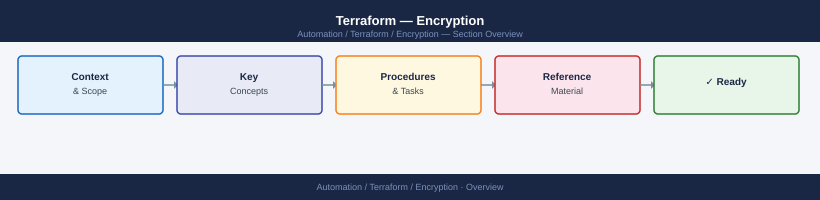
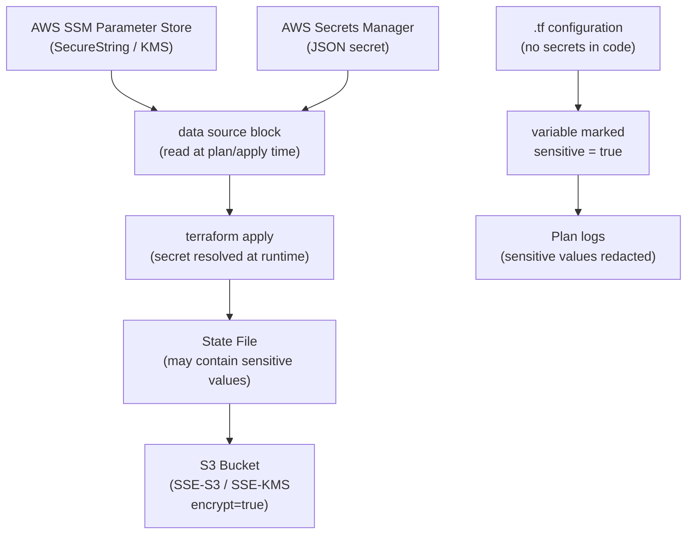

---
tags:
  - security
  - terraform
---
# Terraform — Encryption


<div class="kb-summary">
Encryption reference covering Secrets and Encryption Architecture, Secrets Management with Terraform, Sensitive Variable Handling, Encryption Reference.

*Applies to: Terraform 1.x*
</div>



```d2
direction: down

secrets_and_encryption_architecture: "Secrets and Encryption Architecture" {shape: rectangle}
sensitive_variable_handling: "Sensitive Variable Handling" {shape: rectangle}
encryption_reference: "Encryption Reference" {shape: rectangle}

secrets_and_encryption_architecture -> sensitive_variable_handling: hardens
sensitive_variable_handling -> encryption_reference: hardens
```

## Before you begin

- **Access:** Provider credentials configured (`terraform login` or env vars)
- **Change management:** security changes require CAB approval in most environments
- **Rollback plan:** document current state before any security control change
- **Testing:** validate in a non-production environment first where possible

---

## Secrets and Encryption Architecture




```hcl
# Read a parameter from AWS SSM Parameter Store
data "aws_ssm_parameter" "api_key" {
  name            = "/prod/myapp/api-key"
  with_decryption = true
}
```

## Sensitive Variable Handling

Mark outputs and variables containing sensitive data so Terraform redacts them from logs.

```hcl
variable "db_password" {
  type      = string
  sensitive = true   # redacted in plan output and logs
}

output "db_connection_string" {
  value     = "postgresql://user:${var.db_password}@${aws_db_instance.main.address}/mydb"
  sensitive = true
}
```

## Encryption Reference

| Area | Practice |
|---|---|
| State at rest | `encrypt = true` in backend config; verify bucket encryption |
| State in transit | All backends enforce TLS; do not use HTTP backends |
| Secrets in config | Use Secrets Manager or SSM; never hardcode in `.tf` files |
| Sensitive variables | Mark with `sensitive = true` to suppress log output |
| `.tfvars` files | Do not commit files containing secrets; use CI/CD secret injection |

---

## See also

- [Terraform — Hardening](../hardening/)
- [Terraform — Authentication](../authentication/)
- [Terraform — Access Control](../access-control/)
