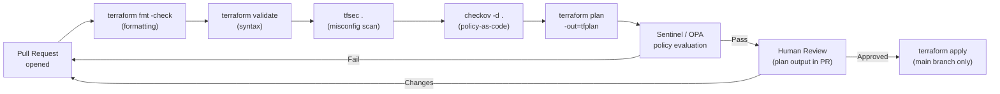

---
tags:
  - security
  - terraform
---
# Terraform — Hardening

<div class="kb-summary">
Hardening reference covering Security Scanning Pipeline, Dependency and Provider Security, Hardening Checklist.

*Applies to: Terraform 1.x*
</div>

```d2
direction: down

security_scanning_pipeline: "Security Scanning Pipeline" {shape: rectangle}
dependency_and_provider_security: "Dependency and Provider Security" {shape: rectangle}
hardening_checklist: "Hardening Checklist" {shape: rectangle}

security_scanning_pipeline -> dependency_and_provider_security: hardens
dependency_and_provider_security -> hardening_checklist: hardens
```

## Before you begin

- **Access:** Provider credentials configured (`terraform login` or env vars)
- **Change management:** security changes require CAB approval in most environments
- **Rollback plan:** document current state before any security control change
- **Testing:** validate in a non-production environment first where possible

---

## Security Scanning Pipeline



## Dependency and Provider Security

```bash
# Lock provider versions to prevent unexpected upgrades
terraform providers lock

# Review the lock file for unexpected version changes
git diff .terraform.lock.hcl

# Verify provider checksums after init
cat .terraform.lock.hcl | grep -A5 "provider"

# Use version constraints to limit provider versions
# versions.tf
terraform {
  required_providers {
    aws = {
      source  = "hashicorp/aws"
      version = "~> 5.0"   # allows patch updates only within 5.x
    }
  }
  required_version = ">= 1.5.0"
}
```

## Hardening Checklist

| Area | Practice |
|---|---|
| Static analysis | Run `tfsec` or `checkov` in CI before every plan |
| Policy enforcement | Use Sentinel or OPA to enforce tagging and compliance rules |
| Provider versions | Lock with `terraform providers lock`; review changes in PRs |
| Sensitive outputs | Mark with `sensitive = true`; review plan output for exposed secrets |
| State access | Restrict state bucket to the Terraform automation role |
| `.gitignore` | Exclude `*.tfvars`, `*.tfstate`, `*.tfstate.backup`, `.terraform/` |
| Code review | All Terraform PRs reviewed before apply; plan output included |
| Audit logs | Enable CloudTrail / Azure Monitor for all provider API calls |

---

## See also

- [Terraform — Authentication](../authentication/)
- [Terraform — Access Control](../access-control/)
- [Terraform — Encryption](../encryption/)
